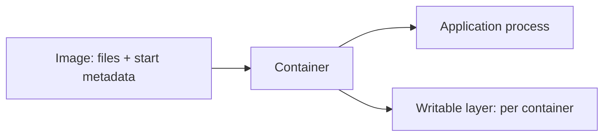

# Process, image, and container

*Launchpad*

**You will be able to:** say which of the three a given action changes, and what is lost when each is replaced.

## Key points

| Term | Is | Lives in | Lost when |
|---|---|---|---|
| **Process** | A running program (memory, file descriptors, PID) | RAM | It exits |
| **Image** | A read-only package: files + start command + metadata | Registry / local disk | Deleted (it is not "running") |
| **Container** | One isolated process started **from** an image, plus a writable layer | Host kernel + its layer | Container is **removed** |

- Rebuilding an image makes a **new artifact**. Running containers keep using the old one until replaced.
- Two containers from one image share starting files, **not** memory or writable files.
- A stopped-then-started container keeps its writable layer. A removed-then-recreated one does not.


```mermaid
flowchart LR
  I[Image: files + start metadata] --> C[Container]
  C --> P[Application process]
  C --> W[Writable layer: per container]
```

## A container is not a VM

- **No guest OS, no hypervisor.** A container is an ordinary Linux process on the host kernel.
- **Namespaces limit what it can see:**

| Namespace | Isolates |
|---|---|
| `pid` | Process IDs (the app is PID 1) |
| `net` | Interfaces, routes, IP, ports |
| `mnt` | Filesystem mounts (the image root) |
| `uts` | Hostname |
| `ipc` | Shared memory, queues |
| `user` | UID mapping (root in container ≠ root on host) |

- **cgroups limit what it can use:** CPU, memory, process count, I/O. Over the memory limit ⇒ the kernel OOM-kills it.
- Shared kernel ⇒ millisecond start, but a kernel bug affects every container.

## Apollo example

- `booking` image built from `stages/launchpad/code/booking/Dockerfile`.
- `docker compose up` creates a container from it, with its own writable layer and `/tmp` tmpfs.
- Running a second `booking` container from the same image gives a second process with separate memory.

## Try it

```bash
cd stages/launchpad && docker compose up -d booking
docker inspect -f 'image={{.Image}}' $(docker compose ps -q booking)
docker compose images booking
```

- The container's `Image` ID equals the image listed. After a rebuild they differ until you recreate the container.

## Gotchas

- "Image exists" ≠ "service running".
- "Container running" ≠ "booking works" (dependencies may be unreachable).
- Writable-layer data survives `restart`, not `rm`. Data that must outlive a container needs a volume (Mission Data).

## Check yourself

<details>
<summary>You rebuild <code>booking:latest</code> while a booking container runs. Did that container change?</summary>

No. The rebuild creates a new image. The container keeps its original image and writable layer until it is replaced.
</details>

<details>
<summary>A process exits but its image still exists. What is definitely gone?</summary>

The process memory. The image remains. The writable layer survives only if the same container is restarted.
</details>

<details>
<summary>What do namespaces limit that cgroups do not, and vice versa?</summary>

Namespaces limit visibility (PIDs, network, mounts). Cgroups limit consumption (CPU, memory).
</details>
