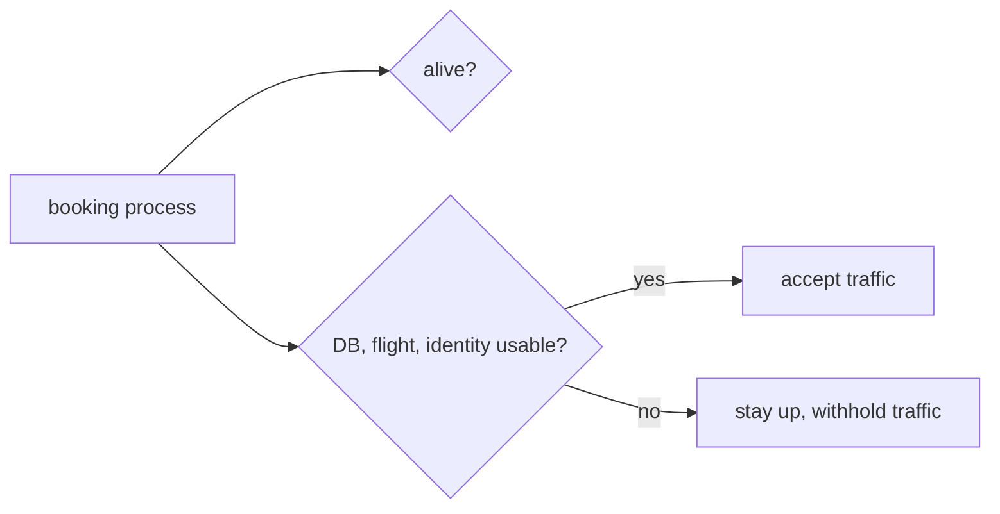

# State and dependencies

*Launchpad*

**You will be able to:** name the storage boundary for any data, and choose between a liveness-style and a readiness-style check.

## Where state lives

| Location | Lost when |
|---|---|
| Process memory | Process exits |
| Container writable layer | Container **removed** (kept on stop/start) |
| `tmpfs` | Container stops |
| Named volume | Volume deleted (`down -v`), host lost, or corrupted |
| External system / backup | Depends on that system |

- Before calling data safe, ask: **what event can happen without these bytes disappearing?**
- `docker compose down` keeps named volumes. It proves nothing about host loss, corruption or restore.

## Alive vs ready

| | Question | If it fails |
|---|---|---|
| **Liveness** (`/healthz`) | Can this process continue? | Restart may help |
| **Readiness** (`/readyz`) | Should it receive the next request? | Withhold traffic; **restarting won't help** |

- Booking can be alive while its database is down. Restarting booking does not fix the database.
- A readiness check should be bounded and cover only what the request path needs. Checking every distant dependency can take a whole service out for an unrelated outage.



## Apollo example

- `flight` `/readyz` pings `flight-db`. `booking` `/readyz` checks its DB plus identity, flight and notification. `search` checks flight. `notification` checks Redis.
- Outages spread transitively: Redis down ⇒ notification unready ⇒ booking unready (although bookings still succeed).

## Try it

```bash
cd stages/launchpad
docker compose stop flight-db
curl -s -o /dev/null -w 'flight healthz=%{http_code}\n' localhost:8081/healthz
curl -s -o /dev/null -w 'flight readyz=%{http_code}\n'  localhost:8081/readyz
docker compose start flight-db
```

- Expect `200` then `503`.

## Gotchas

- A listening port proves only the first hop.
- `depends_on: service_healthy` orders **startup** only; it does not watch later failures.
- Readiness reduces misrouted traffic; it does not guarantee later calls succeed.

## Check yourself

<details>
<summary>Flight's DB is down but <code>/healthz</code> answers. Should liveness restart flight?</summary>

Usually not. A restart does not repair the DB. Readiness should withhold traffic until it recovers.
</details>

<details>
<summary>A record survives <code>docker compose down</code>. Is it safe from host loss?</summary>

No. You proved survival across container removal on one host, nothing more.
</details>
