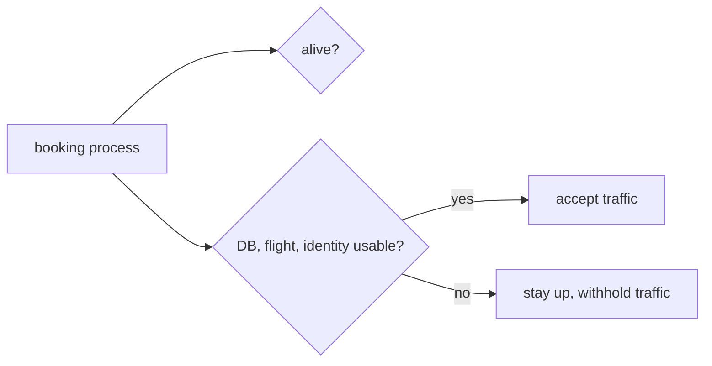

# State and dependencies

*Launchpad*

**You will be able to:** say which storage boundary protects a piece of data, and choose between a "is it alive" check and a "is it ready" check.

## The problem

Booking is running and its port is open. A passenger presses Book and it fails. Two separate things can be going on, and they are easy to blur:

1. **Dependencies:** booking needs identity, flight and its database. If one is down, booking cannot finish the job even though it is running.
2. **State:** booking writes a reservation somewhere. If that "somewhere" disappears when a container is replaced, the passenger loses their booking.

## The idea in plain words: where does the data live?

Think of where you could write something down, from a sticky note to a safe-deposit box. Each place survives a different kind of event:

| Location | Lost when |
|---|---|
| Process memory | The process exits |
| The container's writable layer | The container is **removed** (it survives a stop and start) |
| `tmpfs` (in-memory folder) | The container stops |
| A named volume | The volume is deleted (`down -v`), the host is lost, or it is corrupted |
| An external system or backup | Depends on that system |

Before calling data safe, ask: **what event can happen without these bytes disappearing?** `docker compose down` removes containers but keeps named volumes. That proves survival across container removal on one machine, and nothing more. It says nothing about the machine dying or the data being corrupted.

## The idea in plain words: alive versus ready

Picture a restaurant. A cook who has arrived is **alive**. A kitchen that has its stove lit, ingredients delivered and cook at the station is **ready** to take orders. A restaurant can be open with a cook present but unable to serve because the supplier has not delivered.

Services expose two checks for this:

| Check | Question | If it fails |
|---|---|---|
| **Liveness** (`/healthz`) | Is the process itself healthy enough to continue? | Restarting may help |
| **Readiness** (`/readyz`) | Can it take the next request right now, including reaching what it needs? | Stop sending it traffic. **Restarting will not help** |

If flight's database is down, flight is alive but not ready. Restarting flight would not repair the database; the useful action is to hold back new requests until the database returns.

## How it works



A readiness check should be **bounded and relevant**: it should cover what the request path truly needs and give an answer within a short time. If it checks every distant dependency, an unrelated outage can take a healthy service out of rotation.

## Apollo example

| Service | `/readyz` checks |
|---|---|
| `flight` | its database |
| `search` | the flight service |
| `notification` | Redis |
| `booking` | its database, identity, flight and notification |

Failures therefore spread: Redis down makes notification unready, which makes booking unready, even though booking could still save reservations (it calls notification afterwards, asynchronously). Readiness reports a dependency graph, not whether one particular request would succeed.

## Try it

```bash
cd stages/launchpad
docker compose stop flight-db
curl -s -o /dev/null -w 'flight healthz=%{http_code}\n' localhost:8081/healthz
curl -s -o /dev/null -w 'flight readyz=%{http_code}\n'  localhost:8081/readyz
docker compose start flight-db
```

- You should see `200` then `503`: alive, but not ready.

## Common misconceptions

- **"An open port means the service works."** It only proves the first hop.
- **"`depends_on: service_healthy` keeps dependencies healthy."** It only orders *startup*. It does not watch them afterwards.
- **"Readiness guarantees the next call succeeds."** It reduces misrouted traffic; a dependency can still fail a moment later.

## Check yourself

<details>
<summary>Flight's database is down but <code>/healthz</code> answers. Should liveness restart flight?</summary>

Usually not. A restart does not repair the database. Readiness should withhold traffic until it recovers.
</details>

<details>
<summary>A record survives <code>docker compose down</code>. Is it safe from host loss?</summary>

No. You only proved survival across container removal on one host.
</details>

## Where this leads

Launchpad ends with a question Compose cannot answer: who keeps this running across machines and failures? That is orchestration, and the next stage starts with it.
