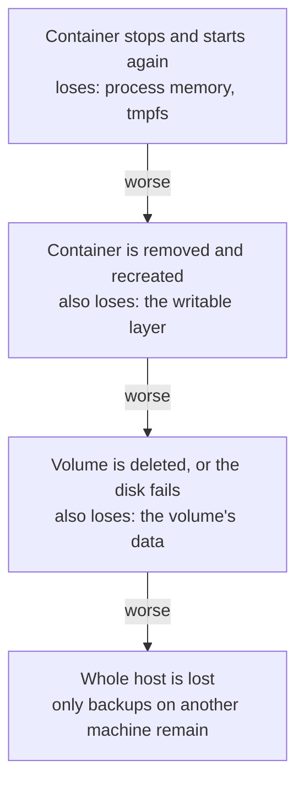
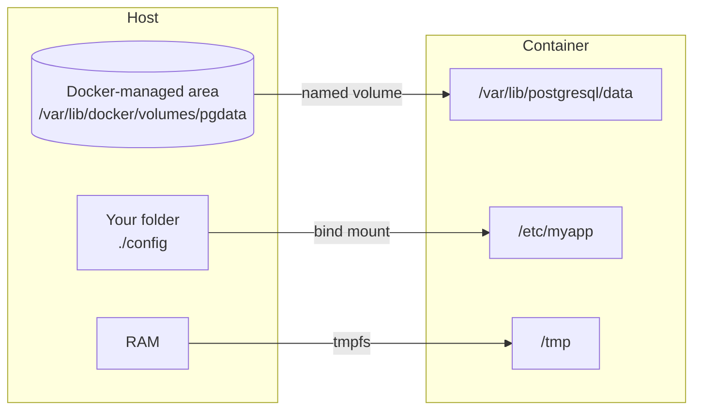
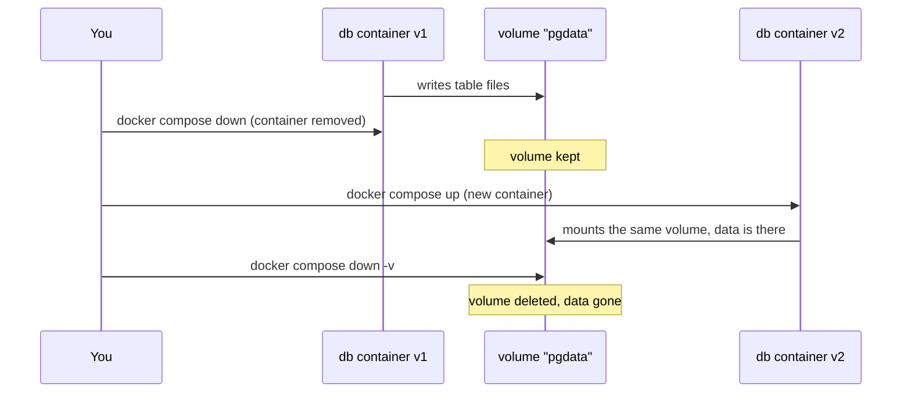
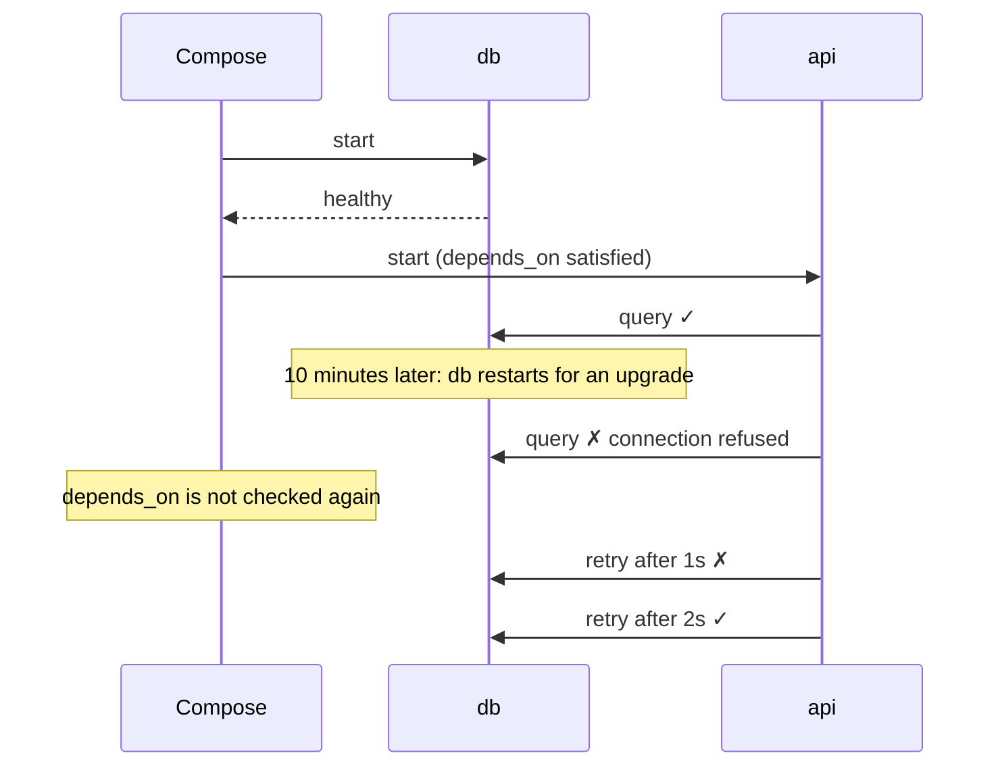
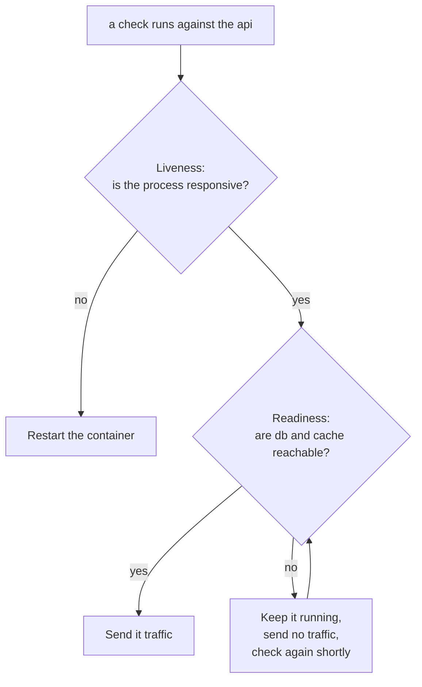
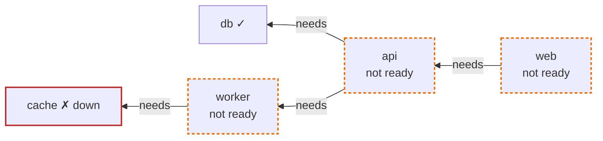

# State and dependencies

*Launchpad*

**You will be able to:** say which storage location protects a piece of data against which event, explain why a service must cope with dependencies that come and go, and choose between an "is it alive?" check and an "is it ready?" check.

## The problem

Your `api` container is running and its port answers. A user submits an order and it fails. Two separate things can be going on, and they are easy to blur:

1. **Dependencies.** The API needs its database (and perhaps a cache or another service). If one of those is down, the API cannot finish the job even though its own process is fine.
2. **State.** The API writes the order somewhere. If that "somewhere" disappears when a container is replaced, the user loses their order.

Containers make both questions sharper, because containers are meant to be **disposable**: you replace them on every upgrade, every config change, every crash. So you must know exactly what survives a replacement, and every service must expect its neighbours to be replaced too.

## Where does the data live?

Think of the places you could write something down, from a whiteboard to a safe-deposit box. Each survives a different set of events.



Each event further down is more severe and wipes out one more place.

| Location | Survives | Lost when |
|---|---|---|
| **Process memory** | Nothing | The process exits or restarts |
| **`tmpfs`** (a folder backed by RAM) | Nothing past a stop | The container stops |
| **The container's writable layer** | Stop and start | The container is **removed** (every upgrade) |
| **A named volume** | Container removal and recreation | The volume is deleted (`docker compose down -v`), or the disk or host is lost |
| **A backup on another machine** | Host loss, deletion, corruption (if you can restore it) | It was never tested, or it is too old |

Before calling data safe, ask: **which event can happen without these bytes disappearing?** Surviving `docker compose down` proves survival across container removal *on one machine*, and nothing more.

### Volumes, bind mounts and tmpfs

There are three ways to put storage into a container from outside its writable layer. They differ in *who manages the storage* and *how long it lasts*.



- A **named volume** is storage Docker creates and manages. It outlives any container that uses it. This is where databases keep their files.
- A **bind mount** maps a folder you choose on the host into the container. Handy for config files and for editing code live during development; it ties the container to that host's folder layout.
- A **tmpfs** mount is memory that looks like a folder: fast, private, and gone at stop. Good for scratch files you never want on disk.



## Dependencies come and go

Your API depends on its database. The obvious fix is to "start the database first". Compose supports this with `depends_on`, and with a health check it can even wait until the database is healthy before starting the API.

That fixes one moment: **startup**. It does nothing afterwards.



A dependency can disappear at any time: a restart, an upgrade, a network blip. So a well-behaved service:

- **retries** failed connections with a growing delay (*backoff*) instead of crashing on the first error;
- **keeps running** while a dependency is away, and says honestly that it cannot serve right now;
- treats start order as a convenience, not a guarantee.

That "say honestly that it cannot serve right now" needs a vocabulary, which brings us to health checks.

## Alive versus ready

Picture a restaurant. A cook who has arrived is **alive**. A kitchen with the stove lit, ingredients delivered and the cook at the station is **ready** to take orders. A restaurant can have a perfectly healthy cook and still be unable to serve because the supplier has not delivered.

Services usually expose two checks, often as HTTP endpoints, so that tools outside the process can ask:

| Check | Question it answers | Typical endpoint | If it fails, the right action is |
|---|---|---|---|
| **Liveness** | Is the process itself working, or is it stuck? | `/healthz` or `/livez` | Restart it. A restart may fix a deadlock or a leak. |
| **Readiness** | Can it handle the next request right now, including reaching what it needs? | `/readyz` | Stop sending it traffic until it recovers. **A restart will not help.** |



If the database is down, the API is alive but not ready. Restarting the API would not repair the database, and if the liveness check *also* tested the database, every API container would be restarted over and over during a database outage, making things worse. Keep **liveness about the process itself** and **readiness about whether it can do its job**.

### Readiness spreads along dependencies

If each service's readiness includes the services it calls, one failure ripples upward:



Maybe the API only needs the worker for an optional step it could do later. Then including it in readiness takes the whole API out of service for nothing. A readiness check should be **bounded and relevant**: cover what the request path truly needs, answer within a short time, and leave optional dependencies out.

Readiness is a signal for routing traffic, not a promise. A dependency can still fail a moment after the check passed, which is why retries are still needed.

## Try it

Part 1: what survives a container's removal.

```bash
docker volume create demo-data
docker run --rm -v demo-data:/data alpine:3.20 sh -c 'echo "kept" > /data/a.txt; echo "lost" > /b.txt'
docker run --rm -v demo-data:/data alpine:3.20 sh -c 'cat /data/a.txt; cat /b.txt'
# kept
# cat: can't open '/b.txt': No such file or directory
docker volume rm demo-data
```

Part 2: a health check is just a command run from outside, again and again.

```bash
docker run -d --name hc \
  --health-cmd 'test -f /tmp/ready' --health-interval 2s --health-retries 1 \
  alpine:3.20 sleep 600
sleep 5; docker inspect -f '{{.State.Health.Status}}' hc    # unhealthy
docker exec hc touch /tmp/ready
sleep 3; docker inspect -f '{{.State.Health.Status}}' hc    # healthy
docker exec hc rm /tmp/ready
sleep 3; docker inspect -f '{{.State.Health.Status}}' hc    # unhealthy again, still running
docker rm -f hc
```

- In part 1, two containers came and went; only the file in the volume remained.
- In part 2, the container was running the whole time. "Running" and "healthy" are separate facts, and plain Docker does not restart a container just because it is unhealthy. Orchestrators like Kubernetes act on these signals, as later stages show.

## Common misconceptions

- **"An open port means the service works."** It proves the first hop only.
- **"`depends_on` keeps dependencies healthy."** It orders *startup*. It does not watch them afterwards.
- **"My data is in a volume, so it is backed up."** A volume survives container removal. It does not survive the disk, the host, or `down -v`.
- **"Readiness guarantees the next call succeeds."** It reduces misrouted traffic; a dependency can still fail a moment later.

## Check yourself

<details>
<summary>The database is down but the API's liveness endpoint answers. Should the API be restarted?</summary>

No. A restart does not repair the database. Readiness should fail so traffic is held back until the database recovers.
</details>

<details>
<summary>A record survives <code>docker compose down</code> and <code>up</code>. Is it safe from losing the host?</summary>

No. You only proved survival across container removal on one host. That needs a backup somewhere else, and a tested restore.
</details>

<details>
<summary>Where should a database keep its files, and why not in the container's writable layer?</summary>

In a named volume. The writable layer is deleted whenever the container is removed, which happens on every upgrade.
</details>

<details>
<summary>The API starts after the database thanks to <code>depends_on</code>. Why should it still retry its connection?</summary>

Start order covers one moment. The database can restart or blip at any time afterwards, and the API should recover without being restarted itself.
</details>

## Where this leads

One more idea completes the single-machine picture: not what a container can *reach* or *keep*, but what it is *allowed to do* if something goes wrong. That is [Least privilege for containers](./least-privilege).
