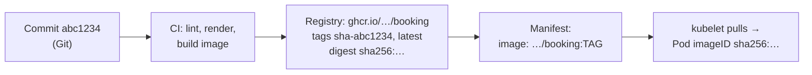

# CI and image delivery

*Stage 5 · Payload Integration*

**You will be able to:**

- describe each job in Apollo's CI workflow, and why pull requests build images but never push them;
- read a full image reference (registry, repository, tag, digest) and say which parts can change meaning;
- predict what `imagePullPolicy` will do on a node, including on a kind cluster with no registry;
- answer "is commit X running in prod?" with evidence instead of a guess.

Someone asks: "Is the fix from commit `abc1234` live?" To answer honestly you must follow an unbroken chain:

1. the commit in Git;
2. a build of *that* commit into an image;
3. the image stored in a registry under some name;
4. a manifest that references that name;
5. a node that pulled that exact image and is running it.

A break anywhere makes "yes" untrustworthy. The tag was overwritten after the manifest was applied. One node still has an older copy of `:latest` cached. The image was rebuilt for prod from a slightly different commit. Each of these happens in real teams, and each looks fine on a dashboard.

The chain also has to be **automatic**. If a person builds images on a laptop, nobody can say which source or which dependencies went into them.

## A chain of custody for images

Think of a parcel's tracking chain: sender, depot, courier, doorstep. You trust the delivery only if every handoff is recorded *and every step handles the same parcel*. A depot that repacks the parcel breaks the chain even if the label stays the same.

Two terms:

- **Continuous integration (CI):** an automated system that, on every change, checks out the code, runs checks (lint, tests) and builds the deliverable. In Apollo that is **GitHub Actions**.
- **Container registry:** a server that stores images by name, such as the **GitHub Container Registry (GHCR)** at `ghcr.io`. Nodes pull images from it.

Delivering an image has four handoffs:



| Handoff | What it proves | What it does not prove |
|---|---|---|
| Commit | The intended source | That CI built *that* commit |
| CI build | Checks passed and an image was built from it | That the manifest refers to it |
| Manifest | Which image someone *asked* for | That nodes actually pulled it |
| Pod `imageID` | The exact image bytes running | That it behaves correctly for passengers |

## Apollo's pipeline, step by step

### Step 1: what Apollo's CI does

[`.github/workflows/main.yml`](https://github.com/darshan-raul/Apollo11/blob/69113dcc80f77e32301d8ee7b9e73a67c923de96/.github/workflows/main.yml) runs on every pull request to `main`, every push to `main`, and every tag that starts with `v`. It has three jobs that run one after another (`needs:`):

| Job | Runs on | What it does | Why |
|---|---|---|---|
| `lint` | every event | `helm lint` for each environment, a smoke `helm template`, a check that the committed Kustomize base matches a fresh render, `kubectl kustomize` for every overlay, `shellcheck` on all scripts, validation of the Argo CD Applications | Catch broken packaging before spending time on builds |
| `build` | every event, after `lint` | Builds all six images (a **matrix**: one parallel run per service) with `push: false` | Prove every Dockerfile still builds, on every PR |
| `push` | only `push` to `main` or a `v*` tag, after `build` | Logs in to GHCR, builds again with the layer cache, pushes with tags | Only reviewed, merged code reaches the registry |

The split between `build` and `push` is a security decision, not just tidiness. A pull request can come from anyone's fork. If PR builds could push, anyone could publish an image under Apollo's name. The `push` job also declares exactly the permissions it needs:

```yaml
# .github/workflows/main.yml, push job (trimmed)
push:
  needs: build
  if: github.event_name == 'push' && (github.ref == 'refs/heads/main' || startsWith(github.ref, 'refs/tags/v'))
  permissions:
    contents: read
    packages: write          # may write to GHCR, nothing else
  steps:
    - uses: docker/login-action@v3
      with:
        registry: ghcr.io
        username: ${{ github.actor }}
        password: ${{ secrets.GITHUB_TOKEN }}   # short-lived token GitHub issues per run
```

Notice what CI does **not** do: it never runs `helm upgrade` or `kubectl apply`. CI has no credentials for any cluster. Getting the new image into a cluster is the job of [GitOps](./gitops-and-ownership), which pulls from Git and the registry. That keeps cluster credentials out of CI entirely.

### Step 2: how an image is named

A full image reference has up to four parts:

```text
ghcr.io / darshan-raul/apollo11/booking : sha-abc1234 @ sha256:9f86d0…
└─┬───┘   └──────────┬────────────────┘   └────┬────┘   └────┬─────┘
registry         repository                   tag          digest
```

- **Registry:** where to pull from. If it is omitted, it defaults to Docker Hub (`docker.io`). That is why `apollo11/booking:latest` means `docker.io/apollo11/booking:latest` to a node.
- **Repository:** the image's name within the registry. GHCR requires it to be lowercase, which is why the workflow sets `IMAGE_PREFIX: darshan-raul/apollo11`.
- **Tag:** a human-friendly label pointing at one image. **Tags can be moved.**
- **Digest:** `sha256:` followed by a hash of the image's content. **A digest can only ever name one exact image.**

### Step 3: which tags Apollo pushes

The `push` job uses `docker/metadata-action` to decide the tags:

```yaml
tags: |
  type=sha,prefix=sha-                                # sha-abc1234: the short commit hash
  type=raw,value=latest,enable={{is_default_branch}}  # latest: only on main
  type=ref,event=tag                                  # v1.0.0: only when you push a git tag v1.0.0
```

| Event | Tags pushed for booking | Will this tag ever point at different content? |
|---|---|---|
| Merge to `main` | `sha-abc1234`, `latest` | `sha-…`: no (by convention). `latest`: **yes**, on every merge |
| Push git tag `v1.0.0` | `sha-abc1234`, `v1.0.0` | Only if someone re-pushes the tag |

The same action also adds standard **labels** to the image, including `org.opencontainers.image.revision` (the full commit SHA) and `org.opencontainers.image.source` (the repo URL). Those labels travel inside the image, so you can go from a running image back to its commit even if all the tags have since moved.

### Step 4: tags versus digests

| | Tag (`:latest`, `:v1.0.0`) | Digest (`@sha256:…`) |
|---|---|---|
| Can it change meaning? | **Yes**, anyone with push access can re-point it | No, the hash *is* the content |
| Two nodes, same reference, at different times | May run different code | Always identical bytes |
| Readable by humans | Yes | No |
| Best use | Naming and discovery | Deploying, or an immutable tag such as `sha-abc1234` |

An **immutable tag** is a tag your team promises never to re-push, like `sha-abc1234`, because it encodes the commit. Some registries can enforce it; GHCR does not by default, so it remains a convention.

### Step 5: what the node does, `imagePullPolicy`

The kubelet decides whether to contact the registry based on the container's `imagePullPolicy`:

| Policy | Behaviour | Default when |
|---|---|---|
| `Always` | Ask the registry which digest the tag points to *now*; download only if the node does not have it | The tag is `:latest` or missing |
| `IfNotPresent` | Use any local image with that name; only pull if there is none | Any other tag |
| `Never` | Use the local image or fail | Never the default |

Combine a mutable tag with `IfNotPresent` and you get the classic failure. Node A pulled `booking:latest` on Monday. CI pushes a new `latest` on Tuesday. A Pod scheduled to node B pulls Tuesday's image; a replacement Pod on node A reuses Monday's. Two replicas of "the same" version now run different code.

Apollo's values set the policy explicitly per environment:

| | Image | `imagePullPolicy` | Why |
|---|---|---|---|
| dev, staging (local) | `apollo11/*:latest` | `IfNotPresent` | Images are loaded straight into the kind nodes; there is no registry to pull from |
| prod | `ghcr.io/darshan-raul/apollo11/*:v1.0.0` | `Always` | Every Pod start re-checks the registry, so a node never runs a stale cached copy |

### The local shortcut: `kind load`

On your machine, `apply.sh` runs `scripts/build-images.sh`, which builds each image with `docker build -t apollo11/booking:latest` and then runs `kind load docker-image`. That copies the image directly into each kind node's `containerd`. No registry is involved.

This only works because of `IfNotPresent`. With `Always`, the kubelet would ask Docker Hub for `docker.io/apollo11/booking:latest`, find nothing, and the Pod would fail with `ErrImagePull`, even though the image is sitting on the node.

### Configuration baked in at build time

The frontend is different from the backends. Vite compiles the `VITE_*` service URLs *into* the JavaScript bundle, so they are passed as `--build-arg` values, read from `config.viteUrls` in the chart's `values.yaml`. CI and `build-images.sh` both read them from the same place so the image and the HTTPRoute hostnames never disagree.

The cost is that the frontend image is tied to those hostnames. If staging and prod ever needed different hostnames, you would need a different frontend image per environment, which breaks "build once, promote everywhere". Backends read their configuration from environment variables at start-up, so one backend image works in every environment. When you design a service, prefer runtime configuration for anything that differs per environment.

## Apollo example: from Pod back to commit

The Pod records both what was asked for and what is actually running:

| Field | Written by | Contains |
|---|---|---|
| `spec.containers[0].image` | You, through the manifest | The reference you asked for, e.g. `…/booking:v1.0.0` |
| `status.containerStatuses[0].imageID` | The kubelet, after the pull | The resolved digest, e.g. `ghcr.io/…/booking@sha256:9f86d0…` |

To answer "is commit `abc1234` running?":

1. Find the digest CI pushed for that commit: `docker buildx imagetools inspect ghcr.io/darshan-raul/apollo11/booking:sha-abc1234` prints a `Digest:` line.
2. Read the digest each running Pod actually has (`imageID`, below).
3. If every Pod's digest matches, yes. If any differ, some replicas run something else.

## Try it

:::caution[Unverified]
The exact `imageID` format depends on the container runtime and on how the image arrived. For images copied in with `kind load`, there is no registry digest, so `imageID` may show a local image ID instead.
:::

```bash
NS=apollo-airlines-apps
kubectl get pods -n $NS -l app=booking \
  -o custom-columns='POD:.metadata.name,NODE:.spec.nodeName,ASKED:.spec.containers[0].image,RUNNING:.status.containerStatuses[0].imageID'
```

- **Expected:** one row per booking replica. `ASKED` is the same on every row. `RUNNING` should be the same too. If two rows have different `RUNNING` values under the same `ASKED` tag, you have found the cached-tag problem.

Check the policy each container was given:

```bash
kubectl get deploy -n $NS -o custom-columns='NAME:.metadata.name,POLICY:.spec.template.spec.containers[0].imagePullPolicy'
```

- **Expected:** `IfNotPresent` for a local dev install, `Always` for prod values.

## Common misconceptions

- **"`v1.2.0` is immutable."** It reads like a release, so it feels permanent. A tag is a pointer; unless the registry enforces immutability, anyone with push access can move it.
- **"Same tag on every node means same code."** Not with `IfNotPresent` and a tag that has been re-pushed. Compare `imageID`, not `image`.
- **"CI passing means it is deployed."** CI only builds and pushes. Apollo's CI cannot even reach a cluster; a manifest change and a sync complete the chain.
- **"`imagePullPolicy: Always` re-downloads the whole image every time."** It always *asks* the registry, which is cheap. It downloads only layers the node does not already have.
- **"Rebuilding for each environment is the same as promoting."** A rebuild can pick up a different base image or dependency version. What you tested is then not what you ship.

## Check yourself

<details>
<summary>Why does Apollo's CI build images on pull requests but only push them from <code>main</code> and <code>v*</code> tags?</summary>

PRs can come from forks and are not yet reviewed. Building proves the Dockerfiles work; pushing would let unreviewed code publish images under Apollo's name. Only merged or tagged code reaches GHCR.
</details>

<details>
<summary>Two nodes show different behaviour for <code>booking:latest</code>. Why, and how do you confirm it?</summary>

`latest` is mutable and `IfNotPresent` keeps whichever image each node cached first. Confirm by comparing `status.containerStatuses[0].imageID` across the Pods: the digests differ.
</details>

<details>
<summary>What would happen if the dev values used <code>imagePullPolicy: Always</code> with locally loaded <code>apollo11/booking:latest</code>?</summary>

The kubelet would try to pull `docker.io/apollo11/booking:latest` from Docker Hub, fail, and the Pod would sit in `ErrImagePull` / `ImagePullBackOff`, even though the image is on the node.
</details>

<details>
<summary>The tag <code>v1.0.0</code> has been re-pushed. How can you still find which commit a running Pod came from?</summary>

Take the digest from the Pod's `imageID` and inspect that image's labels. `org.opencontainers.image.revision` holds the commit SHA it was built from, whatever its tags say now.
</details>

<details>
<summary>Why is the frontend image harder to promote unchanged than the booking image?</summary>

Its service URLs are compiled into the JavaScript at build time. If environments needed different URLs, each would need its own build. Booking reads its configuration from environment variables at runtime, so one image fits every environment.
</details>

## Where this leads

CI now produces traceable images, and the manifests say which ones to run. Something still has to apply those manifests, and keep applying them. The next chapter, [GitOps and ownership](./gitops-and-ownership), makes that a controller's job.
