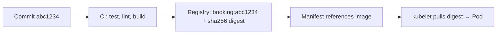

# CI and image delivery

*Stage 5 · Payload Integration*

**You will be able to:** answer "is commit X running?" by following four handoffs, and say why digests beat tags.

## Four handoffs



| Handoff | Proves | Does not prove |
|---|---|---|
| Commit | Intended source | That CI built *that* commit |
| CI build | Tests passed, image built | That the manifest uses it |
| Manifest | Intended artifact | That nodes pulled it |
| Pod | `imageID` actually running | That it is correct for passengers |

## Tags vs digests

| | Tag (`:v1.2.0`, `:latest`) | Digest (`@sha256:…`) |
|---|---|---|
| Mutable? | **Yes**: can be overwritten | No |
| Cache effect | `IfNotPresent` may run stale code | Exact bytes every node |
| Use | Human naming | Deploy by digest or immutable `sha-*` tag |

- Promote the **same artifact** through environments; do not rebuild per environment.

## Try it

```bash
kubectl get pod -l app=booking -n apollo-airlines-apps -o jsonpath='{.items[0].spec.containers[0].image}{"\n"}'
kubectl get pod -l app=booking -n apollo-airlines-apps -o jsonpath='{.items[0].status.containerStatuses[0].imageID}{"\n"}'
```

- The first is what was **asked**; the second is what is **running**.

## Check yourself

<details>
<summary>Two nodes show different behaviour for <code>booking:latest</code>. Why?</summary>

`latest` is mutable and `IfNotPresent` keeps whichever image each node cached first.
</details>
