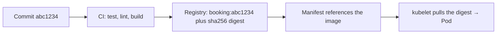

# CI and image delivery

*Stage 5 · Payload Integration*

**You will be able to:** answer "is commit X running in production?" by following four handoffs, and say why a digest is a stronger reference than a tag.

## The problem

Someone asks, "Is the fix from commit `abc1234` live?" To answer you must follow an unbroken chain from source control, through a build, into a registry, into a manifest, and finally into a Pod on a node. A break anywhere, such as a tag that was overwritten or a cached image on one node, makes "yes" untrustworthy.

## The idea in plain words

A parcel's **tracking chain**: sender → depot → courier → doorstep. You trust the delivery only if every handoff is recorded and each step handles the same parcel.

For software, the parcel is the container image and there are four handoffs:



| Handoff | What it proves | What it does not prove |
|---|---|---|
| Commit | The intended source | That CI built *that* commit |
| CI build | Tests passed and an image was built | That the manifest uses it |
| Manifest | The intended artifact | That nodes actually pulled it |
| Pod | The `imageID` actually running | That it behaves correctly for passengers |

## How it works: tags versus digests

A **tag** (`:v1.2.0`, `:latest`) is a human-friendly label that a registry lets you move: it can be overwritten to point at different content. A **digest** (`@sha256:…`) is a hash of the image's content, so it can only ever name one exact image.

| | Tag | Digest |
|---|---|---|
| Can change meaning? | **Yes** | No |
| Effect with caching | With `imagePullPolicy: IfNotPresent`, each node may keep whichever image it pulled first, so two nodes can run different code under one tag | Every node runs identical bytes |
| Best use | Naming for humans | Deploying, or immutable tags like `sha-abc1234` |

Two practices follow. **Promote the same artifact** from dev to staging to prod instead of rebuilding it for each environment, so what you tested is what ships. And record the commit in the image tag or labels so you can trace backwards.

## Apollo example

The deployed Pod holds both facts: what was *asked for* (`spec…image`) and what is *actually running* (`status…imageID`, which includes the digest).

## Try it

```bash
kubectl get pod -l app=booking -n apollo-airlines-apps -o jsonpath='{.items[0].spec.containers[0].image}{"\n"}'
kubectl get pod -l app=booking -n apollo-airlines-apps -o jsonpath='{.items[0].status.containerStatuses[0].imageID}{"\n"}'
```

- The first line is the request; the second is the proof.

## Common misconceptions

- **"`v1.2.0` is immutable."** Only if the registry enforces it.
- **"Same tag on every node means same code."** Not with cached images.
- **"CI passing means it is deployed."** CI only builds; the manifest and kubelet complete the chain.

## Check yourself

<details>
<summary>Two nodes show different behaviour for <code>booking:latest</code>. Why?</summary>

`latest` is mutable and `IfNotPresent` keeps whichever image each node cached first.
</details>

## Where this leads

Once the artifact and manifest are right, who applies them? GitOps makes a controller do it continuously.
