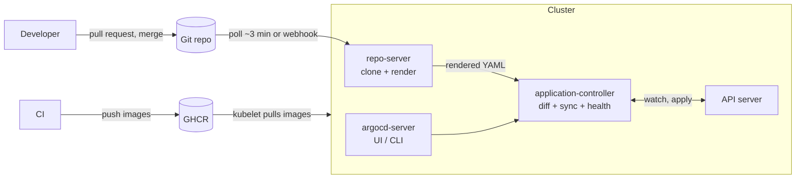

# GitOps and ownership

*Stage 5 · Payload Integration*

**You will be able to:**

- explain what GitOps adds on top of Helm and Kustomize, using the reconciliation loop you already know;
- read Apollo's `Application` and `AppProject` objects field by field;
- interpret Sync and Health together and choose the right next step;
- explain why Apollo's prod environment is synced by hand, and why it ignores `/spec/replicas`;
- spot two writers fighting over a field and decide which one should own it.

With Helm or Kustomize, someone runs a command. After it exits, nothing watches the cluster. Three things go wrong:

- **Drift goes unnoticed.** An engineer runs `kubectl scale deploy/booking --replicas=5` during an incident and forgets. The cluster now differs from every file in Git, and nobody knows until the next deploy silently undoes it, or doesn't.
- **There is no single place changes happen.** Some changes come from a laptop, some from a CI job, some from `kubectl edit`. Answering "who changed prod, and why?" means asking around.
- **Deploy credentials spread.** For CI to run `helm upgrade`, CI needs credentials that can change the cluster. Every system that holds them is a way in.

We want Git to be the one place where changes are proposed, reviewed and recorded, and the cluster to follow Git automatically.

## The controller loop, with Git as desired state

You have already met the idea. [The controller loop](../cluster/controller-loop) showed that every Kubernetes controller runs the same loop: observe desired state, observe actual state, act to close the gap. A ReplicaSet controller does it for a Pod count.

**GitOps applies that same loop to your whole application, with a Git repository as the desired state.** A controller running inside the cluster repeatedly:

1. fetches a branch or tag from Git;
2. renders the manifests found there, with Helm or Kustomize;
3. compares the result with the live objects;
4. if they differ, applies the difference (**sync**).

Apollo uses **Argo CD** as that controller. Flux is a popular alternative that works the same way.

Two terms:

- **Desired state:** what Git says, after rendering. Not what the last person typed.
- **Drift:** any difference between the live cluster and the desired state, whoever caused it.

### "I already have Helm, why Argo?"

They do different jobs, and Argo uses Helm or Kustomize rather than replacing them:

| | Helm, Kustomize | Argo CD |
|---|---|---|
| Where it runs | Your laptop or a CI job | Inside the cluster, permanently |
| Job | Turn templates or overlays into YAML | Fetch Git, render, compare, apply, report |
| After applying | Exits | Keeps looping |
| Notices drift | No | Yes, and can undo it (**self-heal**) |
| Removes objects deleted from Git | Helm yes, `kubectl apply -k` no | Yes, with `prune: true` |
| Who needs cluster credentials | Whoever runs the command | Only Argo CD, inside the cluster |

That last row is the *pull* model. CI pushes images to a registry and changes to Git; it never touches the cluster. Argo, already inside, pulls from both.

## How Argo CD works

### The parts of Argo CD

`install.sh` installs Argo CD v3.5.1 into the `argocd` namespace. Several components cooperate, much like the Kubernetes control plane:

| Component | Job |
|---|---|
| `argocd-repo-server` | Clones Git repositories and **renders** manifests (runs the Helm or Kustomize logic). Has no cluster write access |
| `argocd-application-controller` | The reconciler. Compares rendered manifests with live objects, works out Sync and Health, and applies changes |
| `argocd-server` | The API, web UI and `argocd` CLI endpoint. Where you look and click "Sync" |
| `argocd-redis` | A cache of rendered manifests and live state, so each comparison is cheap |
| `argocd-applicationset-controller`, `dex`, notifications | Generate many Applications from a template; single sign-on; alerts. Not used by Apollo yet |



### The Application: one environment, one object

An **Application** is a custom resource that says *what* to deploy (source), *where* (destination) and *how* to keep it in sync (policy). Apollo has one per environment. Here is [`applications/dev.yaml`](https://github.com/darshan-raul/Apollo11/blob/69113dcc80f77e32301d8ee7b9e73a67c923de96/stages/stage5/argocd/applications/dev.yaml), trimmed and annotated:

```yaml
apiVersion: argoproj.io/v1alpha1
kind: Application
metadata:
  name: apollo11-dev
  namespace: argocd
  finalizers:
    - resources-finalizer.argocd.argoproj.io   # deleting the Application deletes what it deployed
spec:
  project: apollo-airlines                     # the guard rails, see the AppProject below
  source:
    repoURL: https://github.com/darshan-raul/Apollo11.git
    targetRevision: HEAD                       # follow the default branch
    path: stages/stage5/helm/apollo11          # the same chart as Stage 5 Step 3
    helm:
      valueFiles: [values-dev.yaml]
      parameters:                              # like --set
        - {name: image.repository, value: ghcr.io/darshan-raul/apollo11}
        - {name: namespaces.apps,  value: apollo-airlines-dev-apps}
        - {name: namespaces.ui,    value: apollo-airlines-dev-ui}
        - {name: priorityClasses.enabled, value: "false"}   # cluster-scoped: owned by the platform layer
        - {name: gateway.createClass,     value: "false"}   # likewise
  destination:
    server: https://kubernetes.default.svc     # this same cluster
    namespace: apollo-airlines-dev-apps
  syncPolicy:
    automated:
      prune: true        # delete live objects that disappeared from Git
      selfHeal: true     # undo changes made outside Git
      allowEmpty: false  # refuse to sync if the render is empty (protects against deleting everything)
    syncOptions:
      - ServerSideApply=true      # let the API server merge and track field owners
      - ApplyOutOfSyncOnly=true   # only re-apply objects that actually differ
      - PruneLast=true            # delete removed objects after everything else is applied
    retry: {limit: 5, backoff: {duration: 5s, factor: 2, maxDuration: 3m}}
```

Things to notice:

- **Argo renders the chart itself.** The repo-server does what `helm template` does, with `values-dev.yaml` and the `parameters`. It then applies the result directly. There is no Helm release: `helm list -A` shows nothing, and Argo's own sync history replaces `helm history`.
- **Environments are namespaces.** All three Applications point at the same chart and the same cluster. Only the values file and the target namespaces differ (`apollo-airlines-{dev,staging,prod}-{apps,ui}`). That is cheap to run on a laptop, but one cluster failure takes every environment down. Stage 9 moves to separate infrastructure.
- **`allowEmpty: false` is a safety catch.** If a bad commit makes the chart render nothing, a `prune: true` sync would otherwise delete every object in dev.

### The AppProject: guard rails

An **AppProject** limits what its Applications may do. Apollo's [`projects/project.yaml`](https://github.com/darshan-raul/Apollo11/blob/69113dcc80f77e32301d8ee7b9e73a67c923de96/stages/stage5/argocd/projects/project.yaml):

```yaml
kind: AppProject
metadata: {name: apollo-airlines, namespace: argocd}
spec:
  sourceRepos:
    - https://github.com/darshan-raul/Apollo11.git    # no other repo may be deployed
  destinations:                                        # only these six namespaces, this cluster
    - {namespace: apollo-airlines-dev-apps,  server: https://kubernetes.default.svc}
    - {namespace: apollo-airlines-prod-apps, server: https://kubernetes.default.svc}
    # … the other four
  clusterResourceWhitelist: []                         # no cluster-scoped objects at all
  namespaceResourceWhitelist: [{group: '*', kind: '*'}]
```

`clusterResourceWhitelist: []` means no Application in this project can create a Namespace, CRD, ClusterRole, PriorityClass or GatewayClass. A mistake in one environment's values cannot change something every environment shares. Those shared, cluster-scoped objects live in [`platform/platform.yaml`](https://github.com/darshan-raul/Apollo11/blob/69113dcc80f77e32301d8ee7b9e73a67c923de96/stages/stage5/argocd/platform/platform.yaml), which `bootstrap.sh` applies once. That is why each Application sets `priorityClasses.enabled=false` and `gateway.createClass=false`: otherwise dev, staging and prod would all try to own the same PriorityClass, and the project would refuse it anyway.

### Detecting change: polling, watching, refreshing

Argo notices two different kinds of change in two different ways:

| Change | How Argo notices | How fast |
|---|---|---|
| A new commit in Git | Argo re-checks the repo on a timer (polling) | About every three minutes by default, or immediately if a Git webhook calls Argo |
| Someone edits a live object | The controller **watches** the API server, like any controller | Seconds |

A **refresh** asks Argo to compare again now, against the latest Git. A **hard refresh** also throws away cached renders, useful if a chart dependency changed without a new commit. Neither applies anything; only a **sync** does.

### Sync and Health are separate questions

Argo reports two independent statuses for every Application:

- **Sync status** answers "does the cluster match Git?" Values: `Synced`, `OutOfSync`, `Unknown`.
- **Health status** answers "is what's running working?" Values: `Healthy`, `Progressing`, `Degraded`, `Suspended`, `Missing`, `Unknown`.

Health comes from built-in rules per kind. A Deployment is `Progressing` until its rollout finishes and `Degraded` if it exceeds its progress deadline. A StatefulSet is `Healthy` when all replicas are updated and ready. A Service of type `LoadBalancer` is `Progressing` until it gets an address.

| Sync | Health | What it means | What to do |
|---|---|---|---|
| Synced | Healthy | Cluster matches Git, and it works | Nothing |
| Synced | Progressing | Matches Git; a rollout is still going | Wait, then look again |
| Synced | Degraded | Matches Git, but Pods are failing | Git was applied correctly. Debug the app: events, logs. The fix goes into Git |
| OutOfSync | Healthy | Works, but differs from Git | Find out why: someone changed the cluster, or Git has a new commit not yet synced |
| OutOfSync | Degraded | Differs and failing | Read the diff first. Fix Git, then sync |
| OutOfSync | Missing | Objects in Git do not exist yet | Sync (or check why a sync failed) |

The key habit: `Synced` says nothing about whether the app works, and `Healthy` says nothing about whether it matches Git. Read both.

### Self-heal in action

With `selfHeal: true`, drift is treated like any other difference:

1. You run `kubectl scale deploy/booking -n apollo-airlines-dev-apps --replicas=5`.
2. The controller sees the live Deployment change. Rendered Git says `replicas: 1`, so the Application becomes `OutOfSync`.
3. Because self-heal is on, Argo syncs: it applies `replicas: 1` again.
4. The ReplicaSet controller removes four Pods. The Application returns to `Synced`.

The only lasting way to change dev is to change `values-dev.yaml` in Git.

## Apollo example: three policies for three environments

| | dev | staging | prod |
|---|---|---|---|
| Values file | `values-dev.yaml` | `values-staging.yaml` | `values-prod.yaml` |
| Image | `ghcr.io/…/*:latest` | `ghcr.io/…/*:latest` | `ghcr.io/…/*:v1.0.0` |
| `targetRevision` | `HEAD` | `HEAD` | `main` (pin to a release tag once one exists) |
| `automated` sync | Yes, with `prune` and `selfHeal` | Yes, with `prune` and `selfHeal` | **No.** A person reviews the diff and syncs |
| Ignores `/spec/replicas` on Deployments | No | No | **Yes** |
| History kept | 10 syncs | 10 syncs | 50 syncs |

Why prod is different:

- **Manual sync is a review gate.** A merge to `main` makes prod `OutOfSync`, nothing more. Someone runs `argocd app diff apollo11-prod`, reads what will change, and then syncs. Slower, but nothing reaches prod unseen.
- **No self-heal is an incident-response choice.** On-call engineers can still `kubectl` their way out of an emergency without Argo undoing it a few seconds later. The Application then shows `OutOfSync`, which is a visible reminder to put the fix into Git.
- **Ignoring `replicas` hands that field to another owner.** In prod, the number of booking Pods may be changed by a human during an incident, or by a HorizontalPodAutoscaler from Stage 7. If Argo also enforced `replicas: 3` from Git, the two would fight. `ignoreDifferences` tells Argo to leave that one field out of its comparison.

**On kind, images come from GHCR.** The Applications set `image.repository` to `ghcr.io/darshan-raul/apollo11`, so the kind nodes need internet access to pull. If they cannot, `bootstrap.sh --image-repository apollo11` points the Applications at the locally built images instead.

**To see push-to-deploy, use a fork.** You cannot push to the upstream repo, so with the defaults you can only watch self-heal. Fork Apollo11, run `bootstrap.sh --repo-url https://github.com/<you>/Apollo11.git`, and commits to your fork drive the cluster.

## Who owns a field?

Every field of every live object should have exactly one writer. When two systems write the same field, each one's change looks like drift to the other, and the value flips back and forth.

| Conflict | Symptom | Resolution |
|---|---|---|
| HPA changes `replicas`; Argo restores the Git value | Pod count oscillates; Application flaps between Synced and OutOfSync | `ignoreDifferences` on `/spec/replicas` (Apollo's prod), or remove `replicas` from the manifest so the HPA owns it |
| A person runs `kubectl edit` in an environment with self-heal | The edit "doesn't stick" | Make the change in Git. That is the point |
| Helm (or `kubectl apply -k`) and Argo manage the same objects | Fields change back after every run; ownership errors | Tear down the Stage 5 Helm or Kustomize install before bootstrapping Argo |
| Two Applications render the same object | Both report `OutOfSync`, repeatedly | Move shared objects to one owner (Apollo's platform layer) |
| A controller writes into a field you also set (e.g. a webhook adds defaults) | Permanent `OutOfSync` on a field you never changed | `ignoreDifferences`, or let server-side diff account for defaults |

`ServerSideApply=true` helps here. The API server records a **field manager** for every field it stores, so you can see who last wrote what:

```bash
kubectl get deploy booking -n apollo-airlines-prod-apps --show-managed-fields -o yaml | grep -A1 'manager:'
```

## Try it

After running `install.sh` and `bootstrap.sh --sync` (Stage 5, Step 6):

```bash
kubectl get application -n argocd \
  -o custom-columns='NAME:.metadata.name,SYNC:.status.sync.status,HEALTH:.status.health.status,REVISION:.status.sync.revision'
```

- **Expected:** `apollo11-dev` and `apollo11-staging` `Synced`. `apollo11-prod` `OutOfSync` (or `Missing`) until someone syncs it by hand, because nothing syncs prod automatically.

Watch self-heal undo a manual change:

```bash
kubectl scale deploy/booking -n apollo-airlines-dev-apps --replicas=5
kubectl get application apollo11-dev -n argocd -w     # OutOfSync, then Synced
kubectl get deploy booking -n apollo-airlines-dev-apps -o jsonpath='{.spec.replicas}{"\n"}'   # 1
```

Make the same change in prod, and see that it stays but is reported:

```bash
kubectl scale deploy/booking -n apollo-airlines-prod-apps --replicas=5   # stays at 5: replicas is ignored
argocd app diff apollo11-prod                                           # replicas does not appear
```

## Common misconceptions

- **"Argo CD replaces Helm."** Argo runs Helm's *rendering* and applies the output itself. Charts and values stay exactly as they were; only the Helm release record goes away.
- **"`Synced` means healthy."** It means the cluster matches Git. A Git commit with a broken image tag is perfectly `Synced` and thoroughly `Degraded`.
- **"Self-heal means Argo fixes broken apps."** It restores what Git says. If Git says something broken, self-heal faithfully restores the broken thing.
- **"A quick `kubectl` fix is fine."** In dev and staging Argo reverts it within seconds. In prod it stays, but the Application shows `OutOfSync` until the fix is in Git.
- **"GitOps means CI deploys from Git."** In Apollo, CI never touches the cluster. The controller inside the cluster pulls. That is what keeps cluster credentials out of CI.
- **"Polling every three minutes means drift takes three minutes to fix."** Git changes are polled; live changes are watched. Drift is noticed in seconds.

## Check yourself

<details>
<summary>An Application is <code>Synced</code> but <code>Degraded</code>. Is Git wrong?</summary>

Not necessarily wrong as a description, but it describes something that does not work. The cluster matches Git; the workload is failing. Debug the app with events and logs, then fix the cause in Git.
</details>

<details>
<summary>Why does Apollo's AppProject deny all cluster-scoped resources, and where do the shared PriorityClasses come from instead?</summary>

So no single environment's Application can change something every environment shares. Shared cluster-scoped objects (namespaces, GatewayClass, PriorityClasses, MetalLB pool) are applied once from `platform/platform.yaml` by `bootstrap.sh`, and each Application disables them in its values.
</details>

<details>
<summary>You merge a change to booking's readiness probe in <code>values.yaml</code> on <code>main</code>. What happens in dev, and what happens in prod?</summary>

Dev picks it up on the next poll and syncs automatically. Prod (which also tracks `main`) only shows `OutOfSync`: it has no automated sync, so a person must review the diff and sync it.
</details>

<details>
<summary>Stage 7 adds an HPA to booking in dev. Dev's Application has <code>selfHeal: true</code> and does not ignore <code>replicas</code>. What goes wrong, and what are two fixes?</summary>

Argo and the HPA fight: the HPA scales up, Argo sees drift and restores the Git value, the HPA scales again. Fix it with `ignoreDifferences` on `/spec/replicas`, or by leaving `replicas` out of the rendered Deployment so the HPA is the only owner.
</details>

<details>
<summary>Why is <code>allowEmpty: false</code> important when <code>prune: true</code> is set?</summary>

If a bad commit made the chart render nothing, pruning would delete every object in the environment. `allowEmpty: false` makes Argo refuse a sync whose render is empty.
</details>

<details>
<summary><code>helm list -A</code> shows nothing, but Apollo is running under Argo. Why?</summary>

Argo renders the chart in its repo-server and applies the YAML itself. It never runs `helm install`, so no Helm release Secrets exist.
</details>

## Where this leads

Changes now flow from Git into each environment. The last questions are how the same release moves from dev to prod, and what "roll back" really undoes. That is [Promotion and rollback](./promotion-and-rollback).
