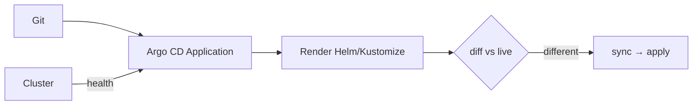

# GitOps and ownership

*Stage 5 · Payload Integration*

**You will be able to:** explain what Argo CD adds over Helm/Kustomize, read Sync × Health, and prevent two controllers fighting over a field.

## Key points

- **GitOps:** Git is the single source of truth; a controller continuously reconciles the cluster to it.
- A manual `kubectl set image` on a managed object is overwritten on the next reconcile.



## Helm/Kustomize vs Argo CD

| | Helm, Kustomize | Argo CD, Flux |
|---|---|---|
| Runs | Client side / CI | In the cluster |
| Job | Render YAML | Watch Git, diff, apply, revert drift |
| After apply | Exits | Keeps looping |
| Helm release? | Yes (Helm) | **No**: Argo renders and applies itself |

## Local lab

- `stages/stage5/argocd/applications/dev.yaml` tracks the **public upstream repo**. You need no push access to see self-heal: change the live cluster and watch Argo revert it.
- For a full push-to-deploy loop: fork the repo and set `GITOPS_REPO=https://github.com/<you>/Apollo11.git`.
- Dev/staging use automated sync + self-heal (~3 min); **prod is manual sync by design**.

## Sync × Health

| Status | Meaning | Action |
|---|---|---|
| Synced + Healthy | Matches Git, working | None |
| Synced + Degraded | Matches Git, Pods failing | Debug the app; Git is applied |
| OutOfSync + Healthy | Works but differs from Git | Merge/sync |
| OutOfSync + Degraded | Differs and failing | Fix Git, reconcile |

## Ownership conflicts

| Conflict | Resolution |
|---|---|
| HPA changes `replicas`, Argo reverts it | `ignoreDifferences` on `/spec/replicas` |
| Humans `kubectl edit` prod | Route changes through Git PRs; limit write RBAC |
| Two tools own one object | One owner per object |

## Try it

```bash
kubectl get application -n argocd
kubectl scale deploy/booking -n apollo-airlines-dev-apps --replicas=5   # then watch it revert
argocd app diff apollo11-dev
```

## Check yourself

<details>
<summary>An Application is <code>Synced</code> but <code>Degraded</code>. Is Git wrong?</summary>

Not necessarily. The cluster matches Git; the workload is failing. Debug the application.
</details>
