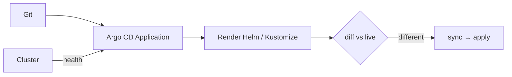

# GitOps and ownership

*Stage 5 · Payload Integration*

**You will be able to:** explain what Argo CD adds over Helm and Kustomize, read Sync and Health together, and stop two controllers fighting over a field.

## The problem

With Helm you run a command from a laptop or CI job. After it exits, nothing watches the cluster. If someone runs `kubectl scale` at midnight, the cluster now differs from what is in Git, and nobody knows. Also, who is allowed to change production, and how do you audit it? We want Git to be the single place changes are made and reviewed.

## The idea in plain words

You already know reconciliation from earlier chapters: a controller compares desired and observed state, then closes the gap. **GitOps applies the same loop to your whole application**, with **Git as the desired state**. A controller inside the cluster (**Argo CD**) repeatedly compares Git to the live cluster and corrects differences.



The loop: **watch** a Git branch, **render** manifests with Helm or Kustomize, **compare** with the live API, and **synchronise** (apply the difference, and revert hand edits when self-heal is on).

### "I already have Helm, why Argo?"

They do different jobs:

| | Helm, Kustomize | Argo CD, Flux |
|---|---|---|
| Runs | On your machine or in CI | Inside the cluster |
| Job | Render YAML | Watch Git, compare, apply, revert drift |
| After applying | Exits | Keeps looping |
| Helm release record? | Yes (Helm) | **No.** Argo renders the chart itself and applies the result |

## How it works in the local lab

Argo CD runs inside the kind cluster, so it cannot read files on your laptop, and you probably cannot push to the upstream repository. Apollo handles this two ways:

1. **See self-healing without pushing:** the `dev` Application tracks the public upstream repo. You change the live cluster yourself (`kubectl scale`) and watch Argo revert it to what Git says.
2. **Full push-to-deploy:** fork the repo and set `GITOPS_REPO=https://github.com/<you>/Apollo11.git`.

Dev and staging use automated sync with self-heal (drift is corrected within about three minutes). **Prod deliberately requires a manual sync**, so a human reviews the diff before anything changes: slower, but controlled.

## Sync and health are separate

Argo reports two independent statuses:

| Status | Meaning | Action |
|---|---|---|
| Synced + Healthy | Matches Git and works | None |
| Synced + Degraded | Matches Git, but Pods are failing | Debug the app; Git is correctly applied |
| OutOfSync + Healthy | Works, but differs from Git | Merge or sync |
| OutOfSync + Degraded | Differs and failing | Fix Git, then reconcile |

## Who owns a field?

If two systems write the same field, the cluster oscillates between them.

| Conflict | Resolution |
|---|---|
| The HPA changes `replicas`, Argo reverts it | Tell Argo `ignoreDifferences` on `/spec/replicas` |
| Humans `kubectl edit` production | Route changes through Git pull requests; limit write RBAC |
| Two tools manage one object | Give each object exactly one owner |

## Try it

```bash
kubectl get application -n argocd
kubectl scale deploy/booking -n apollo-airlines-dev-apps --replicas=5   # then watch Argo revert it
argocd app diff apollo11-dev
```

## Common misconceptions

- **"Argo CD replaces Helm."** It runs Helm's rendering; it does not create Helm releases.
- **"Synced means healthy."** It means the same as Git, nothing about whether it works.
- **"A manual `kubectl` fix is fine."** Argo will undo it, which is the point.

## Check yourself

<details>
<summary>An Application is <code>Synced</code> but <code>Degraded</code>. Is Git wrong?</summary>

Not necessarily. The cluster matches Git; the workload is failing. Debug the application.
</details>

## Where this leads

Once changes flow from Git, the last questions are promotion across environments and what rollback really does.
