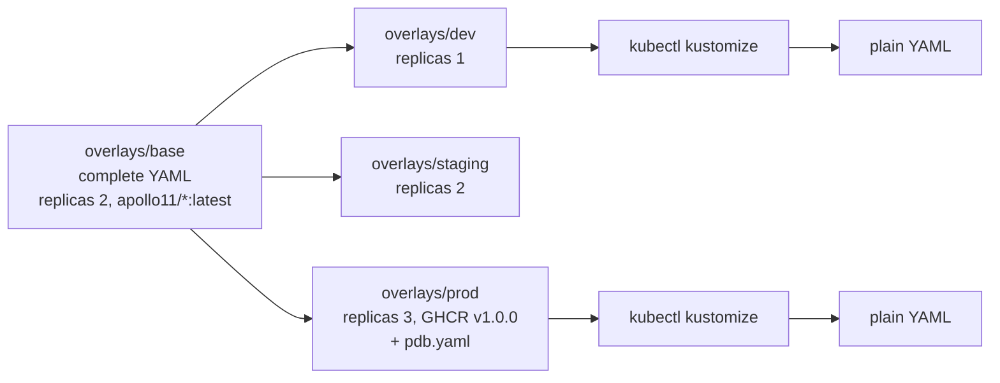

# Kustomize and overlays

*Stage 5 · Payload Integration*

**You will be able to:**

- read an overlay's `kustomization.yaml` and predict exactly what it changes in the base;
- write a strategic-merge patch for a field that has no built-in shortcut;
- explain why Apollo's labels use `includeSelectors: false`;
- choose between Kustomize and Helm for a job, and say why one object must never be managed by both.

[Rendering and Helm](./rendering-and-helm) solved environment drift with templates. That solution has costs:

- Templates are not valid YAML until rendered, so editors, linters and `kubectl apply` cannot read them directly.
- Every field you might want to change per environment must be turned into a value *in advance*. If the chart author never templated `memory`, you cannot change booking's memory in prod without editing the chart.
- Reading a template means reading a small programming language mixed into YAML.

Often the actual need is smaller: "the same manifests, but 3 replicas and a different image in prod". For that, plain YAML with a short list of edits is easier to read and review.

## Bases and overlays

Helm is a mail-merge. **Kustomize is tracked changes on a finished document.** You keep one complete, working set of manifests, the **base**. For each environment you keep a small **overlay** that lists the edits: set these replica counts, swap these images, add this label, apply this patch. Running Kustomize applies the edits and prints the result.

Two terms:

- **Base:** a directory with a `kustomization.yaml` and complete manifests. It can be applied on its own.
- **Overlay:** a directory whose `kustomization.yaml` points at a base (`resources: [../base]`) and lists changes to it. It can add new objects too.

The key difference from Helm: **nothing in the base has blanks.** The base is valid Kubernetes YAML you could `kubectl apply` today. The overlay only describes how this environment departs from it.



The tracked-changes analogy breaks in one place: Kustomize does not edit text. It parses every file into Kubernetes objects, changes fields on those objects, then prints them again. That is why it can find "the Deployment named booking" no matter where it sits in a file, and why comments in the base disappear from the output.

## How Kustomize builds the output

### Step 1: collect resources

Kustomize starts from the `resources:` list. An entry can be a YAML file or another directory with its own `kustomization.yaml`. Apollo's prod overlay lists both:

```yaml
# overlays/prod/kustomization.yaml (trimmed)
resources:
  - ../base        # everything the base produces
  - pdb.yaml       # two extra objects only prod has
```

### Step 2: apply the transformers

A **transformer** is a built-in edit that Kustomize applies to every matching object. You list them as fields in `kustomization.yaml`. These are the ones you will use most:

| Field | What it changes | Apollo uses it |
|---|---|---|
| `replicas:` | `spec.replicas` of the named Deployments or StatefulSets | dev, staging, prod |
| `images:` | The image name and/or tag in every container that uses a given image | dev, prod |
| `labels:` | Adds labels to metadata, and optionally to selectors and Pod templates | base and every overlay |
| `namespace:` | Sets `metadata.namespace` on every namespaced object | `base/ui` |
| `namePrefix:` / `nameSuffix:` | Renames every object and updates references to it | — |
| `configMapGenerator:` / `secretGenerator:` | Creates a ConfigMap or Secret from files or literals, with a content hash in its name | — |
| `patches:` | Anything else: a strategic-merge or JSON patch against chosen objects | — |

The `images:` transformer matches on the *image name*, not the container name. Apollo's prod overlay rewrites both the registry and the tag:

```yaml
# overlays/prod/kustomization.yaml (trimmed)
images:
  - name: apollo11/booking                            # find containers using this image…
    newName: ghcr.io/darshan-raul/apollo11/booking    # …change the name…
    newTag: v1.0.0                                    # …and the tag
```

The staging overlay has no `images:` block at all, so staging keeps the base's `apollo11/*:latest`.

### Step 3: patch anything else

When no transformer covers a field, you write a **patch**. Kustomize supports two kinds:

- **Strategic-merge patch:** a partial object that looks like the real one. Kustomize merges it in, field by field. Lists of containers are matched by `name`, so you only write the container you are changing.
- **JSON patch (RFC 6902):** a list of precise operations (`add`, `replace`, `remove`) at a path. More verbose, but it can do things a merge cannot, such as remove a single field.

Apollo does not need a patch today. Here is one you might add if booking needed more memory in prod only:

```yaml
# overlays/prod/kustomization.yaml (addition, not in the repo)
patches:
  - target: {kind: Deployment, name: booking}
    patch: |-
      apiVersion: apps/v1
      kind: Deployment
      metadata:
        name: booking
      spec:
        template:
          spec:
            containers:
              - name: booking              # matched by name, not by position
                resources:
                  requests: {memory: 512Mi}
                  limits:   {memory: 512Mi}
```

Rendered, booking keeps every other field from the base, including `cpu: 200m`, and only the memory changes:

```text
        resources:
          limits:
            cpu: 200m
            memory: 512Mi
          requests:
            cpu: 200m
            memory: 512Mi
```

### Step 4: print the result

`kubectl kustomize <dir>` (or the standalone `kustomize build <dir>`) prints the final YAML. `kubectl apply -k <dir>` renders and applies in one step. Kustomize itself never talks to the cluster.

### Why `includeSelectors: false`

Every Apollo overlay adds an `environment` label like this:

```yaml
labels:
  - includeSelectors: false
    pairs:
      environment: dev
```

The older `commonLabels:` field added labels to *selectors* as well as metadata. A Deployment's `spec.selector` is immutable, so adding a label to it on a live Deployment makes the API server reject the apply. A Service's selector would also change, and could stop matching existing Pods. `includeSelectors: false` restricts the label to metadata. In the rendered dev output, booking's metadata carries `environment: dev`, while its selector is still just `app: booking`.

The base goes one step further with `includeTemplates: true`, which also stamps its labels onto Pod templates. That is why rendered Pods show `app.kubernetes.io/managed-by: kustomize` instead of the base snapshot's original `Helm`.

### Generators and rollouts

`configMapGenerator` is worth knowing even though Apollo does not use it. It creates a ConfigMap named something like `booking-config-7g2h9k4m5f`, where the suffix is a hash of the contents, and rewrites every reference to it. When the contents change, the name changes, so the Deployment's Pod template changes and Kubernetes rolls the Pods. With a hand-written ConfigMap, editing it does not restart anything, and Pods keep the old environment variables until they happen to restart.

## Apollo example: a base that is a Helm render

Apollo's [`overlays/base/kustomization.yaml`](https://github.com/darshan-raul/Apollo11/blob/69113dcc80f77e32301d8ee7b9e73a67c923de96/stages/stage5/overlays/base/kustomization.yaml) has one resource, `generated.yaml`. That file is a committed render of the Helm chart: ConfigMaps, Secrets, 13 ServiceAccounts, 4 StatefulSets, 6 Deployments, Services, seed Jobs, Gateway resources and the MetalLB pool. That makes the two Stage 5 paths deploy identical objects; only the method differs.

The CI workflow's `lint` job includes a step meant to keep that snapshot honest. It re-renders the chart with the base's settings and runs `diff` against `generated.yaml`, so a template change that is not re-rendered into the base should fail the build. This is a common real-world pattern: render a third-party chart once, commit the output, and manage the environment differences with Kustomize, so reviewers see plain YAML diffs.

The three overlays, side by side:

| | dev | staging | prod |
|---|---|---|---|
| `resources` | `../base` | `../base` | `../base`, `pdb.yaml` |
| `replicas` | 1 each | 2 each | 3 each |
| `images` | `apollo11/*` → `:latest` | (none: inherits base) | → `ghcr.io/darshan-raul/apollo11/*:v1.0.0` |
| `labels` | `environment: dev` | `environment: staging` | `environment: prod` |
| Extra objects | — | — | `booking-pdb`, `frontend-pdb` (`minAvailable: 2`) |

`apply.sh --mode kustomize` still installs the Envoy Gateway and MetalLB bundles first, for the same reason as with Helm: their CRDs must exist before the base's `Gateway` and `IPAddressPool` objects can be accepted.

## Helm versus Kustomize

| | Helm | Kustomize |
|---|---|---|
| Model | Templates with blanks + values | Complete YAML + patches |
| Is the base valid YAML on its own? | No | Yes |
| Can change a field nobody planned for? | Only by editing the chart | Yes, with a patch |
| Logic (`if`, loops) | Yes | No |
| Built into `kubectl` | No | Yes (`kubectl apply -k`) |
| Release record, history, rollback | Yes (`helm history`, `helm rollback`) | No. Git history is the record |
| Deletes objects you removed? | Yes, on upgrade | No. `kubectl apply` leaves them unless you use `--prune` |
| Best for | Packages that strangers will install with their own settings | Environment differences in your own repo |

The deletion row catches people out. Remove `pdb.yaml` from the prod overlay and re-run `kubectl apply -k overlays/prod`: the two PodDisruptionBudgets stay in the cluster, because `apply` only creates and updates. Helm compares against its previous revision and deletes them. [Argo CD](./gitops-and-ownership) closes this gap for both tools with `prune: true`.

**One owner per object.** Apollo offers both paths, but `teardown.sh` must remove one before you run the other. If Helm and `kubectl apply -k` both manage booking, each one's next run overwrites the other's fields, and Helm refuses to adopt objects it did not create (`invalid ownership metadata`).

## Try it

From the Apollo11 repo root. No cluster needed for the first three commands.

```bash
kubectl kustomize stages/stage5/overlays/dev  > /tmp/dev.yaml
kubectl kustomize stages/stage5/overlays/prod > /tmp/prod.yaml
diff /tmp/dev.yaml /tmp/prod.yaml | grep -E '^[<>] +(replicas|image):' | sort | uniq -c
```

```text
      6 <   replicas: 1
      6 >   replicas: 3
      1 <         image: apollo11/booking:latest
      …
      1 >         image: ghcr.io/darshan-raul/apollo11/booking:v1.0.0
      …
```

- **Proves:** the overlay changes exactly six replica counts and six images; everything else is identical.

With the Kustomize path applied to a cluster:

```bash
kubectl diff -k stages/stage5/overlays/dev
```

- **Expected:** no output if the cluster matches the overlay. Change a replica count in `overlays/dev/kustomization.yaml` and run it again: you see the exact field that would change, before anything is applied.

## Common misconceptions

- **"Kustomize is a deployment tool."** `kubectl apply -k` makes it feel like one. Kustomize only renders; `kubectl apply` sends the result.
- **"Kustomize can roll back."** There is no release record to roll back to. Revert the overlay in Git and apply again.
- **"`commonLabels` is harmless."** It also edits selectors, which are immutable on Deployments. Use `labels:` with `includeSelectors: false` on objects that already exist.
- **"A patch replaces the whole container list."** A strategic-merge patch matches containers by `name` and merges into them. Only a JSON patch `replace` on the list would replace it.
- **"Removing a file from an overlay deletes the object."** Not with plain `kubectl apply`. The object stays until you delete it or use a tool that prunes.
- **"I can manage one object with Helm and Kustomize."** Each tool assumes it is the only writer. Pick one owner per object.

## Check yourself

<details>
<summary>The staging overlay has no <code>images:</code> block. Which image does staging's booking run?</summary>

`apollo11/booking:latest`, inherited unchanged from the base.
</details>

<details>
<summary>You need booking to have a different liveness probe period in prod only. No transformer covers it. What do you write?</summary>

A strategic-merge patch in `overlays/prod/kustomization.yaml` that targets the booking Deployment and sets `livenessProbe.periodSeconds` on the container named `booking`.
</details>

<details>
<summary>Why would adding a label with <code>commonLabels</code> to an already-running Deployment fail?</summary>

`commonLabels` also adds the label to `spec.selector`, and a Deployment's selector is immutable. The API server rejects the change.
</details>

<details>
<summary>You delete <code>pdb.yaml</code> from the prod overlay and run <code>kubectl apply -k overlays/prod</code>. Do the PDBs disappear?</summary>

No. `kubectl apply` creates and updates but does not delete objects that are missing from the input. Delete them yourself, or use a tool that prunes (Helm upgrade, Argo CD with `prune: true`).
</details>

<details>
<summary>Why can't Kustomize roll back the way Helm can?</summary>

It stores nothing in the cluster about previous applies. The only history is Git: revert the commit and apply again.
</details>

## Where this leads

Helm and Kustomize decide what the manifests say. They both reference images by name and tag. The next chapter, [CI and image delivery](./ci-and-image-delivery), follows those images back to the commit they were built from.
