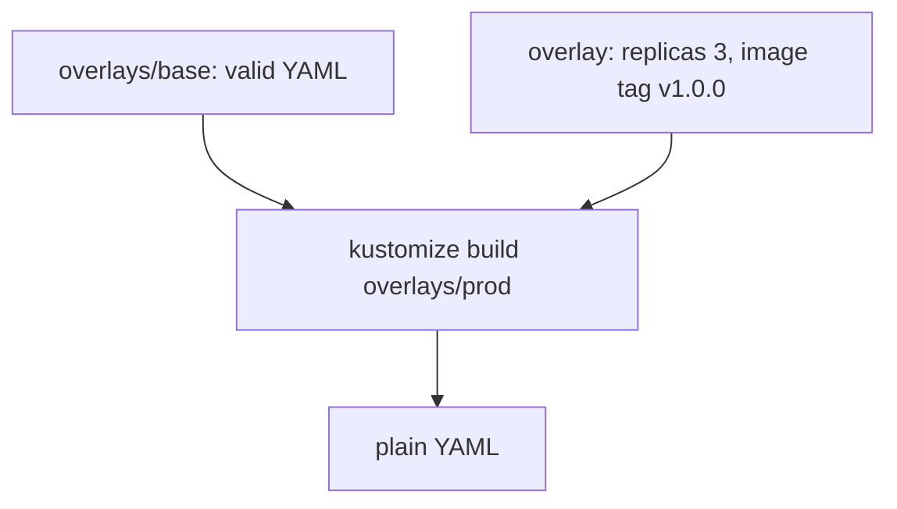

# Kustomize and overlays

*Stage 5 · Payload Integration*

**You will be able to:** read an overlay, and choose Helm or Kustomize for a job.

## Key points

- Kustomize has **no templates**. The **base** is valid, standalone Kubernetes YAML.
- An **overlay** applies transformations: replicas, image tags, labels, patches.
- Output is plain YAML for `kubectl apply -k`.



*Source: `stages/stage5/overlays/{base,dev,staging,prod}`*

| Overlay field | Effect |
|---|---|
| `resources: [../base]` | Start from the base |
| `replicas:` | Override counts per Deployment |
| `images:` | Override tag/name |
| `labels:` | Add labels (`includeSelectors: false` keeps selectors immutable-safe) |
| patches | Strategic-merge / JSON patches |

## Helm vs Kustomize

| | Helm | Kustomize |
|---|---|---|
| Model | Go templates + values | YAML patches |
| Base is runnable? | No | Yes |
| Logic (if/range) | Yes | No |
| Release record / rollback | Yes (`helm history`) | No; Git history |
| Learning curve | Higher | Lower |
| Best for | Packages others install | Environment differences in your own repo |

- Use **one** tool per environment: mixing owners on the same objects causes conflicts.

## Try it

```bash
kubectl kustomize stages/stage5/overlays/dev  > /tmp/dev.yaml
kubectl kustomize stages/stage5/overlays/prod > /tmp/prod.yaml
diff /tmp/dev.yaml /tmp/prod.yaml | grep -E 'replicas|image:'
kubectl diff -k stages/stage5/overlays/dev
```

## Check yourself

<details>
<summary>Why can't Kustomize roll back?</summary>

It stores nothing about previous applies; use Git revert and re-apply.
</details>
