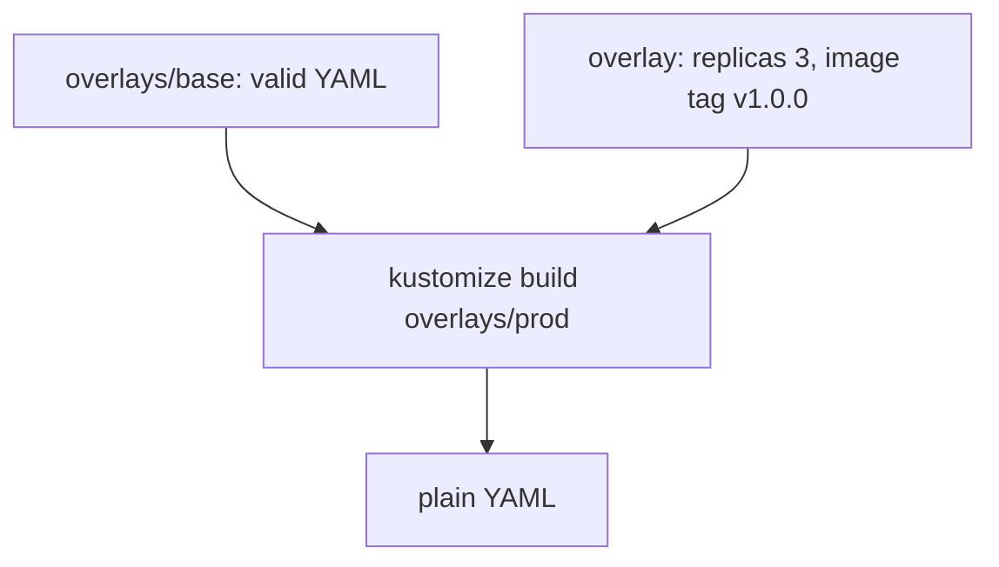

# Kustomize and overlays

*Stage 5 · Payload Integration*

**You will be able to:** read a Kustomize overlay, and choose between Helm and Kustomize for a given job.

## The problem

Helm's templates are not valid YAML on their own, and you must learn its template language. Sometimes you just want "the same manifests, but 3 replicas and a different image tag in prod", and you would rather work with plain, valid YAML throughout.

## The idea in plain words

Helm is a mail-merge; **Kustomize is tracked changes** on a finished document. You keep one complete, working set of manifests (the **base**), and for each environment you keep a small **overlay** that says what to change: replicas, image tags, labels, patches. The base is always runnable by itself.



The result is plain YAML you can apply with `kubectl apply -k`. `kubectl` has Kustomize built in.

## How it works

*Source: `stages/stage5/overlays/{base,dev,staging,prod}`*

An overlay's `kustomization.yaml` points at its base and lists transformations:

| Field | Effect |
|---|---|
| `resources: [../base]` | Start from the base |
| `replicas:` | Override replica counts for named Deployments |
| `images:` | Override image names or tags |
| `labels:` | Add labels (`includeSelectors: false` avoids touching immutable selectors) |
| patches | Strategic-merge or JSON patches for anything else |

There is no logic: no conditionals or loops. That is the trade-off.

## Helm versus Kustomize

| | Helm | Kustomize |
|---|---|---|
| Model | Go templates plus values | Patches on real YAML |
| Is the base runnable on its own? | No | Yes |
| Logic (if / range) | Yes | No |
| Release record and rollback | Yes (`helm history`) | No. Git history is the record |
| Learning curve | Higher | Lower |
| Best for | Packages others will install | Environment differences within your own repo |

Use **one** tool per environment. If two tools manage the same objects they fight over ownership.

## Try it

```bash
kubectl kustomize stages/stage5/overlays/dev  > /tmp/dev.yaml
kubectl kustomize stages/stage5/overlays/prod > /tmp/prod.yaml
diff /tmp/dev.yaml /tmp/prod.yaml | grep -E 'replicas|image:'
kubectl diff -k stages/stage5/overlays/dev
```

- The `diff` shows exactly what the overlay changes. `kubectl diff -k` compares the render with the live cluster.

## Common misconceptions

- **"Kustomize is a deployment tool."** It renders; `kubectl apply` deploys.
- **"Kustomize can roll back."** It stores nothing; revert in Git and re-apply.
- **"I can mix Helm and Kustomize on one object."** Don't; pick one owner.

## Check yourself

<details>
<summary>Why can't Kustomize roll back?</summary>

It stores nothing about previous applies; use Git revert and re-apply.
</details>

## Where this leads

Rendering produces manifests; the next question is where the *images* in those manifests come from, and how to trust them.
