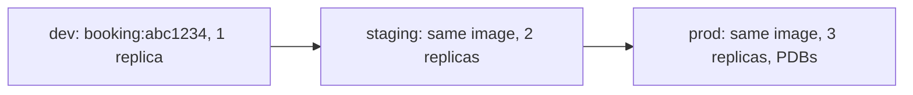
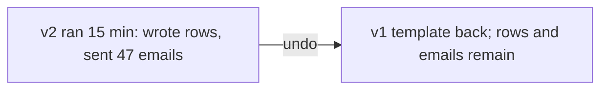

# Promotion and rollback

*Stage 5 · Payload Integration*

**You will be able to:** promote safely, and list what a rollback leaves behind.

## Promotion



| Identical across environments | Varies |
|---|---|
| Image (digest/immutable tag) | Replicas, resources, hostnames, certificates, PDBs |

- Do not rebuild per environment: you would be shipping an untested artifact.

## Rollback

| Changes | Does **not** change |
|---|---|
| `spec.template` restored | DB rows and schema changes |
| Previous ReplicaSet scaled up | Emails/SMS already sent |
| Endpoints point to old Pods | Charges and payments |
| (Helm) a new revision recording the old state | Consumed queue messages |



## Expand → deploy → verify → contract

1. **Expand:** add backwards-compatible schema (nullable columns).
2. **Deploy** the new version.
3. **Verify:** error budget and traffic healthy.
4. **Contract:** drop legacy fields only after stability.

## Same evidence ladder, in reverse

```bash
kubectl rollout status deploy/booking -n apollo-airlines-apps
kubectl get endpoints booking -n apollo-airlines-apps
helm history apollo11 -n apollo-airlines-apps
curl -s -o /dev/null -w '%{http_code}\n' http://localhost:30082/readyz
```

## Check yourself

<details>
<summary>Why is "rollback" not an undo button?</summary>

It restores desired objects only. State and external effects produced by the bad version persist.
</details>
