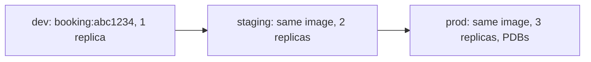
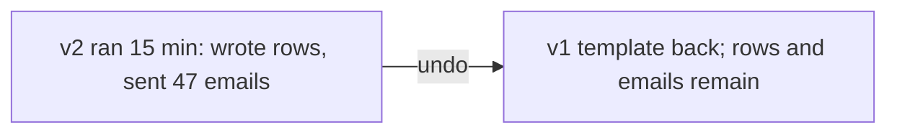

# Promotion and rollback

*Stage 5 · Payload Integration*

**You will be able to:** promote an artifact safely through environments, and list what a rollback leaves behind.

## The problem

You have tested a booking release in dev. How do you get it to production without introducing something that was not tested? And when production misbehaves, "just roll back" sounds simple, but the bad version already ran for fifteen minutes and wrote data and sent emails.

## The idea in plain words

**Promotion** is moving the *same* tested thing from one stage to the next, like a product passing quality gates. You do not rebuild it at each gate; you only change the surrounding settings (how many copies, what resources, what hostname).



| Stays identical | Varies by environment |
|---|---|
| The image (a digest or immutable tag) | Replicas, resources, hostnames, certificates, PDBs |

Rebuilding for each environment would mean the thing in production is not what you tested.

**Rollback** is pointing the environment back at an earlier description. It resets *what is declared*; it cannot reverse *what already happened*.

| Rollback changes | Rollback does not change |
|---|---|
| The Pod template (image, probes) is restored | Database rows and schema changes made by the bad version |
| The previous ReplicaSet scales up | Emails and SMS already sent |
| Endpoints point at old Pods | Payments and charges |
| (Helm) a new revision records the old state | Messages already consumed from a queue |



## How it works: making rollback safe

Because data persists across versions, the new and old code must both be able to live with the same database. The **expand → deploy → verify → contract** pattern achieves that:

1. **Expand:** add backwards-compatible schema (for example nullable columns).
2. **Deploy** the new version. Rolling back remains safe.
3. **Verify:** watch the error budget and traffic.
4. **Contract:** drop old fields only after the new version has proved stable.

## Check the same evidence ladder, in reverse

A rollback is a release, so verify it like one:

```bash
kubectl rollout status deploy/booking -n apollo-airlines-apps
kubectl get endpoints booking -n apollo-airlines-apps
helm history apollo11 -n apollo-airlines-apps
curl -s -o /dev/null -w '%{http_code}\n' http://localhost:30082/readyz
```

## Common misconceptions

- **"Rollback is an undo button."** It restores configuration, not consequences.
- **"Rebuild per environment is safer."** It ships untested bits.
- **"If it rolled back, the incident is over."** Check data and customers affected.

## Check yourself

<details>
<summary>Why is "rollback" not an undo button?</summary>

It restores desired objects only. State and external effects produced by the bad version persist.
</details>

## Where this leads

Changes ship and can be reversed. Stage 6 answers the next question: how do you know, from the outside, what the system is actually doing?
