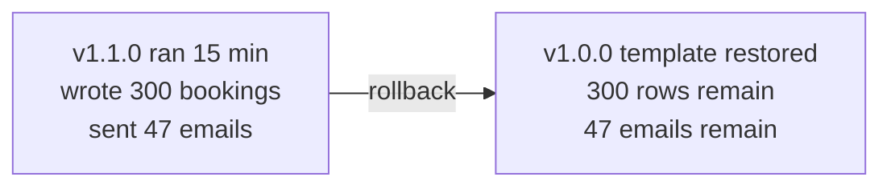

# Promotion and rollback

*Stage 5 · Payload Integration*

**You will be able to:**

- describe promotion as moving the *same* image through environments, and do it in Apollo with a reviewed Git change;
- pick the correct rollback tool (`kubectl rollout undo`, `helm rollback`, `argocd app rollback`, `git revert`) for how an environment is managed, and say what happens if you pick the wrong one;
- list what a rollback restores and what it cannot undo;
- plan a database change so that rolling back stays safe.

You have tested a booking release in dev. Two questions follow.

**How does it get to prod without picking up anything untested on the way?** If prod gets a fresh build, or a tag that moved since you tested it, "it worked in dev" proves nothing about prod.

**What do you do when prod misbehaves?** "Just roll back" sounds simple. But the bad version already ran for fifteen minutes. It wrote rows to `booking-db`, and it called the notification service, which sent emails. And in a GitOps environment, the obvious command, `kubectl rollout undo`, may be reverted by Argo CD a few seconds after you run it.

## Promote the same artifact

**Promotion** is moving the *same* tested thing to the next stage, like a part passing quality gates on a production line. Nobody rebuilds the part at each gate. Each gate only changes its surroundings: how many copies, how much memory, which hostname.

| Stays identical across environments | Varies by environment |
|---|---|
| The image, ideally by digest or an immutable tag | Replica counts, resource sizes, PDBs, hostnames, certificates, sync policy |

**Rollback** is pointing an environment back at an earlier *description* of itself. It resets what is declared: the Pod template, the image, the replica count. It cannot reverse what already happened while the bad version ran.

The production-line analogy stops where data begins. A recalled part leaves no trace on the line; a recalled release leaves rows, messages and charges behind.

## Promotion in practice

### Promotion in Apollo

Apollo's environments differ in their values file and Argo CD Application:

| | dev | staging | prod |
|---|---|---|---|
| Replicas per service | 1 | 2 | 3 |
| Image tag | `latest` | `latest` | `v1.0.0` |
| `imagePullPolicy` | `IfNotPresent` | `IfNotPresent` | `Always` |
| PodDisruptionBudgets | off | off | `minAvailable: 2` |
| Argo sync | automatic, self-heal | automatic, self-heal | manual |

Dev and staging follow the moving `latest` tag. That gives fast feedback: every merge to `main` produces a new `latest`, and both environments pick it up. It also means dev and staging are not pinned to anything. Prod is pinned to `v1.0.0`.

Promoting a release to prod is therefore a **change in Git**:

1. Merge the change to `main`. CI pushes `sha-abc1234` and `latest`; dev and staging sync to it automatically.
2. Test in staging.
3. Create the release tag. Pushing git tag `v1.1.0` makes CI push an image tagged `v1.1.0`, built from the same commit as `sha-abc1234`.
4. Open a pull request that changes the `image.tag` parameter in [`argocd/applications/prod.yaml`](https://github.com/darshan-raul/Apollo11/blob/69113dcc80f77e32301d8ee7b9e73a67c923de96/stages/stage5/argocd/applications/prod.yaml) from `v1.0.0` to `v1.1.0`. That parameter overrides `values-prod.yaml`, so it is the line that decides prod's tag. Reviewers see a one-line diff.
5. Merge, then re-apply the Application (`bash stages/stage5/argocd/scripts/bootstrap.sh`). Apollo's Application objects are applied with `kubectl`, not managed by Argo itself, so a change to them only takes effect when re-applied. `apollo11-prod` becomes `OutOfSync`.
6. Run `argocd app diff apollo11-prod`, check that only the six images changed, and sync.

Step 5 is a gap worth noticing. Many teams close it with the **app of apps** pattern: one parent Application whose source is the `applications/` folder, so merging a change to an Application in Git is enough.

Why go through Git instead of `argocd app set --helm-set image.tag=v1.1.0` or `helm upgrade --set`? Because those change the cluster's desired state *without changing Git*. The pull request is your audit record of who promoted what, when, and who approved it. A command typed into a terminal leaves no such record.

:::note[Stricter promotion]
Step 3 builds the `v1.1.0` image again from the same commit; it does not copy the exact bytes that staging ran. Stricter pipelines avoid even that: they promote by re-tagging the tested digest, or by deploying `image@sha256:…` directly, so prod runs byte-for-byte what staging tested. [CI and image delivery](./ci-and-image-delivery) explains why digests are the stronger reference.
:::

### Four ways to roll back, and when each one is right

The correct tool depends on **who owns the environment's desired state**. Roll back at that layer. Roll back below it, and the owner puts the bad version back.

| Tool | What it changes | Use it when | In an Argo self-heal environment |
|---|---|---|---|
| `kubectl rollout undo deploy/booking` | Makes the Deployment's previous ReplicaSet current again (see [Rollouts and rollback](../workloads/rollouts-and-rollback)) | Plain manifests applied by hand | **Reverted.** Argo sees drift and re-applies the bad template |
| `helm rollback apollo11 <rev>` | Re-applies an earlier release revision as a new revision | The environment is a Helm release (Stage 5 Helm path) | Not applicable: under Argo there is no Helm release |
| `argocd app rollback apollo11-prod <id>` | Syncs the Application to an earlier entry in its sync history | Emergency in an Argo environment **without** automated sync | **Refused.** Argo does not allow it while automated sync is on |
| `git revert <commit>` | Creates a new commit that undoes the bad one; Argo syncs it like any change | Any Git-managed environment. The normal GitOps rollback | Works: the revert *is* the new desired state |

Apply that to Apollo:

- **dev and staging** (automated, self-heal): `git revert` the commit. If you want the old image back immediately, that is what the revert does once Argo syncs, usually within minutes, or at once if you click Sync after merging.
- **prod** (manual sync): two routes.
  - Normal: revert the tag change in Git, review, sync.
  - Emergency: `argocd app rollback apollo11-prod <history-id>` to return to the last good sync right away. The Application then shows `OutOfSync`, because Git still says the bad version. Follow up with the Git revert so Git and the cluster agree again. This is why prod keeps 50 sync history entries rather than 10.

### Roll back or roll forward?

Rolling back is not always the fastest safe option.

| Roll back when | Roll forward (ship a fix) when |
|---|---|
| The bad version is clearly the cause, and the old one is known to work | The old version can no longer run, e.g. a schema change it does not understand |
| The fix is not obvious yet | The fix is small, obvious and already tested |
| User impact is ongoing | Rolling back would itself cause a second disruption |

A useful rule: decide within a fixed time, such as ten minutes. If the fix is not ready by then, roll back and investigate calmly.

### What a rollback cannot undo

| Rollback restores | Rollback leaves behind |
|---|---|
| The Pod template: image, env vars, probes, resources | Rows inserted or updated in `booking-db` by the bad version |
| Replica counts and other declared fields | Schema changes the bad version made |
| The previous ReplicaSet scaled back up; Services route to its Pods | Emails sent through the notification service |
| (Helm) a new revision recording the old state | Payments, external API calls, messages already consumed from a queue |



So after any rollback, ask two questions: **can the old version read what the new version wrote?** and **which users were affected while it ran?**

### Making rollback safe: expand, deploy, verify, contract

Code can be swapped in seconds; data cannot. Both the new version and the old one must therefore be able to work with the same database. The **expand → deploy → verify → contract** pattern makes that true:

1. **Expand.** Make a backwards-compatible schema change on its own: add a new nullable column or a new table. Old code ignores it.
2. **Deploy** the new version, which starts using the new column. Rolling back is still safe: the old code ignores the column.
3. **Verify.** Watch error rates and traffic until you trust the new version.
4. **Contract.** Only now remove what the old version needed, in a later release. From this point, rolling back past this release is no longer safe, and that is a deliberate decision.

The unsafe version does everything at once: rename `seat_number` to `seat` in the same release that starts using `seat`. If you roll back, the old code asks for `seat_number`, which no longer exists, and every booking request fails. The rollback has caused a second outage.

**An Apollo-specific trap.** Apollo creates its tables from init SQL mounted at `/docker-entrypoint-initdb.d`. Postgres runs those scripts only when its data directory is empty, on the very first start. Change `postgres.initScripts.booking` in `values.yaml` and redeploy, and the existing database is untouched, while rolling back does not remove anything either. Real schema changes need a migration step, usually a Job that runs before the new version starts. Stage 5 does not have one yet.

## Verify a rollback like a release

A rollback is a release, just towards an older version. Check it with the same [evidence ladder](../cluster/objects-and-api#what-each-kind-of-evidence-proves):

```bash
NS=apollo-airlines-apps
kubectl rollout status deploy/booking -n $NS                       # the rollout finished
kubectl get pods -n $NS -l app=booking \
  -o custom-columns='POD:.metadata.name,IMAGE:.spec.containers[0].image,READY:.status.containerStatuses[0].ready'
kubectl get endpointslices -n $NS -l kubernetes.io/service-name=booking   # traffic goes to the old Pods
helm history apollo11 -n $NS                                       # Helm path: a new "Rollback to N" revision
```

Then test a real request, such as a booking through the frontend. Finally check the data the bad version left behind.

## Try it

On the Stage 5 **Helm** path, without Argo CD. The [Stage 5 walkthrough](../../stage-5), Step 4, does this in full.

```bash
C=stages/stage5/helm/apollo11; NS=apollo-airlines-apps
helm upgrade apollo11 $C -n $NS --reuse-values --set image.tag=v999-missing   # a bad release
kubectl get pods -n $NS -l app=booking                 # new Pod in ImagePullBackOff; old ones still serve
helm history apollo11 -n $NS                           # note the last good revision number
helm rollback apollo11 <good-revision> -n $NS
helm history apollo11 -n $NS | tail -1                 # a new revision: "Rollback to <good-revision>"
```

- **Proves:** the bad image never replaced the working Pods, because a new Pod must become ready before old ones are removed. And a rollback adds history rather than erasing it.

Under **Argo CD**, see why the layer matters:

```bash
kubectl rollout undo deploy/booking -n apollo-airlines-dev-apps
kubectl get application apollo11-dev -n argocd -w      # OutOfSync, then Synced: Argo put Git's version back
```

## Common misconceptions

- **"Rollback is an undo button."** It feels like one because it is one command. It restores configuration, not consequences.
- **"Rebuilding per environment is safer."** It sounds cautious. It ships bits that were never tested.
- **"`kubectl rollout undo` always works."** Under GitOps self-heal, the GitOps controller restores the bad version, because Git still asks for it.
- **"If it rolled back, the incident is over."** The service is stable. The data written and users affected during the bad window still need checking.
- **"Promotion means copying the dev values to prod."** Only the image moves. Replicas, PDBs and sync policy are meant to differ.

## Check yourself

<details>
<summary>Why is "rollback" not an undo button?</summary>

It restores the declared objects only. Rows, emails, payments and other effects the bad version produced while it ran remain.
</details>

<details>
<summary>dev has automated sync with self-heal. You run <code>kubectl rollout undo deploy/booking</code>. What happens, and what should you have done?</summary>

Argo sees the live Deployment differ from Git and re-applies the bad template within seconds. Revert the commit in Git instead; Argo then syncs the old version.
</details>

<details>
<summary>Why does <code>argocd app rollback</code> work for <code>apollo11-prod</code> but not <code>apollo11-dev</code>?</summary>

Argo refuses a history rollback while automated sync is on, because the next automatic sync would immediately re-apply Git. Prod has no automated sync, so the rollback holds until someone syncs again.
</details>

<details>
<summary>After an emergency <code>argocd app rollback</code> in prod, the Application shows <code>OutOfSync</code>. Is that a problem?</summary>

It is expected, and it is a reminder. The cluster runs the old version while Git still asks for the bad one. Revert the change in Git so the two agree, otherwise the next manual sync redeploys the bad version.
</details>

<details>
<summary>A release renames a column and uses the new name. Why does rolling it back cause a second outage, and how would you have shipped it instead?</summary>

The old code queries the old column name, which no longer exists. Ship it in steps: add the new column (expand), deploy code that uses it, verify, and only later drop the old column (contract).
</details>

<details>
<summary>Why promote by changing <code>image.tag</code> in Git rather than running <code>argocd app set --helm-set image.tag=…</code>?</summary>

The Git change is reviewed and recorded: who promoted what, when, and who approved it. The CLI change alters the cluster's desired state with no record in Git, and the next person to read Git gets a false picture of prod.
</details>

## Where this leads

Changes now ship through Git, move between environments as the same artifact, and can be reversed. But "Healthy" in Argo still only means Pods are ready. [Stage 6](../../stage-6) answers the next question: how do you know, from the outside, what the system is actually doing?
