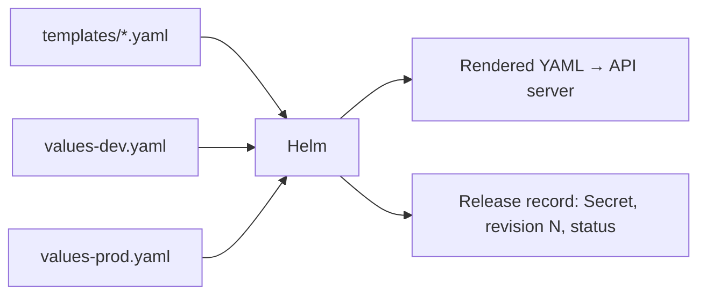

# Rendering and Helm

*Stage 5 · Payload Integration*

**You will be able to:** explain Helm's two outputs, read a template, and review a change by rendering it before you apply it.

## The problem

Apollo has three environments: dev (1 replica, `latest`), staging, prod (3 replicas, pinned version, PodDisruptionBudgets). If you keep three copies of every YAML file, they drift: someone fixes a probe in prod and forgets dev. Yet the files are 95% identical. We want one description of the shape and a small set of per-environment differences.

## The idea in plain words

A mail-merge letter: one template with blanks (`Dear {{name}}`), and a list of values that fills the blanks differently for each recipient.

A Helm **chart** is that. The **templates** are YAML with blanks; the **values files** (`values-dev.yaml`, `values-prod.yaml`) supply the data. Helm combines them into ordinary Kubernetes YAML. The cluster never knows Helm was involved: it just receives Deployments and Services.

Helm does two separate things, and learners often blur them:

| Operation | What happens | Touches the cluster? |
|---|---|---|
| **Render** (`helm template`) | Templates + values → YAML, on your machine | **No** |
| **Release** (`helm install` / `upgrade`) | Render, **apply** to the API, and store a **release record** | Yes |



The **release record** is a Secret named `sh.helm.release.v1.<name>.vN` in the release's namespace. It stores the chart version, the values and the rendered manifest for each revision. That history is what makes `helm rollback` and `helm history` possible.

## How it works: template mechanics

Templates use Go template syntax between `{{ }}`:

| Feature | Example | Purpose |
|---|---|---|
| Insert a value | `replicas: {{ $appCfg.replicas }}` | Fill a blank |
| Condition | `{{- if .Values.pdb.enabled }} … {{- end }}` | Include an object only in some environments |
| Indent helper | `{{- include "apollo11.labels" . \| nindent 4 }}` | Insert a block at the right depth (`nindent N` = newline + indent N spaces) |
| Trim whitespace | `{{-` / `-}}` | Stop stray blank lines breaking YAML |
| Merge order | `-f values.yaml -f values-prod.yaml` | **Later files win** |

YAML is whitespace-sensitive, which is why `nindent` and trimming matter so much. And because templates can produce surprising YAML, `values.schema.json` acts as a type check: a bad value such as `replicas: 0` is rejected when you render.

Apollo's two main environments differ in a handful of values:

| Dev | Prod |
|---|---|
| 1 replica, `:latest`, PDBs off | 3 replicas, `:v1.0.0`, PDBs on |

## The Apollo chart, file by file

```text
stages/stage5/helm/apollo11/
  Chart.yaml            # name and version of the chart
  values.yaml           # every default, for every environment
  values-dev.yaml       # only what dev changes (1 replica, PDBs off, …)
  values-staging.yaml
  values-prod.yaml      # pinned tag, more replicas, PDBs on
  values.schema.json    # types and limits for values; bad input fails at render
  templates/
    _helpers.tpl        # shared snippets (labels, names)
    config/             # ConfigMap, Secret, ServiceAccounts, PriorityClasses
    infra/              # Postgres and Redis StatefulSets
    jobs/               # seed Jobs
    apps/               # one template per backend service
    ui/                 # frontend
    gateway/            # Gateway, HTTPRoutes, MetalLB pool
    pdb/                # PodDisruptionBudgets
  bundles/              # vendored Envoy Gateway and MetalLB installs
```

- **Values are layered.** Helm starts from `values.yaml`, then applies `-f values-dev.yaml` on top, then any `--set`. The later source wins, key by key. An environment file therefore lists only its *differences*, which is what makes dev and prod easy to compare.
- **The templates are grouped by job**, mirroring the Stage 1–4 folders (`config/`, `infra/`, `apps/`…). The Kubernetes objects are the same ones; only the way they are written changed.
- **`bundles/` holds third-party installs.** Envoy Gateway and MetalLB bring their own CRDs. A Gateway object can't be created until the Gateway CRD exists, so `apply.sh` installs the bundles first and then installs the chart with the bundle switches off.
- **Upgrades need the same inputs as the install.** `helm upgrade` renders from the values you pass *now*. Leave out a `--set` that the install used, and the upgrade quietly changes that setting back. `--reuse-values` or an identical command line avoids it.

## The habit: render, review, then apply

Because the real output is just YAML, you can read exactly what you are about to send.

```bash
C=stages/stage5/helm/apollo11
helm lint $C
helm template apollo11 $C -f $C/values-dev.yaml | grep 'image:'
helm history apollo11 -n apollo-airlines-apps
helm rollback apollo11 <good-revision> -n apollo-airlines-apps
```

## Limits to remember

- A release status of `deployed` means the API accepted the objects, not that the app works. Use `--wait` or `--atomic` in automation.
- Rollback restores objects, not data written in the meantime.
- Helm exits after installing. It does not watch for drift; that is Argo CD's job (later chapters).

## Common misconceptions

- **"Helm deploys the app."** It renders YAML and hands it to the API; Kubernetes deploys.
- **"`helm template` checks my cluster."** It never contacts it.
- **"A chart is just a folder of YAML."** Its templates are not valid YAML on their own.

## Check yourself

<details>
<summary>Why <code>nindent</code> instead of <code>indent</code>?</summary>

`nindent` adds a leading newline so the block starts on its own line at the right depth.
</details>

<details>
<summary>Where does Helm keep the history that <code>helm rollback</code> uses?</summary>

In release Secrets in the release namespace.
</details>

## Where this leads

Helm is one way to vary YAML. The next chapter shows the opposite approach: start from real YAML and patch it.
