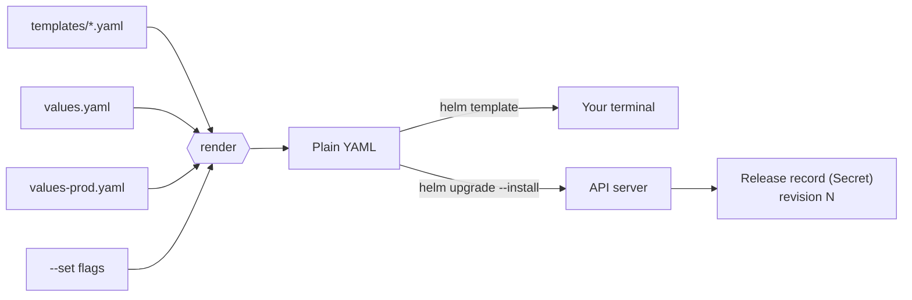

# Rendering and Helm

*Stage 5 · Payload Integration*

**You will be able to:**

- explain the two separate things Helm does (render, then release) and which of them touches the cluster;
- read an Apollo template line by line and predict the YAML it produces for dev and for prod;
- say which value wins when `values.yaml`, an environment file and `--set` disagree;
- review a change by rendering and diffing it before anything is applied, and recover a bad release from its history.

By the end of Stage 4, Apollo is about sixty Kubernetes objects spread over dozens of YAML files. Now it needs three environments:

| | dev | staging | prod |
|---|---|---|---|
| Replicas per service | 1 | 2 | 3 |
| Image | `apollo11/*:latest`, built on your machine | `apollo11/*:latest` | `ghcr.io/darshan-raul/apollo11/*:v1.0.0` |
| PodDisruptionBudgets | off | off | on, `minAvailable: 2` |

The obvious answer is three copies of every file. It fails within a week. Someone fixes a readiness probe in the prod copy and forgets dev; someone raises booking's memory in dev and it never reaches prod. The copies **drift**, and nobody can say which differences are deliberate.

What we want is one description of the *shape* of Apollo and a short, readable list of what differs per environment. Producing the final YAML from those two inputs is called **rendering**.

## Templates plus values

Think of a mail-merge letter: one template with blanks (`Dear {{name}}`) and a list of values that fills the blanks differently for each recipient.

A Helm **chart** works that way:

- **Templates** are Kubernetes YAML with blanks in them.
- **Values** are the data that fills the blanks: defaults in `values.yaml`, plus one small file per environment.
- **Rendering** combines the two into ordinary Kubernetes YAML.

The cluster never knows Helm was involved. The API server receives normal Deployments and Services, exactly as if you had written them by hand.

Helm also does a second, separate job, and learners often blur the two together:

| Operation | Command | What happens | Touches the cluster? |
|---|---|---|---|
| **Render** | `helm template` | Templates + values → YAML, printed on your machine | **No** |
| **Release** | `helm install`, `helm upgrade` | Render, send the YAML to the API server, and save a **release record** | Yes |

A **release** is one installed copy of a chart, with a name (`apollo11`) and a namespace. Every install, upgrade or rollback creates a new numbered **revision** of it.



The mail-merge analogy stops being useful at the release step. A letter is sent and forgotten; Helm keeps a record of what it sent so it can compare, upgrade and roll back.

## How Helm renders a release

### Step 1: values are layered, later wins

Helm builds one combined set of values before it looks at any template. Sources are merged in this order, and a later source wins key by key:

1. the chart's `values.yaml` (every default);
2. each `-f` file, in the order you list them;
3. each `--set` flag.

Apollo's `apply.sh` runs this command for `--env prod`:

```bash
helm upgrade --install apollo11 stages/stage5/helm/apollo11 \
  --namespace apollo-airlines-apps --create-namespace \
  --set image.tag="$TAG" \
  --set gateway.envoy.bundleInstall=false --set metallb.bundleInstall=false \
  -f stages/stage5/helm/apollo11/values-prod.yaml \
  --wait --wait-for-jobs --timeout 10m
```

So for prod the image tag is decided like this:

| Source | `image.tag` | `image.repository` | `apps.booking.replicas` |
|---|---|---|---|
| `values.yaml` | `latest` | `apollo11` | `2` |
| `values-prod.yaml` | `v1.0.0` | `ghcr.io/darshan-raul/apollo11` | `3` |
| `--set image.tag=$TAG` | whatever you pass | — | — |
| **Result** | **`$TAG`** | `ghcr.io/darshan-raul/apollo11` | `3` |

Two details matter in practice:

- **Maps merge, lists replace.** Setting `apps.booking.replicas` in `values-prod.yaml` leaves `apps.booking.port` and `apps.booking.tier` from `values.yaml` intact. A *list*, however, is replaced as a whole: an environment file that sets `serviceAccounts.apps: [identity]` would drop the other four.
- **Environment files list only differences.** [`values-prod.yaml`](https://github.com/darshan-raul/Apollo11/blob/69113dcc80f77e32301d8ee7b9e73a67c923de96/stages/stage5/helm/apollo11/values-prod.yaml) is about 40 lines, while `values.yaml` is several hundred. You can read the whole difference between dev and prod in a minute. That readability is the point of the layering.

### Step 2: the schema rejects bad values early

Before any template runs, Helm checks the combined values against [`values.schema.json`](https://github.com/darshan-raul/Apollo11/blob/69113dcc80f77e32301d8ee7b9e73a67c923de96/stages/stage5/helm/apollo11/values.schema.json). Apollo's schema requires, for example, an integer `replicas` of at least 1 and a `pullPolicy` that is one of `Always`, `IfNotPresent` or `Never`:

```bash
helm template apollo11 stages/stage5/helm/apollo11 --set apps.booking.replicas=0
```

```text
Error: values don't meet the specifications of the schema(s) in the following chart(s):
apollo11:
- apps.booking.replicas: Must be greater than or equal to 1
```

Without the schema, `replicas: 0` would render perfectly valid YAML and silently scale booking to nothing.

### Step 3: templates fill the blanks

Templates use Go template syntax between `{{ }}`. Everything outside the braces is copied through as-is. Here is the top of [`templates/apps/booking.yaml`](https://github.com/darshan-raul/Apollo11/blob/69113dcc80f77e32301d8ee7b9e73a67c923de96/stages/stage5/helm/apollo11/templates/apps/booking.yaml), annotated:

```yaml
{{- $name := "booking" -}}                          # a local variable
{{- $appCfg := index .Values.apps $name -}}         # = .Values.apps.booking
{{- $tier := index .Values.tiers $appCfg.tier -}}   # booking's tier is "flagship" → 200m / 256Mi
apiVersion: apps/v1
kind: Deployment
metadata:
  name: {{ $name }}
  namespace: {{ .Values.namespaces.apps }}
  labels:
    {{- include "apollo11.labels" . | nindent 4 }}  # shared label block from _helpers.tpl
spec:
  replicas: {{ $appCfg.replicas }}
  template:
    spec:
      {{- if $appCfg.priorityClassName }}          # only rendered if the value is set
      priorityClassName: {{ $appCfg.priorityClassName }}
      {{- end }}
      containers:
        - name: {{ $name }}
          image: "{{ .Values.image.repository }}/{{ $name }}:{{ .Values.image.tag }}"
          imagePullPolicy: {{ .Values.image.pullPolicy }}
          resources:
            requests: {cpu: {{ $tier.cpu }}, memory: {{ $tier.memory }}}
```

The pieces you will meet in every chart:

| Syntax | Example | What it does |
|---|---|---|
| Built-in objects | `.Values`, `.Release.Name`, `.Chart.AppVersion` | The merged values; the release name (`apollo11`); fields from `Chart.yaml` |
| Variable | `{{- $name := "booking" -}}` | Names a value for reuse in this file |
| Lookup | `index .Values.apps $name` | Reads a map entry whose key is in a variable |
| Condition | `{{- if .Values.pdb.enabled }} … {{- end }}` | Includes a block, or a whole object, only in some environments |
| Scope | `{{- with .Values.probes.startup }} … {{- end }}` | Inside the block, `.` means the startup probe values; skipped if they are empty |
| Named snippet | `include "apollo11.labels" .` | Inserts a block defined once in `_helpers.tpl` |
| Pipe | `… \| nindent 4`, `… \| quote` | Passes the result through a function: indent it, or wrap it in quotes |
| Whitespace trim | `{{-` and `-}}` | Removes the newline before or after the tag so no stray blank lines appear |

**Why `nindent` matters so much.** YAML structure *is* indentation. `include` returns the label block as text starting at column 0; `nindent 4` adds a newline and indents every line by four spaces so it sits under `labels:`. Get the number wrong and the YAML either fails to parse or, worse, parses with the labels attached to the wrong parent.

**Why selector labels are kept separate.** [`_helpers.tpl`](https://github.com/darshan-raul/Apollo11/blob/69113dcc80f77e32301d8ee7b9e73a67c923de96/stages/stage5/helm/apollo11/templates/_helpers.tpl) defines `apollo11.labels`, which includes `app.kubernetes.io/version`, and a separate, smaller selector set. A Deployment's `spec.selector` cannot be changed after creation. If the chart version were in the selector, the next upgrade would try to change it and the API server would reject the whole upgrade. So the templates use the full label set on metadata and only the stable `app: booking` in `matchLabels`.

The same template, rendered for two environments:

```bash
C=stages/stage5/helm/apollo11
helm template apollo11 $C -f $C/values-prod.yaml --show-only templates/apps/booking.yaml \
  | grep -E 'replicas:|image:|imagePullPolicy|priorityClassName'
```

```text
  replicas: 3
      priorityClassName: apollo-airlines-app-critical
          image: "ghcr.io/darshan-raul/apollo11/booking:v1.0.0"
          imagePullPolicy: Always
```

With `-f $C/values-dev.yaml` you get `replicas: 1`, `apollo11/booking:latest` and `IfNotPresent` from the same template.

### Step 4: a release is applied and recorded

`helm upgrade --install` renders exactly as above, then:

1. **Compares** three things: the manifest it applied last time (from the previous revision), the objects currently live in the cluster, and the new render. This *three-way merge* means a change someone made with `kubectl` is not blindly overwritten unless the chart also changes that field.
2. **Sends** the changes to the API server. Objects that were in the old render but not the new one are **deleted**.
3. **Waits**, if you asked it to. With `--wait`, Helm blocks until Deployments and StatefulSets are ready; `--wait-for-jobs` also waits for Jobs to complete. Without these, Helm reports success as soon as the API server *accepts* the objects.
4. **Records** the result as a new revision.

The record is a Secret in the release namespace named `sh.helm.release.v1.<release>.v<revision>`. It holds the chart, the values you supplied and the rendered manifest for that revision, compressed. Those Secrets are what `helm history`, `helm get` and `helm rollback` read:

```bash
helm history apollo11 -n apollo-airlines-apps
```

```text
# trimmed: the UPDATED column is omitted
REVISION  STATUS      CHART           APP VERSION  DESCRIPTION
1         superseded  apollo11-1.0.0  1.0.0        Install complete
2         superseded  apollo11-1.0.0  1.0.0        Upgrade complete
3         deployed    apollo11-1.0.0  1.0.0        Rollback to 1
```

A rollback does not rewind the counter: it creates a *new* revision whose content is a copy of the old one.

### Chart version versus app version

[`Chart.yaml`](https://github.com/darshan-raul/Apollo11/blob/69113dcc80f77e32301d8ee7b9e73a67c923de96/stages/stage5/helm/apollo11/Chart.yaml) carries two numbers that mean different things:

| Field | Apollo | Versions what | Bump it when |
|---|---|---|---|
| `version` | `1.0.0` | The **packaging**: templates, defaults, schema | A template or default changes |
| `appVersion` | `"1.0.0"` | The **application** the chart deploys (informational) | You ship new application code |

The image tag that actually runs comes from `image.tag`, not from `appVersion`. Apollo only copies `appVersion` into the `app.kubernetes.io/version` label.

## Apollo example: the chart, file by file

```text
stages/stage5/helm/apollo11/
  Chart.yaml            # name, chart version, app version
  values.yaml           # every default, for every environment
  values-dev.yaml       # 1 replica, :latest, PDBs off
  values-staging.yaml   # 2 replicas, :latest, PDBs off
  values-prod.yaml      # GHCR image :v1.0.0, pullPolicy Always, 3 replicas, PDBs on
  values.schema.json    # types and limits; bad input fails at render time
  templates/
    _helpers.tpl        # shared snippets: labels, selector labels, names
    config/             # ConfigMap, Secret, ServiceAccounts, PriorityClasses
    infra/              # Postgres and Redis StatefulSets
    jobs/               # idempotent seed Jobs
    apps/               # one template per backend service
    ui/                 # frontend
    gateway/            # GatewayClass, Gateway, HTTPRoutes, MetalLB pool
    pdb/                # PodDisruptionBudgets, wrapped in {{ if .Values.pdb.enabled }}
  bundles/              # vendored Envoy Gateway and MetalLB install manifests
```

- **The objects are Stage 4's objects.** Same Deployments, probes and resource tiers; Stage 5 only changes how they are written. In Stage 4 each Deployment had its own copy of the probe settings; now there is one `probes:` block in `values.yaml`.
- **Resource sizes are named tiers.** `apps.booking.tier: flagship` looks up `tiers.flagship` (200m CPU, 256Mi memory). Changing a tier changes every service that uses it.
- **CRDs go first, outside the release.** The chart creates `Gateway`, `HTTPRoute` and `IPAddressPool` objects. Those kinds only exist once Envoy Gateway's and MetalLB's CustomResourceDefinitions are installed, and the API server rejects an object of an unknown kind with `no matches for kind "Gateway"`. So `apply.sh` applies `bundles/` first, waits for the CRDs to register, then installs the chart with `bundleInstall=false`.
- **Namespaces are created outside the chart.** The chart writes into both `apollo-airlines-apps` and `apollo-airlines-ui` but deliberately owns neither. `apply.sh` creates them before `helm upgrade --install`, so `helm uninstall` removes Apollo's objects without deleting the namespaces themselves.

## The habit: render, review, then apply

Because the output is plain YAML, you can read exactly what an upgrade will send before sending it:

```bash
C=stages/stage5/helm/apollo11
helm lint $C -f $C/values-prod.yaml                         # structure + schema
diff <(helm template apollo11 $C -f $C/values-dev.yaml) \
     <(helm template apollo11 $C -f $C/values-prod.yaml)    # what prod changes
helm get values apollo11 -n apollo-airlines-apps            # what the live release was given
helm get manifest apollo11 -n apollo-airlines-apps          # what the live release rendered
```

The dev-to-prod diff for Apollo is short: `replicas: 1` becomes `3` six times, `IfNotPresent` becomes `Always`, the six app images move to GHCR at `v1.0.0`, and two PodDisruptionBudgets appear. If a diff shows anything else, that is a change you did not intend.

## Upgrades need the same inputs as the install

`helm upgrade` renders from the values you give it *now*:

| You run | Values used |
|---|---|
| `helm upgrade` with no `-f` or `--set` at all | The previous revision's values, reused |
| `helm upgrade -f values-prod.yaml` (any value given) | `values.yaml` + only what you passed now. Earlier `--set` flags are **dropped** |
| `helm upgrade --reuse-values --set image.tag=v1.0.1` | The previous revision's values, plus this change |
| `helm upgrade --reset-values …` | Chart defaults + what you passed, ignoring the previous revision |

The trap is the second row. Install with `--set image.tag=v1.0.0`, later upgrade with `-f values-prod.yaml` to change something else, and the tag silently falls back to whatever the file says. Scripts like `apply.sh` avoid this by always passing the full set of inputs.

## Limits to remember

- **`deployed` means "accepted", not "working".** Without `--wait`, Helm marks a revision `deployed` even if every Pod is in `ImagePullBackOff`. With `--wait`, it means the workloads became ready. Neither means a booking succeeds.
- **Rollback restores objects, not data.** Rows written and emails sent by the bad version stay. See [Promotion and rollback](./promotion-and-rollback).
- **Helm runs once and exits.** If someone changes the cluster afterwards, Helm does not notice until the next upgrade. Watching for drift is [Argo CD's job](./gitops-and-ownership).
- **The release record lives in the cluster.** Delete the namespace and the history goes with it. Git still has the chart and values, which is why GitOps treats Git, not the release Secrets, as the record.

## Try it

Run these from the Apollo11 repo root. None of them needs a cluster.

```bash
C=stages/stage5/helm/apollo11
helm template apollo11 $C -f $C/values-dev.yaml  | grep -c '^kind: PodDisruptionBudget'   # 0
helm template apollo11 $C -f $C/values-prod.yaml | grep -c '^kind: PodDisruptionBudget'   # 2
helm template apollo11 $C -f $C/values-prod.yaml --set image.tag=v1.0.1 \
  --show-only templates/apps/booking.yaml | grep 'image:'
```

```text
0
2
          image: "ghcr.io/darshan-raul/apollo11/booking:v1.0.1"
```

- **Proves:** an `if` around a whole file removes the objects entirely, and `--set` wins over `values-prod.yaml`, all without contacting the cluster.

## Common misconceptions

- **"Helm deploys the app."** It is tempting because `helm install` is the command you type. Helm renders YAML and submits it; the controllers, scheduler and kubelets described in [Architecture and the basic flow](../cluster/architecture) do the deploying.
- **"`helm template` checks my cluster."** It looks like a dry run. It never contacts the API server, so it cannot tell you a CRD is missing or a namespace does not exist. `helm install --dry-run=server` (Helm 3.13+) or `kubectl apply --dry-run=server` can.
- **"A chart is a folder of YAML."** The files end in `.yaml`, but templates are not valid YAML until rendered. `kubectl apply -f templates/` fails.
- **"Changing `appVersion` upgrades the app."** It only changes a label. The image that runs comes from `image.tag`.
- **"`helm rollback` goes back in time."** It applies an old manifest as a new revision. Data, external calls and anything outside the release are untouched.

## Check yourself

<details>
<summary><code>values.yaml</code> says <code>image.tag: latest</code>, <code>values-prod.yaml</code> says <code>v1.0.0</code>, and you pass <code>--set image.tag=v1.0.1</code>. Which tag renders?</summary>

`v1.0.1`. `--set` is applied last and wins key by key.
</details>

<details>
<summary>Why does Apollo's chart put <code>app.kubernetes.io/version</code> on metadata but not in <code>spec.selector.matchLabels</code>?</summary>

A Deployment's selector is immutable. If the version were in the selector, any upgrade that bumped the chart's version would try to change it and be rejected by the API server.
</details>

<details>
<summary>Why <code>nindent 4</code> rather than <code>indent 4</code> after <code>include "apollo11.labels" .</code>?</summary>

`nindent` adds a leading newline, so the block starts on its own line under `labels:` at the right depth. `indent` would put the first label on the same line as `labels:`, producing invalid YAML.
</details>

<details>
<summary>An install fails with <code>no matches for kind "Gateway"</code>. What is missing, and why can't the same chart simply include it?</summary>

The Gateway API CRDs. The API server must know a kind before it accepts objects of that kind. Helm sends the whole render in one go, so the Gateway object would arrive before the API server had registered the new kind. Apollo installs the CRD bundles first, then the chart.
</details>

<details>
<summary>Where does Helm keep the history that <code>helm rollback</code> uses, and what happens to it if you delete the namespace?</summary>

In Secrets named `sh.helm.release.v1.apollo11.vN` in the release namespace. Deleting the namespace deletes them, and with them the release history.
</details>

<details>
<summary>Helm says <code>STATUS: deployed</code> but booking Pods are in <code>ImagePullBackOff</code>. How is that possible?</summary>

Without `--wait`, Helm marks a revision `deployed` once the API server accepts the objects. Pulling the image happens later, on the node.
</details>

## Where this leads

Helm generates YAML from templates. The next chapter, [Kustomize and overlays](./kustomize-comparison), takes the opposite approach: start from complete, valid YAML and patch it per environment.
