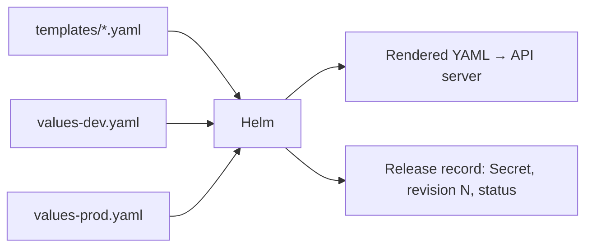

# Rendering and Helm

*Stage 5 · Payload Integration*

**You will be able to:** explain Helm's two outputs, read a template, and review a change by rendering it.

## Key points

- Duplicate YAML per environment drifts. A **chart** = shared templates + per-environment **values**.
- `helm template` renders on your machine and **never contacts the cluster**.
- `helm install` / `upgrade` render, **apply**, and store a **release record**.



| Output | What | Where |
|---|---|---|
| Rendered manifests | Ordinary Deployments, Services… (API server does not know Helm made them) | Cluster |
| Release record | Chart version, values, manifest per revision | Secret `sh.helm.release.v1.<name>.vN` in the release namespace |

## Template mechanics

| Feature | Example |
|---|---|
| Value | `replicas: {{ $appCfg.replicas }}` |
| Conditional | `{{- if .Values.pdb.enabled }} … {{- end }}` |
| Indent helper | `{{- include "apollo11.labels" . \| nindent 4 }}` (`nindent N` = newline + indent N spaces) |
| Whitespace trim | `{{-` / `-}}` removes surrounding whitespace |
| Merge order | `-f values.yaml -f values-prod.yaml`: **later wins** |

- `values.schema.json` rejects bad values at render time (`replicas: 0`, unknown `tier`).

## Apollo chart

| Dev | Prod |
|---|---|
| 1 replica, `:latest`, PDBs off | 3 replicas, `:v1.0.0`, PDBs on |

## Discipline: render, diff, then apply

```bash
C=stages/stage5/helm/apollo11
helm lint $C
helm template apollo11 $C -f $C/values-dev.yaml | grep 'image:'
helm history apollo11 -n apollo-airlines-apps
helm rollback apollo11 <good-revision> -n apollo-airlines-apps
```

## Gotchas

- `deployed` means applied, **not healthy**. Use `--wait`/`--atomic` in CI.
- Rollback restores objects, not data written meanwhile.
- Helm exits after install; it does not watch for drift (Argo CD does).

## Check yourself

<details>
<summary>Why <code>nindent</code> instead of <code>indent</code>?</summary>

`nindent` adds a leading newline so the block starts on its own line at the right depth.
</details>

<details>
<summary>Where does Helm keep the history that <code>helm rollback</code> uses?</summary>

In release Secrets in the release namespace.
</details>
