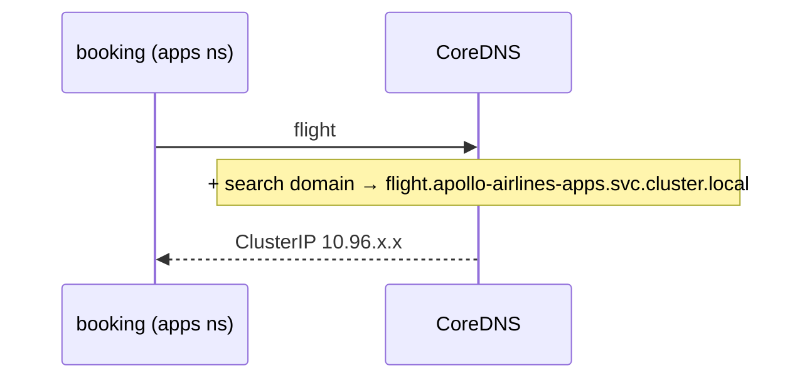

# DNS and namespaces

*Stage 2 · Guidance*

**You will be able to:** predict whether a name resolves from a given namespace, and pick the right form for a shared ConfigMap.

## Key points

- In-cluster names are resolved by **CoreDNS** (`10.96.0.10` in kind).
- The kubelet writes `/etc/resolv.conf` in every container:

```text
search apollo-airlines-apps.svc.cluster.local svc.cluster.local cluster.local
nameserver 10.96.0.10
options ndots:5
```

- A short name is tried against each search domain **in the caller's namespace first**.
- A successful lookup proves name → IP only, not that anything is ready.

## Name forms

| Name | Expands to | Works from |
|---|---|---|
| `flight` | `flight.<caller-ns>.svc.cluster.local` | Same namespace only |
| `flight.apollo-airlines-apps` | `….apollo-airlines-apps.svc.cluster.local` | Any namespace |
| `flight.apollo-airlines-apps.svc.cluster.local` | itself (FQDN) | Anywhere |



- From `apollo-airlines-ui`, bare `identity` becomes `identity.apollo-airlines-ui…` → `NXDOMAIN`.
- Shared ConfigMaps should use at least `<svc>.<namespace>`.

## What else a namespace scopes

| Scope | Examples |
|---|---|
| DNS search | Short-name lookup |
| RBAC | Who may act in which namespace |
| NetworkPolicy | Per-namespace rules |
| Quotas | ResourceQuota, LimitRange |

## Try it

```bash
kubectl exec -n apollo-airlines-apps deploy/booking -- cat /etc/resolv.conf
kubectl exec -n apollo-airlines-ui curl-client -- nslookup identity                         # NXDOMAIN
kubectl exec -n apollo-airlines-ui curl-client -- nslookup identity.apollo-airlines-apps    # ClusterIP
```

## Gotchas

- DNS succeeds but calls time out → check `kubectl get endpoints <svc>`.
- `ndots:5` means short names trigger several lookups; FQDNs avoid them.

## Check yourself

<details>
<summary>Why does <code>http://identity:8080</code> fail from the UI namespace?</summary>

The search domain adds the UI namespace; no `identity` Service exists there.
</details>
