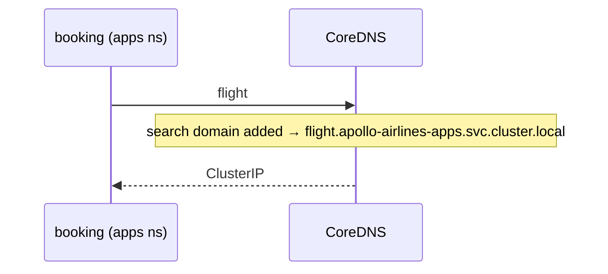

# DNS and namespaces

*Stage 2 · Guidance*

**You will be able to:** predict whether a name resolves from a given namespace, and choose the right form for a shared ConfigMap.

In Stage 1 everything lived in one namespace, and `http://identity:8080` just worked. In Stage 2 the frontend moves to a different namespace and the same short name suddenly fails with `NXDOMAIN`. The change feels arbitrary until you see how Kubernetes turns short names into full ones.

## Namespaces scope names

A **namespace** is a named folder inside the cluster that groups objects and scopes names. Two folders can each hold a Service called `identity`.

When you write the short name `identity`, you are like someone saying "call Sam from accounts" inside a building: it is understood in the context of **where you are standing**. Kubernetes DNS (**CoreDNS**) fills in the rest using your own namespace. From another building you must say the full name.

## How short names are resolved

The kubelet writes a resolver file into every container, listing **search domains** that get appended to short names:

```text
search apollo-airlines-apps.svc.cluster.local svc.cluster.local cluster.local
nameserver 10.96.0.10
options ndots:5
```

For a Pod in `apollo-airlines-apps` asking for `flight`:

1. The resolver tries `flight.apollo-airlines-apps.svc.cluster.local`.
2. CoreDNS finds the Service and returns its ClusterIP.
3. The caller connects to that IP.



For a Pod in `apollo-airlines-ui` asking for `identity`, the resolver tries `identity.apollo-airlines-ui.svc.cluster.local`. No such Service exists there, so the answer is `NXDOMAIN`.

| Name | Expands to | Works from |
|---|---|---|
| `identity` | `identity.<your-namespace>.svc.cluster.local` | The same namespace only |
| `identity.apollo-airlines-apps` | `….apollo-airlines-apps.svc.cluster.local` | Any namespace |
| `identity.apollo-airlines-apps.svc.cluster.local` | itself (the FQDN) | Anywhere |

Shared ConfigMaps should use at least `<service>.<namespace>`.

## What else a namespace scopes

| Scope | Example |
|---|---|
| DNS search | Short-name lookups |
| RBAC | Who may act in which namespace |
| NetworkPolicy | Per-namespace firewall rules |
| Quotas | ResourceQuota, LimitRange |

### What splitting Apollo into namespaces costs

Stage 2 moves the backend services and databases to `apollo-airlines-apps` and the frontend to `apollo-airlines-ui`. The DNS side is easy: callers use `booking.apollo-airlines-apps` instead of `booking`. The less obvious part is what *doesn't* cross the line:

- **ConfigMaps and Secrets are namespaced.** A Pod can only read them from its own namespace. So each namespace gets its own copy.
- **That is a feature.** The UI namespace's Secret holds only `JWT_SECRET`. The frontend never needs the database password, so it isn't there to leak.
- **Labels and selectors stop at the boundary too.** A Service only selects Pods in its own namespace.
- **Some things deliberately cross it,** and each needs explicit permission. A Gateway route attached from another namespace needs a `ReferenceGrant` ([Gateway API](./gateway-api)).

## Try it

```bash
kubectl exec -n apollo-airlines-apps deploy/booking -- cat /etc/resolv.conf
kubectl exec -n apollo-airlines-ui curl-client -- nslookup identity                       # NXDOMAIN
kubectl exec -n apollo-airlines-ui curl-client -- nslookup identity.apollo-airlines-apps  # ClusterIP
```

- Same name, different results depending on the caller's namespace.

## Common misconceptions

- **"A successful lookup means the service works."** It proves a name maps to an IP, nothing more. If calls then time out, check `kubectl get endpoints`.
- **"Namespaces are only for tidiness."** They change DNS behaviour and carry security boundaries.
- **"`ndots:5` is a typo."** It makes short names try the search list first, which costs extra lookups; FQDNs avoid that.

## Check yourself

<details>
<summary>Why does <code>http://identity:8080</code> fail from the UI namespace?</summary>

The search domain adds the UI namespace, and no `identity` Service exists there.
</details>

## Where this leads

Names work inside the cluster. Reaching Apollo from your laptop needs another layer: NodePort and LoadBalancer.
