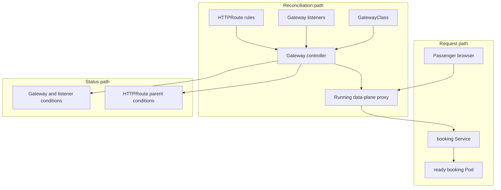
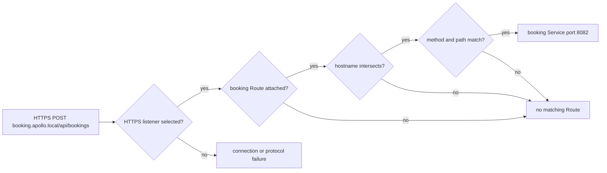
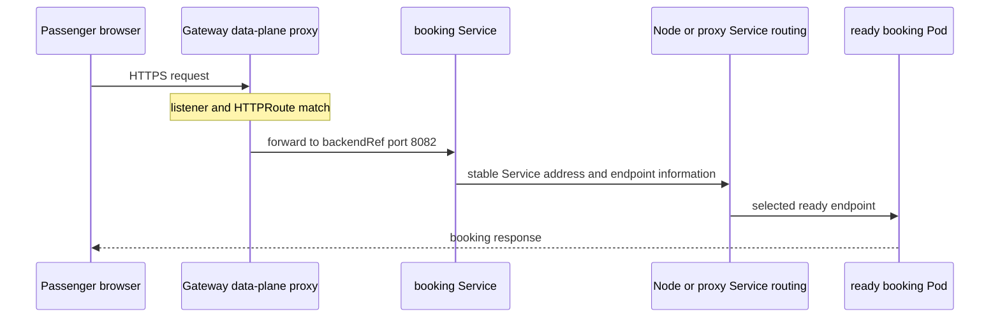
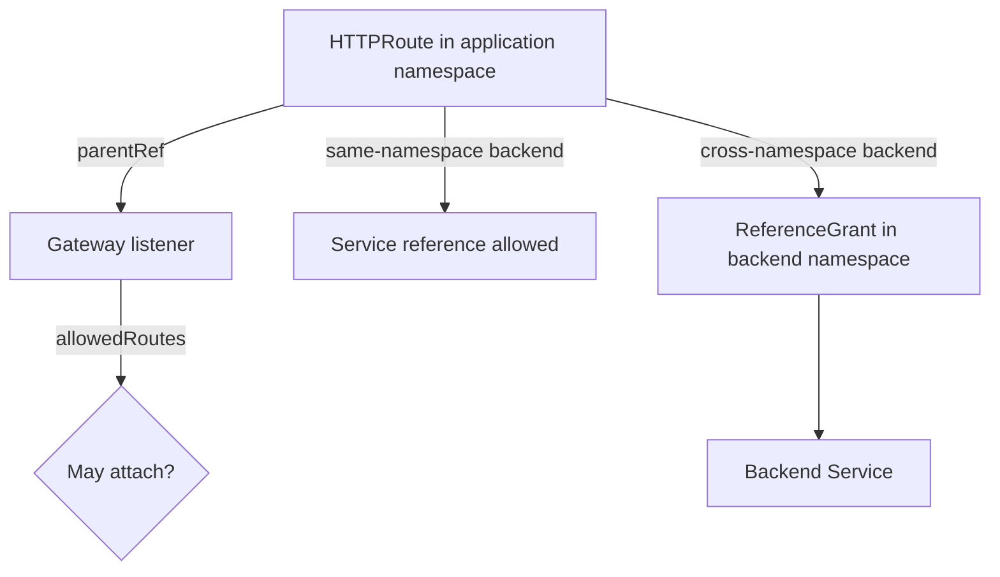

# Gateway API: infrastructure, routes, and permission

*Stage 2 · Guidance*

:::info[Advanced chapter]
First-time readers may complete the core Guidance model after
[Ingress and TLS](./ingress-and-tls). Return here for the full Stage 2 lab or
when you need separate infrastructure and application ownership, route status,
and cross-namespace permission.
:::

A passenger types `booking.apollo.local` into a browser. Apollo needs a running
edge proxy that accepts the connection, identifies the HTTP request, and sends
it toward booking. It also needs an API that lets a platform team own the edge
without forcing that team to write every application's routes.

Gateway API separates those responsibilities. It is a family of Kubernetes API
objects, not a proxy implementation:

- **GatewayClass** connects Gateways to an installed controller.
- **Gateway** asks for addresses and listeners.
- **HTTPRoute** describes HTTP matching and forwarding.
- **ReferenceGrant** permits selected cross-namespace references.

The controller and its data-plane proxy are the running participants that turn
those stored requests into behavior.

## Does Gateway API replace Ingress?

Gateway API is the successor to the Ingress API, but “replace” needs care.
Kubernetes still supports the stable Ingress API; it is frozen rather than
scheduled for removal. Existing Ingress objects and controllers do not
automatically become Gateway API objects.

Gateway API replaces the **configuration model** when a team chooses to migrate:

- one Ingress resource becomes an explicit Gateway entry point plus one or more
  Routes;
- implicit controller infrastructure becomes a GatewayClass and Gateway;
- application routing moves into HTTPRoute;
- many controller-specific annotations become typed fields, filters, or policy
  resources;
- infrastructure and application permissions become explicit.

It does not replace the whole request path. Services, EndpointSlices, Pods, DNS,
certificate Secrets, and a running controller/data plane are still required.

| Ingress model | Gateway API model | What changed? |
| --- | --- | --- |
| `IngressClass` | `GatewayClass` | Selects an implementation contract. |
| Controller-provided HTTP/HTTPS entry points | `Gateway.spec.listeners` | Ports, protocols, hostnames, and TLS are explicit. |
| `Ingress.spec.tls` | HTTPS listener `tls` | TLS moves to the infrastructure entry point. |
| `Ingress.spec.rules[].host` | `HTTPRoute.spec.hostnames` | Application hostname matching lives with the Route. |
| `Ingress` path and backend | HTTPRoute match and `backendRefs` | Routing becomes a separate application-owned object. |
| Controller annotations | Typed filters, policy attachment, or implementation extension | Portable features become structured; non-portable features still need review. |
| `ingressClassName` | HTTPRoute `parentRefs` | A Route attaches to a concrete Gateway, optionally one listener. |
| Ingress default backend | Explicit catch-all HTTPRoute rule | Gateway API has no direct default-backend field. |

The important change is not merely new YAML names. Ingress combines entry-point
and application-routing concerns in one resource. Gateway API lets a platform
team own the Gateway and listeners while application teams own HTTPRoutes that
attach under controlled rules.

### The same Apollo route in both APIs

Apollo's Traefik substage exposes booking with an Ingress shaped like this:

```yaml title="Ingress: combined edge and route configuration"
apiVersion: networking.k8s.io/v1
kind: Ingress
metadata:
  name: booking
  namespace: apollo-airlines-apps
spec:
  ingressClassName: traefik
  tls:
    - hosts: [booking.apollo.local]
      secretName: apollo-tls-secret
  rules:
    - host: booking.apollo.local
      http:
        paths:
          - path: /
            pathType: Prefix
            backend:
              service:
                name: booking
                port:
                  number: 8082
```

In Gateway API, the entry point and route are deliberately separate. The
platform-owned Gateway carries the listener and certificate:

```yaml title="Gateway: shared HTTPS entry point"
apiVersion: gateway.networking.k8s.io/v1
kind: Gateway
metadata:
  name: apollo-gateway
  namespace: apollo-gateway
spec:
  gatewayClassName: apollo-envoy
  listeners:
    - name: https
      protocol: HTTPS
      port: 443
      hostname: "*.apollo.local"
      tls:
        mode: Terminate
        certificateRefs:
          - kind: Secret
            name: apollo-tls-secret
      allowedRoutes:
        namespaces:
          from: Selector
          selector:
            matchLabels:
              gateway-access: apollo
```

The application-owned HTTPRoute carries booking's hostname, path, and backend:

```yaml title="HTTPRoute: booking routing rule"
apiVersion: gateway.networking.k8s.io/v1
kind: HTTPRoute
metadata:
  name: booking
  namespace: apollo-airlines-apps
spec:
  parentRefs:
    - name: apollo-gateway
      namespace: apollo-gateway
      sectionName: https
  hostnames:
    - booking.apollo.local
  rules:
    - matches:
        - path:
            type: PathPrefix
            value: /
      backendRefs:
        - name: booking
          port: 8082
```

The passenger-visible intention is the same: HTTPS requests for
`booking.apollo.local` with a `/` path prefix reach the booking Service. The
ownership and reconciliation boundaries are more explicit.

### An annotation is a migration question, not text to copy

Ingress implementations commonly use annotations for redirects, rewrites,
timeouts, authentication, traffic splitting, and other behavior. During
migration, inventory every annotation and classify it:

1. **Standard Gateway API field or filter:** translate it to typed configuration,
   such as `RequestRedirect` for an HTTP-to-HTTPS redirect.
2. **Implementation policy or extension:** use the chosen controller's documented
   policy resource or extension reference.
3. **No supported equivalent:** redesign the behavior or keep that route on the
   old controller until a safe replacement exists.

Do not copy an Ingress annotation onto an HTTPRoute and assume the Gateway
controller understands it. Gateway API intentionally discourages annotations as
its extension mechanism.

## Migrate Apollo without a flag day

Ingress and Gateway API can coexist. Their controllers watch different API
objects and can expose different addresses, which allows Apollo to validate the
new path before moving passenger traffic.

```mermaid
flowchart LR
  Inventory[Inventory Ingress rules, TLS, and annotations] --> Install[Install Gateway API CRDs and controller]
  Install --> Parallel[Create Gateway on a separate test address]
  Parallel --> Convert[Create equivalent HTTPRoutes]
  Convert --> Status[Verify Accepted, Programmed, and ResolvedRefs]
  Status --> Compare[Send the same Apollo requests through both paths]
  Compare --> Cutover[Move DNS or host mapping to Gateway address]
  Cutover --> Observe[Observe errors, latency, TLS, and backends]
  Observe --> Retire[Remove old Ingress only after rollback window]
```



*Diagram NW-13 — Apollo can run Traefik Ingress and Envoy Gateway in parallel,
compare behavior, cut traffic over, and retain a rollback window.*

A practical migration sequence is:

1. Record every Ingress host, path, TLS Secret, class, annotation, and expected
   response—including unmatched requests.
2. Choose a Gateway API implementation and confirm that it supports the required
   core and extended features.
3. Install its CRDs and controller without removing the Ingress controller.
4. Create a Gateway with a separate test address or hostname.
5. Convert routing rules into HTTPRoutes and translate annotations deliberately.
6. Inspect Gateway and Route status before sending traffic.
7. Replay representative requests against both addresses and compare status
   codes, redirects, headers, certificates, and selected backends.
8. Change DNS or the local hosts mapping to direct traffic to the Gateway.
9. Observe passenger behavior and retain the old path for an agreed rollback
   interval.
10. Remove the Ingress resources and controller only after no required behavior
    depends on them.

Automatic tools such as `ingress2gateway` can produce a conversion starting
point. Generated objects still require review because implementation-specific
annotations and live cutover behavior cannot be inferred safely in every case.

## Begin with three paths

Gateway troubleshooting becomes easier when three paths remain separate:

1. **Reconciliation path:** controller watches objects and programs a proxy.
2. **Request path:** browser sends traffic through the proxy and Service routing.
3. **Status path:** controller reports what it accepted, resolved, and programmed.



*Diagram NW-09 — stored objects configure a running proxy, traffic crosses the
proxy and Service path, and status reports reconciliation separately.*

## GatewayClass selects an implementation

A **GatewayClass** is cluster-scoped. Its `controllerName` identifies the
controller responsible for Gateways that reference the class. Installing the
Gateway API custom resource definitions creates the object types, but does not
install a controller or proxy.

This **conceptual example** shows the relationship:

```yaml
apiVersion: gateway.networking.k8s.io/v1
kind: GatewayClass
metadata:
  name: apollo-envoy
spec:
  controllerName: gateway.envoyproxy.io/gatewayclass-controller
```

The controller watches GatewayClasses with the controller name it implements.
An `Accepted=True` condition on the class means the controller has accepted
responsibility for it. It does not yet mean an Apollo listener or address exists.

A cluster can contain several GatewayClasses backed by different controllers or
configurations. The class is therefore a choice of implementation and operating
contract, not merely a label.

## Gateway asks for an address and listeners

A **Gateway** references a GatewayClass and declares listeners. A listener is a
distinct network entry point with a name, port, protocol, optional hostname, TLS
configuration, and rules governing which Routes may attach.

```yaml
apiVersion: gateway.networking.k8s.io/v1
kind: Gateway
metadata:
  name: apollo-gateway
  namespace: apollo-gateway
spec:
  gatewayClassName: apollo-envoy
  listeners:
    - name: https
      protocol: HTTPS
      port: 443
      hostname: "*.apollo.local"
      tls:
        mode: Terminate
        certificateRefs:
          - kind: Secret
            name: apollo-local-tls
      allowedRoutes:
        namespaces:
          from: Selector
          selector:
            matchLabels:
              gateway-access: apollo
```

Read this from the outside inward:

1. The controller for `apollo-envoy` owns reconciliation.
2. The Gateway asks for an HTTPS listener on port 443.
3. Only hostnames intersecting `*.apollo.local` can use this listener.
4. The proxy terminates TLS with the referenced certificate.
5. Only Routes from labelled namespaces may attach.

The implementation decides how to realize the Gateway. It might create a new
proxy Deployment, configure shared infrastructure, provision a cloud load
balancer, or program another data plane. The API does not require one deployment
model.

## A connection selects one listener

Listeners are not fallback rules. Incoming traffic selects one listener from
the Gateway's address, port, protocol, and hostname information. Route matching
happens only among Routes attached to that listener.

If a request selects a listener but no attached Route matches its hostname and
HTTP properties, the proxy does not try another listener as a second chance.
This makes listener boundaries useful for ownership and security: configuration
attached to one listener cannot unexpectedly catch traffic rejected by another.

Listener status deserves its own inspection. A Gateway can be broadly accepted
while one listener reports a conflict, an invalid certificate reference, or no
attached Routes.

## HTTPRoute negotiates attachment

An **HTTPRoute** describes HTTP behavior. Its `parentRefs` identifies the
Gateway—and optionally a specific listener name—to which it wants to attach.
The relevant listener must also permit that Route's namespace and kind.

Both sides therefore participate:

- the Route says “I want to use this Gateway listener”;
- the listener says “Routes like this may attach here.”

```yaml
apiVersion: gateway.networking.k8s.io/v1
kind: HTTPRoute
metadata:
  name: booking
  namespace: apollo-airlines-apps
spec:
  parentRefs:
    - name: apollo-gateway
      namespace: apollo-gateway
      sectionName: https
  hostnames:
    - booking.apollo.local
  rules:
    - matches:
        - path:
            type: PathPrefix
            value: /api/bookings
          method: POST
      backendRefs:
        - name: booking
          port: 8082
```

`sectionName: https` selects the listener named `https`. The listener's wildcard
hostname and the Route's exact hostname overlap, so that hostname is eligible.
The namespace must also satisfy `allowedRoutes`.

If the Route omits `sectionName`, it attempts to attach to every compatible
listener on the referenced Gateway. Being explicit is useful when listeners
have different owners, certificates, or policies.

## Match an HTTP request in layers

After listener selection and Route attachment, the proxy evaluates HTTPRoute
configuration. Keep the layers in order:

1. The request's host must be within the listener and Route hostname
   intersection.
2. A rule's matches can inspect path, method, headers, or query parameters.
3. Filters can modify a request or response, redirect, or produce another
   supported action.
4. Backend references identify where a matching request should be sent.

Within one match, the specified conditions are combined: the example above
requires both `POST` and the `/api/bookings` path prefix. Multiple matches in a
rule offer alternative ways for that rule to match.



*Diagram NW-10 — listener selection, attachment, hostname intersection, and HTTP
matching are separate gates before forwarding.*

### When Routes overlap

Several HTTPRoutes may attach to one listener. Only one rule ultimately handles
a request. Gateway API defines conflict-resolution precedence so behavior does
not depend on arbitrary controller order. More specific hostname and match
criteria win before creation time and lexical ordering are used as tie-breakers.

Avoid designing Apollo around subtle tie-breaks. Prefer non-overlapping ownership
and inspect status whenever two teams could claim the same hostname and path.

## Backend references continue into Service routing

The booking backend reference points to a Service, not directly to a Pod. The
Gateway proxy sends the request toward that backend; the Service and endpoint
machinery from earlier Guidance chapters still select a ready booking Pod.



*Diagram NW-11 — Gateway routing selects a Service backend; Service routing
still selects the ready Pod.*

An accepted Route does not imply that its Service has ready endpoints. The
Gateway controller can program a valid route whose runtime response is an error
because the backend is absent or unavailable.

## Attachment and backend permission are different

Cross-namespace relationships require two independent questions.

### May this Route attach to that listener?

The Gateway listener's `allowedRoutes` answers this. Namespace behavior can be:

- `Same`, which is the default;
- `All`;
- `Selector`, which selects namespaces by label.

The Gateway namespace grants attachment. The Route cannot grant itself access by
adding a `parentRef`.

### May this Route refer to that backend?

If an HTTPRoute points to a Service in another namespace, the backend namespace
must permit the reference with a **ReferenceGrant**.

```yaml
apiVersion: gateway.networking.k8s.io/v1beta1
kind: ReferenceGrant
metadata:
  name: allow-ui-route-to-booking
  namespace: apollo-airlines-apps
spec:
  from:
    - group: gateway.networking.k8s.io
      kind: HTTPRoute
      namespace: apollo-airlines-ui
  to:
    - group: ""
      kind: Service
      name: booking
```

The grant lives with the object being referenced. It does not attach the Route
to a Gateway and does not grant general access to the namespace.

Apollo's common case is easier: a Route may attach across namespaces while
referencing a Service in its own namespace. That needs `allowedRoutes` approval,
but no ReferenceGrant for the same-namespace backend.



*Diagram NW-12 — listener attachment and backend reference permission protect
different ownership boundaries.*

## Read status as a chain

Do not infer Gateway behavior from `spec` alone. Controllers report conditions
at several levels:

| Object or status level | Condition or field | Question answered |
| --- | --- | --- |
| GatewayClass | `Accepted` | Did a controller accept this class? |
| Gateway | `Accepted` | Is the Gateway configuration valid for that controller? |
| Gateway | `Programmed` | Was configuration sent to the data plane? |
| Gateway | `addresses` | Which address was actually assigned? |
| Listener status | conditions, `attachedRoutes` | Is this listener valid, and how many Routes attached? |
| HTTPRoute parent status | `Accepted` | Did this parent/listener accept attachment? |
| HTTPRoute parent status | `ResolvedRefs` | Do referenced objects exist and have permission? |

Conditions include a status, reason, message, transition time, and observed
generation. Check that the controller observed the generation you are reading;
otherwise status may describe an older specification.

`Accepted=True` and `ResolvedRefs=True` are not passenger-success conditions.
`Programmed=True` means configuration reached the data plane, but implementations
may still need a short interval before it becomes effective. DNS, TLS trust,
Service endpoints, NetworkPolicy, and application behavior remain separate.

## Diagnose one Apollo request

When `booking.apollo.local` fails, inspect in dependency order:

1. **GatewayClass:** is it accepted by the expected controller?
2. **Gateway:** does it have an address and `Accepted`/`Programmed` conditions?
3. **Listener:** is the HTTPS listener valid, and does it report the Route as
   attached?
4. **HTTPRoute parent status:** are `Accepted` and `ResolvedRefs` true for the
   intended Gateway and listener?
5. **Hostname and match:** does the actual request use the expected host, method,
   and path?
6. **Backend Service:** does the named port exist, and are ready endpoints
   published?
7. **Request:** from the passenger's location, does DNS reach the assigned
   address and does TLS present the intended certificate?

Useful status inspections include:

```bash
kubectl get gatewayclass apollo-envoy -o yaml
kubectl get gateway apollo-gateway -n apollo-gateway -o yaml
kubectl get httproute booking -n apollo-airlines-apps -o yaml
kubectl get service,endpointslice -n apollo-airlines-apps
```

Read the full conditions rather than relying only on a one-line `kubectl get`
summary.

## What Gateway API does not promise

Gateway API describes desired traffic handling. By itself it does not provide:

- an installed controller or running proxy;
- public DNS or a routable address;
- a trusted or automatically renewed certificate;
- cross-namespace permission beyond the relationships explicitly granted;
- ready Service endpoints;
- network-policy enforcement;
- application availability or a successful booking.

A local address and self-signed certificate can demonstrate the request path.
They do not establish an internet-facing production boundary.

## Official references

- [Kubernetes Gateway API overview](https://kubernetes.io/docs/concepts/services-networking/gateway/)
- [Kubernetes Ingress status and recommendation](https://kubernetes.io/docs/concepts/services-networking/ingress/)
- [Gateway API resource model](https://gateway-api.sigs.k8s.io/docs/concepts/api-overview/)
- [Official migration guide from Ingress](https://gateway-api.sigs.k8s.io/guides/getting-started/migrating-from-ingress/)
- [HTTPRoute reference](https://gateway-api.sigs.k8s.io/reference/api-types/httproute/)
- [Traffic matching](https://gateway-api.sigs.k8s.io/docs/concepts/traffic-matching/)
- [Troubleshooting and status](https://gateway-api.sigs.k8s.io/docs/concepts/troubleshooting/)
