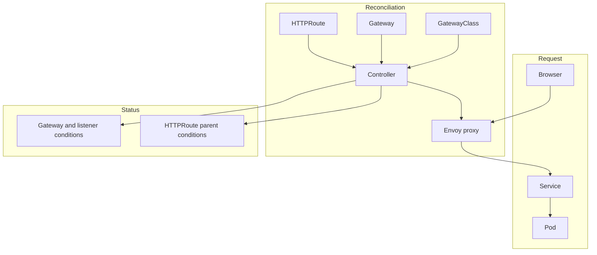

# Gateway API: infrastructure, routes, and permission

*Stage 2 · Guidance*

:::info[Advanced chapter]
First pass: finish [Ingress and TLS](./ingress-and-tls) and stop. Return here for the full Stage 2 lab, route status, and cross-namespace permission.
:::

**You will be able to:** name which object owns the listener, the route and each permission, read Gateway status as a chain, and diagnose a failing hostname.

## The problem

An Ingress puts everything in one object: the entry point (ports, TLS) *and* the application's routing rules. In a real organisation those belong to different people. A platform team owns the front door, certificates and addresses; application teams own "booking.apollo.local goes to the booking Service". With one object they must edit the same file, and anything unusual (redirects, rewrites, timeouts) has to be squeezed into vendor-specific **annotations** that differ per controller.

Gateway API is the Kubernetes answer: split the one object into several, each with a clear owner and typed fields instead of annotations.

## The idea in plain words

Think of an airport. The **airport authority** decides which runways and terminals exist. The **terminal operator** runs a specific gate area and decides which airlines may use it. Each **airline** says which flights leave from which gate. An airline cannot claim a gate the terminal has not opened to it, and cannot send passengers into another airline's check-in without that airline's consent.

Gateway API has the same layers:

| Object | Owner | Role (airport version) |
|---|---|---|
| `GatewayClass` | Infrastructure | Which implementation runs the airport. Apollo: `eg` (Envoy Gateway) |
| `Gateway` | Platform team | The gate area: addresses and **listeners** (port, protocol, hostname, TLS, which routes may attach). Apollo: `apollo-gateway` |
| `HTTPRoute` | App team | The airline's flights: host/path matching and `backendRefs` |
| `ReferenceGrant` | Owner of the *referenced* namespace | Consent for another namespace to point at something it owns |

Gateway API is a set of **API objects**. A controller and its proxy do the actual work, and you still need Services, EndpointSlices, Pods, DNS and certificate Secrets. It does not remove Ingress; Ingress is frozen, not deleted, and existing Ingresses do not convert themselves.

## How it works: three paths to keep separate


```mermaid
flowchart TB
  subgraph Reconcile[Reconciliation]
    GC[GatewayClass] --> Ctl[Controller]
    G[Gateway] --> Ctl
    R[HTTPRoute] --> Ctl
    Ctl --> Proxy[Envoy proxy]
  end
  subgraph Request[Request]
    Browser --> Proxy --> Svc[Service] --> Pod
  end
  subgraph Status[Status]
    Ctl --> GS[Gateway and listener conditions]
    Ctl --> RS[HTTPRoute parent conditions]
  end
```

1. **Reconciliation:** the controller reads the objects and programs the proxy.
2. **Request:** the browser's traffic flows through that proxy, then the usual Service routing.
3. **Status:** the controller reports back what it accepted and resolved. Always read this, never infer behaviour from `spec` alone.

## How it works: reading the Apollo objects

*Source: `stages/stage2/k8s/substages/05-envoy-gateway/`*

```yaml
# Gateway (listener excerpt)
listeners:
  - name: https
    port: 443
    protocol: HTTPS
    tls: {mode: Terminate, certificateRefs: [{name: apollo-tls-secret}]}
    allowedRoutes: {namespaces: {from: All}}
---
# HTTPRoute
spec:
  parentRefs: [{name: apollo-gateway}]
  hostnames: ["booking.apollo.local"]
  rules: [{backendRefs: [{name: booking, port: 8082}]}]
```

How a request is matched, in order:

1. The connection selects **one listener** by address, port, protocol and hostname. There is no fallback to another listener.
2. Only Routes **attached** to that listener are considered.
3. The request's host must overlap the listener and route hostnames.
4. A rule's matches (path, method, headers, query) pick a rule; filters may modify the request.
5. The `backendRef` names a **Service**, and normal Service routing then picks a ready Pod.

If several routes overlap, Gateway API resolves ties by specificity, then age and name. Avoid designs that depend on tie-breaking.

## Two different permissions

People confuse these constantly, so keep them apart:

| Question | Mechanism | Lives in | Failure status |
|---|---|---|---|
| May this Route **attach** to that listener? | `allowedRoutes` (`Same`, `All` or `Selector`) | The Gateway's namespace | `Accepted=False` (`NotAllowedByListeners`) |
| May this Route **point at** that Service? | `ReferenceGrant` | The Service's namespace | `ResolvedRefs=False` (`RefNotPermitted`) |

The first is "will the gate area take your airline?"; the second is "will the other airline accept your passengers?". A Route cannot grant itself attachment by adding a `parentRef`.

In Apollo, the frontend Route lives in `apollo-airlines-ui` but attaches to `apollo-gateway` in `apollo-airlines-apps`, which is permitted by `allowedRoutes: All`. Its backend is in its **own** namespace, so no grant is needed. `01a-referencegrant.yaml` shows what a grant for a cross-namespace backend looks like. A grant never attaches a Route and never gives general access to a namespace.

## Reading status as a chain

| Level | Field | Question it answers |
|---|---|---|
| GatewayClass | `Accepted` | Did a controller take responsibility? |
| Gateway | `Accepted`, `Programmed`, `addresses` | Is it valid? Was it sent to the data plane? Which IP? |
| Listener | conditions, `attachedRoutes` | Is its certificate reference valid? How many routes attached? |
| HTTPRoute parent | `Accepted`, `ResolvedRefs` | Did it attach? Do its backends exist and are they permitted? |

Check that `observedGeneration` matches the spec you are reading, or the status may describe an older version. And none of these mean a passenger succeeds: DNS, TLS trust, endpoints, policy and the app remain separate.

## Diagnose `booking.apollo.local`

Work in dependency order: GatewayClass accepted? → Gateway has an address and is `Programmed`? → HTTPS listener valid and route attached? → Route `Accepted` and `ResolvedRefs`? → host, method and path as expected? → Service port exists with ready endpoints? → from the client, does DNS resolve and TLS present the right certificate?

```bash
kubectl get gatewayclass,gateway -A
kubectl get httproute -A
kubectl describe httproute booking -n apollo-airlines-apps | sed -n '/Status:/,$p'
kubectl get endpointslice -n apollo-airlines-apps -l kubernetes.io/service-name=booking
```

## Migrating from Ingress without a flag day

Ingress and Gateway API can run side by side, so you can prove the new path before moving traffic:

1. Inventory every Ingress host, path, TLS Secret, annotation and expected response (including unmatched requests).
2. Choose an implementation and confirm it supports the features you need.
3. Install the CRDs and controller alongside the existing Ingress controller.
4. Create a Gateway on a separate address, convert routes to HTTPRoutes, and translate annotations deliberately.
5. Check Gateway and Route status.
6. Replay the same requests against both paths and compare codes, redirects, headers, certificates and backends.
7. Move DNS, watch, and keep the old path for a rollback window.
8. Remove the Ingress only when nothing depends on it.

Annotations deserve care: translate each to a standard field or filter, a documented controller policy, or keep that route on the old controller. Never copy an annotation onto an HTTPRoute and assume it works. `ingress2gateway` produces a starting point, never a finished result.

| Ingress | Gateway API |
|---|---|
| `IngressClass` | `GatewayClass` |
| `spec.tls` | HTTPS listener `tls` |
| `rules[].host` | `HTTPRoute.hostnames` |
| path + backend | HTTPRoute `matches` + `backendRefs` |
| `ingressClassName` | `parentRefs` |
| Annotations | Typed filters / policy resources |
| Default backend | Explicit catch-all rule |

## What it does not promise

Gateway API describes desired traffic handling. It does not provide a controller or proxy, public DNS, a trusted or renewed certificate, ready endpoints, policy enforcement, or a successful booking.

## Common misconceptions

- **"Accepted means working."** `Accepted` is about attachment; a wrong backend shows as `ResolvedRefs=False`.
- **"A ReferenceGrant lets a route attach."** Attachment is `allowedRoutes`.
- **"Gateway API replaced Ingress."** It replaces the configuration model when you migrate; Ingress still works.

## Check yourself

<details>
<summary>A route in <code>ui</code> attaches but its backend in <code>apps</code> is refused. Which object fixes it?</summary>

A `ReferenceGrant` in `apps` allowing HTTPRoutes from `ui` to reference that Service.
</details>

<details>
<summary>Route status shows <code>Accepted=True</code> but requests return 5xx. What do you check?</summary>

`ResolvedRefs` and the backend Service port and endpoints. Attachment and backend resolution are separate.
</details>

## Where this leads

Networking gets requests to a Pod. Stage 3 deals with what those Pods keep: storage that outlives them.

## References

- [Gateway API overview](https://kubernetes.io/docs/concepts/services-networking/gateway/) · [Resource model](https://gateway-api.sigs.k8s.io/docs/concepts/api-overview/) · [Migrating from Ingress](https://gateway-api.sigs.k8s.io/guides/getting-started/migrating-from-ingress/) · [Troubleshooting](https://gateway-api.sigs.k8s.io/docs/concepts/troubleshooting/)
