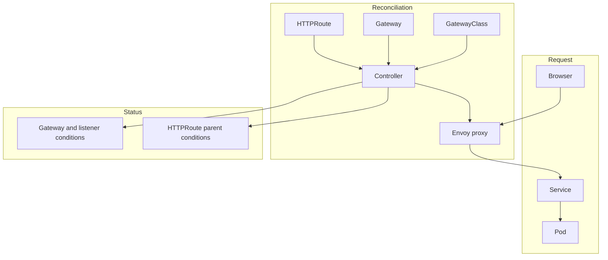

# Gateway API: infrastructure, routes, and permission

*Stage 2 · Guidance*

:::info[Advanced chapter]
First pass: finish [Ingress and TLS](./ingress-and-tls) and stop. Return here for the Stage 2 walkthrough, route status, and cross-namespace permission.
:::

**You will be able to:** name which object owns the listener, the route and each permission, read every Apollo Gateway API manifest, read Gateway status as a chain, break and repair a route, and diagnose a failing hostname.

## The problem

An Ingress puts everything in one object: the entry point (ports, TLS) *and* the application's routing rules. In a real organisation those belong to different people. A platform team owns the front door, certificates and addresses; application teams own "booking.apollo.local goes to the booking Service". With one object they must edit the same file, and anything unusual (redirects, rewrites, timeouts) has to be squeezed into vendor-specific **annotations** that differ per controller.

Annotations are also untyped strings. A typo in one is accepted by the API server and silently ignored by the proxy, and moving to another controller means rewriting all of them.

Gateway API is the Kubernetes answer: split the one object into several, each with a clear owner and typed fields instead of annotations.

## The idea in plain words

Think of an airport. The **airport authority** decides which runways and terminals exist. The **terminal operator** runs a specific gate area and decides which airlines may use it. Each **airline** says which flights leave from which gate. An airline cannot claim a gate the terminal has not opened to it, and cannot send passengers into another airline's check-in without that airline's consent.

Gateway API has the same layers:

| Object | Owner | Role (airport version) |
|---|---|---|
| `GatewayClass` | Infrastructure | Which implementation runs the airport. Apollo: `eg` (Envoy Gateway) |
| `Gateway` | Platform team | The gate area: addresses and **listeners** (port, protocol, hostname, TLS, which routes may attach). Apollo: `apollo-gateway` |
| `HTTPRoute` | App team | The airline's flights: host/path matching and `backendRefs` |
| `ReferenceGrant` | Owner of the *referenced* namespace | Consent for another namespace to point at something it owns |

Gateway API is a set of **API objects**. A controller and its proxy do the actual work, and you still need Services, EndpointSlices, Pods, DNS and certificate Secrets. It does not remove Ingress; Ingress is frozen, not deleted, and existing Ingresses do not convert themselves.

## How it works: three paths to keep separate


```mermaid
flowchart TB
  subgraph Reconcile[Reconciliation]
    GC[GatewayClass] --> Ctl[Controller]
    G[Gateway] --> Ctl
    R[HTTPRoute] --> Ctl
    Ctl --> Proxy[Envoy proxy]
  end
  subgraph Request[Request]
    Browser --> Proxy --> Svc[Service] --> Pod
  end
  subgraph Status[Status]
    Ctl --> GS[Gateway and listener conditions]
    Ctl --> RS[HTTPRoute parent conditions]
  end
```

1. **Reconciliation:** the controller reads the objects and programs the proxy.
2. **Request:** the browser's traffic flows through that proxy, then the usual Service routing.
3. **Status:** the controller reports back what it accepted and resolved. Always read this, never infer behaviour from `spec` alone.

Most Gateway API confusion comes from mixing these up. Reconciliation problems show as missing or `False` conditions; request problems show as wrong responses even when every condition is `True`.

## How it works: what has to be installed

*Source: `stages/stage2/k8s/substages/05-envoy-gateway/`*

Unlike Ingress, Gateway API is not part of a standard Kubernetes install. Apollo's substage 5 adds four things, in this order:

| Step | File | What it adds |
|---|---|---|
| 1 | `00-envoy-gateway-install.yaml` | The Gateway API **CRDs** (the new object types) and the Envoy Gateway controller, in `envoy-gateway-system` |
| 2 | `00a-gatewayclass.yaml` | The `GatewayClass` named `eg` |
| 3 | `00b-envoyproxy.yaml`, `01-gateway.yaml` | Proxy settings and the Gateway itself |
| 4 | `01a-referencegrant.yaml`, `02`–`07-httproute-*.yaml` | Permission and the routes |

A **CRD** (CustomResourceDefinition) teaches the API server a new object type. Before step 1, `kubectl get gateway` fails because the type does not exist. The install file is about 45,000 lines, which is why Apollo applies it with `kubectl apply --server-side`: the CRDs are too large for the annotation client-side apply uses to track changes.

Before this substage, Apollo removes the Traefik DaemonSet, its Service and the Ingresses. Two controllers can coexist, but not two proxies claiming the same address and hostnames.

## How it works: reading the Apollo objects

### GatewayClass: which implementation

```yaml
apiVersion: gateway.networking.k8s.io/v1
kind: GatewayClass
metadata:
  name: eg
spec:
  controllerName: gateway.envoyproxy.io/gatewayclass-controller
```

This is the Gateway API counterpart of `IngressClass`. `controllerName` is a string the controller watches for; a Gateway that names `gatewayClassName: eg` is handed to Envoy Gateway. It is cluster-scoped (no namespace) because it describes infrastructure, not an application.

### EnvoyProxy: settings for the data plane

```yaml
kind: EnvoyProxy
metadata:
  name: envoyproxy-lb-config
  namespace: apollo-airlines-apps
spec:
  provider:
    type: Kubernetes
    kubernetes:
      envoyService:
        type: LoadBalancer
```

`EnvoyProxy` is *not* part of Gateway API; it is an Envoy Gateway extension. Gateway API deliberately says nothing about how the proxy is deployed, so implementations use their own objects for that. Here it asks for the proxy's Service to be `type: LoadBalancer`, which [MetalLB](./nodeport-and-loadbalancer) then fulfils with a real IP from its `172.18.0.50-172.18.0.100` pool. Compare Ingress, where Apollo wrote the proxy's Deployment and Service by hand; here the controller creates both.

### Gateway: the front door

```yaml
kind: Gateway
metadata:
  name: apollo-gateway
  namespace: apollo-airlines-apps
spec:
  gatewayClassName: eg
  infrastructure:
    parametersRef:
      group: gateway.envoyproxy.io
      kind: EnvoyProxy
      name: envoyproxy-lb-config
  listeners:
    - name: http
      port: 80
      protocol: HTTP
      allowedRoutes:
        namespaces:
          from: All
    - name: https
      port: 443
      protocol: HTTPS
      tls:
        mode: Terminate
        certificateRefs:
          - name: apollo-tls-secret
      allowedRoutes:
        namespaces:
          from: All
```

| Field | Meaning |
|---|---|
| `gatewayClassName` | Which GatewayClass, and therefore which controller, owns this |
| `infrastructure.parametersRef` | Points at the `EnvoyProxy` that configures the proxy |
| `listeners[]` | Each is one port + protocol the proxy opens |
| `tls.mode: Terminate` | TLS ends at the proxy (the alternative, `Passthrough`, forwards it still encrypted) |
| `certificateRefs` | The Secret holding `tls.crt` and `tls.key`, looked up in the Gateway's namespace |
| `allowedRoutes` | Which namespaces' Routes may attach to this listener |

Two listeners means two entry doors: plain HTTP on 80 for quick tests, HTTPS on 443 using the same self-signed `apollo-tls-secret` described in [Ingress and TLS](./ingress-and-tls). The certificate trust rules are unchanged; only the object that holds the Secret reference moved from the Ingress to the Gateway listener.

### HTTPRoute: one team's routing

```yaml
kind: HTTPRoute
metadata:
  name: booking
  namespace: apollo-airlines-apps
spec:
  parentRefs:
    - name: apollo-gateway
  hostnames: ["booking.apollo.local"]
  rules:
    - backendRefs:
        - name: booking
          port: 8082
```

| Field | Meaning |
|---|---|
| `parentRefs` | Which Gateway this Route asks to attach to. It is a *request* |
| `hostnames` | The `Host` values to match |
| `rules[].matches` | Path, method, header or query conditions. Omitted here, so the rule matches everything |
| `rules[].backendRefs` | Where to send it: a Service and port |

Apollo has six of these, one per hostname: identity (8080), flight (8081), booking (8082), search (8083), notification (8084) and frontend (3000). Each is a handful of lines. That is the point: an application team can own this file without touching ports or certificates.

### Ingress and HTTPRoute, side by side

The same booking rule in both models:

| Concern | Ingress (`03-ingress-apps.yaml`) | Gateway API |
|---|---|---|
| Which controller | `ingressClassName: traefik` | `Gateway.spec.gatewayClassName: eg` |
| TLS certificate | `spec.tls[].secretName` on the Ingress | `listeners[].tls.certificateRefs` on the Gateway |
| Host | `rules[].host` | `HTTPRoute.hostnames` |
| Backend | `rules[].http.paths[].backend.service` | `rules[].backendRefs` |
| Who edits which | One file, one owner | Listener: platform. Route: app team |

The Ingress carried the certificate *and* the routing. Now the app team's Route contains no TLS configuration at all.

## How a request is matched

1. The connection selects **one listener** by address, port, protocol and hostname. There is no fallback to another listener.
2. Only Routes **attached** to that listener are considered.
3. The request's host must overlap the listener and route hostnames.
4. A rule's matches (path, method, headers, query) pick a rule; filters may modify the request.
5. The `backendRef` names a **Service**, and normal Service routing then picks a ready Pod.

If several routes overlap, Gateway API resolves ties by specificity, then age and name. Avoid designs that depend on tie-breaking.

### What a rule can express beyond Apollo's

Apollo's rules match every path for a host. Typed fields cover cases that needed annotations under Ingress. This sketch is **illustrative and not in the Apollo repository**:

```yaml
# Illustrative only: not an Apollo manifest
rules:
  - matches:
      - path: {type: PathPrefix, value: /api/bookings}
        method: GET
    backendRefs:
      - {name: booking, port: 8082, weight: 90}
      - {name: booking-canary, port: 8082, weight: 10}
  - filters:
      - type: RequestRedirect
        requestRedirect: {scheme: https, statusCode: 301}
```

Weighted backends, redirects, header modification and mirroring are standard fields, so they behave the same on every conforming implementation. Support for *optional* features varies, which is why you check your controller's conformance list before relying on one.

## Two different permissions

People confuse these constantly, so keep them apart:

| Question | Mechanism | Lives in | Failure status |
|---|---|---|---|
| May this Route **attach** to that listener? | `allowedRoutes` (`Same`, `All` or `Selector`) | The Gateway's namespace | `Accepted=False` (`NotAllowedByListeners`) |
| May this Route **point at** that Service? | `ReferenceGrant` | The Service's namespace | `ResolvedRefs=False` (`RefNotPermitted`) |

The first is "will the gate area take your airline?"; the second is "will the other airline accept your passengers?". A Route cannot grant itself attachment by adding a `parentRef`.

### Attachment across namespaces

The Gateway lives in `apollo-airlines-apps`. The frontend Route lives in `apollo-airlines-ui` and reaches it by naming the namespace:

```yaml
# 07-httproute-frontend.yaml
metadata:
  name: frontend
  namespace: apollo-airlines-ui
spec:
  parentRefs:
    - name: apollo-gateway
      namespace: apollo-airlines-apps
```

Without `namespace`, a `parentRef` means "a Gateway in my own namespace", and the Route would not find `apollo-gateway`. The attachment is permitted by the Gateway's side: both listeners say `allowedRoutes: {namespaces: {from: All}}`. Narrower choices exist: `Same` accepts only the Gateway's own namespace, and `Selector` accepts namespaces carrying a label. `All` is convenient for a lab and loose for a shared cluster.

### Backends across namespaces

The frontend Route's backend is the `frontend` Service in `apollo-airlines-ui`, its **own** namespace, so no grant is needed for it. A `ReferenceGrant` is needed only when a Route points at a Service in a *different* namespace from itself. Apollo ships one to show the shape:

```yaml
# 01a-referencegrant.yaml
kind: ReferenceGrant
metadata:
  name: apollo-gateway-grant
  namespace: apollo-airlines-ui
spec:
  from:
    - group: gateway.networking.k8s.io
      kind: HTTPRoute
      namespace: apollo-airlines-apps
  to:
    - group: ""
      kind: Service
      name: frontend
```

Read it as a sentence, with the namespace it lives in as the speaker: *"In `apollo-airlines-ui`, I allow HTTPRoutes from `apollo-airlines-apps` to reference my Service `frontend`."* Three details matter:

- It lives in the namespace being **referenced**, so the owner of the target is the one who consents.
- `to.name` is optional; leaving it out would allow every Service in that namespace. Naming one Service is the least privilege.
- It is one-directional and narrow. It never attaches a Route and never gives general access to a namespace.

## Reading status as a chain

| Level | Field | Question it answers |
|---|---|---|
| GatewayClass | `Accepted` | Did a controller take responsibility? |
| Gateway | `Accepted`, `Programmed`, `addresses` | Is it valid? Was it sent to the data plane? Which IP? |
| Listener | conditions, `attachedRoutes` | Is its certificate reference valid? How many routes attached? |
| HTTPRoute parent | `Accepted`, `ResolvedRefs` | Did it attach? Do its backends exist and are they permitted? |

Check that `observedGeneration` matches the spec you are reading, or the status may describe an older version. And none of these mean a passenger succeeds: DNS, TLS trust, endpoints, policy and the app remain separate.

Read the chain top-down, because each level depends on the one above. If the GatewayClass is not `Accepted`, no later condition is meaningful. A Route can be `Accepted=True` and `ResolvedRefs=False` at the same time: it attached, but its backend is wrong.

```bash
kubectl get gatewayclass eg
kubectl get gateway apollo-gateway -n apollo-airlines-apps \
  -o jsonpath='{range .status.conditions[*]}{.type}={.status} ({.reason}){"\n"}{end}'
kubectl get gateway apollo-gateway -n apollo-airlines-apps \
  -o jsonpath='{range .status.listeners[*]}{.name} attached={.attachedRoutes}{"\n"}{end}'
kubectl get httproute -A -o wide
```

- Expect `Accepted=True` and `Programmed=True` on the Gateway, and the `ADDRESS` column to show a MetalLB IP.
- `attachedRoutes` is a quick sanity check. Each listener should count all six Routes; a count lower than the Routes you applied points at `allowedRoutes` or a wrong `parentRef`.

## What the controller creates for you

You wrote no Deployment for the proxy, yet one exists. Envoy Gateway creates it when it sees the Gateway:

```bash
kubectl get deploy,svc,pods -n envoy-gateway-system
EG_IP=$(kubectl get svc -n envoy-gateway-system \
  -l gateway.envoyproxy.io/owning-gateway-name=apollo-gateway \
  -o jsonpath='{.items[0].status.loadBalancer.ingress[0].ip}')
echo "$EG_IP"
```

The label `gateway.envoyproxy.io/owning-gateway-name=apollo-gateway` is how you find the generated Service, and `verify-tls.sh` uses the same selector. Those objects are owned by the controller: edit the Gateway or `EnvoyProxy`, never the generated Deployment, because the controller will overwrite your change.

When a Route changes, Envoy Gateway translates it to Envoy's dynamic configuration (xDS) and streams it to the running proxy. The Pods are **not restarted**, which is why adding a Route takes effect in seconds.

## Diagnose `booking.apollo.local`

Work in dependency order: GatewayClass accepted? → Gateway has an address and is `Programmed`? → HTTPS listener valid and route attached? → Route `Accepted` and `ResolvedRefs`? → host, method and path as expected? → Service port exists with ready endpoints? → from the client, does DNS resolve and TLS present the right certificate?

```bash
kubectl get gatewayclass,gateway -A
kubectl get httproute -A
kubectl describe httproute booking -n apollo-airlines-apps | sed -n '/Status:/,$p'
kubectl get endpointslice -n apollo-airlines-apps -l kubernetes.io/service-name=booking
```

Then test from the client side, which is the only part the cluster cannot report:

```bash
curl -s  -H "Host: booking.apollo.local" "http://$EG_IP/healthz"
curl -sI -H "Host: nothing.apollo.local" "http://$EG_IP/" | head -n 1
curl --cacert <(kubectl get secret apollo-tls-secret -n apollo-airlines-apps -o jsonpath='{.data.tls\.crt}' | base64 -d) \
  --resolve booking.apollo.local:443:$EG_IP https://booking.apollo.local/healthz
```

- The first uses the plain listener. The second shows what an unmatched host looks like: Envoy answers with its own 404.
- The third repeats the trust check from [Ingress and TLS](./ingress-and-tls), now against the Gateway's HTTPS listener.

### Reading failures at the Gateway

| Symptom | Likely cause | Where to look |
|---|---|---|
| `kubectl get gateway` says no such resource | CRDs not installed | `kubectl get crd \| grep gateway.networking` |
| Gateway has no `ADDRESS` | LoadBalancer unfulfilled | MetalLB; the generated Service's `EXTERNAL-IP` |
| `Programmed=False` | Controller rejected the Gateway | Gateway conditions and `message` |
| Listener `ResolvedRefs=False` | Certificate Secret missing or malformed | `certificateRefs`, and the Secret in the Gateway's namespace |
| Route `Accepted=False` | Not allowed to attach, or wrong `parentRef` | `allowedRoutes`; `parentRefs.namespace` |
| Route `ResolvedRefs=False` | Backend missing, wrong port, or not permitted | Service name and port; `ReferenceGrant` |
| 404 from Envoy | No Route matched the host or path | `hostnames`, `matches` |
| 5xx from Envoy | Route matched, but no healthy endpoint | EndpointSlice readiness |

Note one difference from Ingress: a missing certificate Secret is reported on the **listener** as a failed condition, rather than silently falling back to a default certificate. The controller tells you; you just have to read the status.

## Try breaking it

*Source: `stages/stage2/k8s/substages/05-envoy-gateway/README.md`*

Predict first. Point the frontend Route at a port its Service does not expose:

```bash
kubectl patch httproute frontend -n apollo-airlines-ui --type='json' \
  -p='[{"op":"replace","path":"/spec/rules/0/backendRefs/0/port","value":9999}]'
kubectl get httproute frontend -n apollo-airlines-ui \
  -o jsonpath='{range .status.parents[*].conditions[*]}{.type}={.status} ({.reason}){"\n"}{end}'
curl -sI -H "Host: frontend.apollo.local" "http://$EG_IP/" | head -n 1
```

What do you expect? Both the Route and the Service are valid objects, so the Route stays `Accepted=True`. But `ResolvedRefs` turns `False`, because no such Service port exists, and Envoy has no backend to send to: the request fails with a 5xx. Attachment succeeded and resolution failed, which is exactly the distinction in the two-permissions table above.

Recover by restoring the port, then check that both conditions are `True` and the response is `200`:

```bash
kubectl patch httproute frontend -n apollo-airlines-ui --type='json' \
  -p='[{"op":"replace","path":"/spec/rules/0/backendRefs/0/port","value":3000}]'
```

A second experiment, optional: change `allowedRoutes.namespaces.from` on the `http` listener to `Same` and re-apply. The frontend Route in `apollo-airlines-ui` should now show `Accepted=False` with `NotAllowedByListeners`, while the Routes in `apollo-airlines-apps` keep working. Set it back to `All` afterwards.

## Migrating from Ingress without a flag day

Ingress and Gateway API can run side by side, so you can prove the new path before moving traffic:

1. Inventory every Ingress host, path, TLS Secret, annotation and expected response (including unmatched requests).
2. Choose an implementation and confirm it supports the features you need.
3. Install the CRDs and controller alongside the existing Ingress controller.
4. Create a Gateway on a separate address, convert routes to HTTPRoutes, and translate annotations deliberately.
5. Check Gateway and Route status.
6. Replay the same requests against both paths and compare codes, redirects, headers, certificates and backends.
7. Move DNS, watch, and keep the old path for a rollback window.
8. Remove the Ingress only when nothing depends on it.

Apollo's repository takes the short route for a lab: it deletes Traefik first (`kubectl delete ingress --all`, then the Service and DaemonSet) and installs Envoy Gateway second. That is acceptable when nobody depends on the cluster. It is the opposite of what you would do for production, where steps 3 to 7 exist precisely to avoid an outage.

Annotations deserve care: translate each to a standard field or filter, a documented controller policy, or keep that route on the old controller. Never copy an annotation onto an HTTPRoute and assume it works. `ingress2gateway` produces a starting point, never a finished result.

| Ingress | Gateway API |
|---|---|
| `IngressClass` | `GatewayClass` |
| `spec.tls` | HTTPS listener `tls` |
| `rules[].host` | `HTTPRoute.hostnames` |
| path + backend | HTTPRoute `matches` + `backendRefs` |
| `ingressClassName` | `parentRefs` |
| Annotations | Typed filters / policy resources |
| Default backend | Explicit catch-all rule |

## What it does not promise

Gateway API describes desired traffic handling. It does not provide a controller or proxy, public DNS, a trusted or renewed certificate, ready endpoints, policy enforcement, or a successful booking.

## Common misconceptions

- **"Accepted means working."** `Accepted` is about attachment; a wrong backend shows as `ResolvedRefs=False`.
- **"A ReferenceGrant lets a route attach."** Attachment is `allowedRoutes`.
- **"Gateway API replaced Ingress."** It replaces the configuration model when you migrate; Ingress still works.
- **"A Gateway is a proxy."** It is configuration, exactly as an Ingress is. The proxy is the Envoy Deployment the controller creates.
- **"`EnvoyProxy` is part of Gateway API."** It is an Envoy Gateway extension; another implementation would use a different object.
- **"A Route in another namespace needs a ReferenceGrant to attach."** Not for attachment. The grant matters only for a backend in another namespace.
- **"One Gateway per application."** Many teams' Routes can share a Gateway. That sharing is the design.

## Check yourself

<details>
<summary>A route in <code>ui</code> attaches but its backend in <code>apps</code> is refused. Which object fixes it?</summary>

A `ReferenceGrant` in `apps` allowing HTTPRoutes from `ui` to reference that Service.
</details>

<details>
<summary>Route status shows <code>Accepted=True</code> but requests return 5xx. What do you check?</summary>

`ResolvedRefs` and the backend Service port and endpoints. Attachment and backend resolution are separate.
</details>

<details>
<summary>Why does the frontend Route set <code>namespace: apollo-airlines-apps</code> in its <code>parentRef</code>, but the others do not?</summary>

The frontend Route is in <code>apollo-airlines-ui</code> while the Gateway is in <code>apollo-airlines-apps</code>. A <code>parentRef</code> without a namespace means the Route's own namespace, so the other Routes, which sit beside the Gateway, can omit it.
</details>

<details>
<summary>You change a Route and nothing happens. Which observable fact tells you whether the controller saw your change?</summary>

The Route's status <code>observedGeneration</code>. If it is lower than <code>metadata.generation</code>, the controller has not yet processed the latest spec, and every condition you are reading describes the previous version.
</details>

<details>
<summary>Why does <code>ReferenceGrant</code> live in the namespace of the Service rather than the namespace of the Route?</summary>

Because it is the owner of the referenced thing who must consent. If the Route's author could write the grant, they could grant themselves access to anyone's Service, and the check would mean nothing.
</details>

<details>
<summary>The Gateway's TLS certificate Secret is deleted. What differs from the Traefik behaviour?</summary>

Traefik keeps serving but presents its default certificate, with no failure visible in Kubernetes objects. Envoy Gateway reports the missing reference on the listener's status, so the failure is visible to `kubectl`. What a client sees on the wire depends on the implementation, which is why you read the status.
</details>

## Where this leads

Networking gets requests to a Pod. Stage 3 deals with what those Pods keep: storage that outlives them.

## References

- [Gateway API overview](https://kubernetes.io/docs/concepts/services-networking/gateway/) · [Resource model](https://gateway-api.sigs.k8s.io/docs/concepts/api-overview/) · [Migrating from Ingress](https://gateway-api.sigs.k8s.io/guides/getting-started/migrating-from-ingress/) · [Troubleshooting](https://gateway-api.sigs.k8s.io/docs/concepts/troubleshooting/) · [ReferenceGrant](https://gateway-api.sigs.k8s.io/api-types/referencegrant/) · [Envoy Gateway](https://gateway.envoyproxy.io/docs/)
