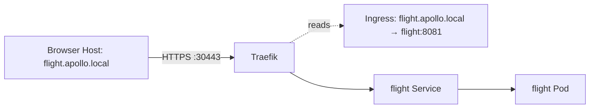
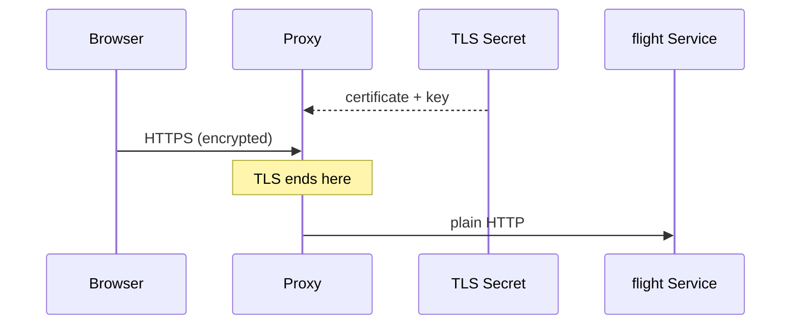

# Ingress and TLS

*Stage 2 · Guidance*

**You will be able to:** separate Ingress rules from the proxy that applies them, read every object that makes Apollo's Traefik edge work, trace where TLS ends, explain what a self-signed certificate cannot prove, and diagnose a failure from the symptom alone.

## The problem

With NodePort, every service needs its own port number: flight on 30081, booking on 30082. Passengers should not need to know that. Yet every HTTP request already carries a `Host` header with the hostname it was meant for (`flight.apollo.local`). One proxy listening on the standard ports 80 and 443 can read that header and choose the right backend itself.

Two more problems arrive at the same time:

- **Encryption.** Passwords and bearer tokens cross this edge. Someone has to hold a certificate and private key, and it should not be baked into every application image.
- **Ownership.** Six services and a frontend would each need their own TLS code if the edge did not do it once, centrally.

An Ingress controller solves all three at the one place every request already passes through.

## The idea in plain words

Picture a hotel receptionist. Guests all arrive at one front desk and say which room they want; the receptionist directs them. Two separate things exist: the **guest list and room map** (the rules) and **the receptionist** (the one who acts on them).

- An **Ingress** is only the rules: "host `flight.apollo.local` goes to Service `flight` on 8081."
- An **Ingress controller** (Traefik, NGINX, …) is the running proxy that reads Ingress objects and configures itself from them.
- An **IngressClass** is the name tag that says which controller owns which Ingress, because a cluster can run more than one.

An Ingress with no controller does nothing. It is accepted by the API server, stored in etcd, and never acted on. This is the single most common reason a new Ingress "doesn't work".



## How it works: the four pieces Apollo installs

*Source: `stages/stage2/k8s/substages/03-traefik-ingress-tls/`*

Traefik is not built into Kubernetes. Apollo installs it from five manifests, and each one answers a different question:

| File | Object(s) | Question it answers |
|---|---|---|
| `00-traefik-rbac-and-class.yaml` | ServiceAccount, ClusterRole, ClusterRoleBinding, IngressClass | May Traefik read Ingresses, and which Ingresses are its own? |
| `01-traefik-daemonset.yaml` | DaemonSet | What process actually runs, and on which node? |
| `01b-traefik-service.yaml` | Service (NodePort) | How does traffic from outside the cluster reach it? |
| `02-ingress-frontend.yaml`, `03-ingress-apps.yaml` | Ingress ×5 | What are the routing rules? |
| `generate-certs.sh` | Secret `apollo-tls-secret` | What certificate does it present? |

### Permission: RBAC and the IngressClass

Traefik is a program that *watches the Kubernetes API*. To do that it needs read access, which is granted to its ServiceAccount through a ClusterRole:

```yaml
rules:
  - apiGroups: [""]
    resources: ["services", "endpoints", "secrets", "nodes"]
    verbs: ["get", "list", "watch"]
  - apiGroups: ["networking.k8s.io"]
    resources: ["ingressclasses", "ingresses"]
    verbs: ["get", "list", "watch"]
  - apiGroups: ["discovery.k8s.io"]
    resources: ["endpointslices"]
    verbs: ["get", "list", "watch"]
```

Read it as a shopping list of what the proxy needs to do its job: Ingresses (the rules), Services and EndpointSlices (where to send traffic), and **Secrets** (the certificate). A ClusterRole rather than a namespaced Role is needed because Apollo's Ingresses live in two namespaces, `apollo-airlines-apps` and `apollo-airlines-ui`.

The IngressClass is one line of substance:

```yaml
kind: IngressClass
metadata:
  name: traefik
spec:
  controller: traefik.io/ingress-controller
```

Every Apollo Ingress says `ingressClassName: traefik`, which is how Traefik knows to claim it.

### The proxy itself: a DaemonSet on the control-plane node

```yaml
kind: DaemonSet
spec:
  template:
    spec:
      serviceAccountName: traefik
      nodeSelector:
        node-role.kubernetes.io/control-plane: ""
      tolerations:
        - operator: Exists
      containers:
        - name: traefik
          image: traefik:v3.1
          args:
            - --providers.kubernetesingress
            - --entrypoints.web.address=:8000
            - --entrypoints.websecure.address=:8443
            - --entrypoints.websecure.http.tls=true
```

Three choices here are worth understanding rather than copying:

- **`--providers.kubernetesingress`** is the line that turns on "read Ingress objects". Without it Traefik would start, listen, and have no routes.
- **Two entrypoints.** `web` on 8000 is plain HTTP; `websecure` on 8443 speaks TLS. Traefik listens on high ports inside the container so it need not run as root. The standard-looking 80/443 appear one layer out, on the Service.
- **DaemonSet pinned to the control-plane node.** `nodeSelector` plus a tolerations rule that accepts every taint puts exactly one Traefik Pod on the control-plane node. In kind that is the node whose ports Docker publishes to your laptop, so the proxy has to run there for `localhost:30443` to arrive at it.

### The way in: a NodePort Service

```yaml
kind: Service
spec:
  type: NodePort
  selector:
    app: traefik
  ports:
    - name: web
      port: 80
      targetPort: 8000
      nodePort: 30080
    - name: websecure
      port: 443
      targetPort: 8443
      nodePort: 30443
```

Read each port as a translation: the Service's own `port: 443` is for in-cluster callers, `targetPort: 8443` is where Traefik really listens, and `nodePort: 30443` is what your laptop uses through kind's port mapping. So `https://…:30443` becomes Traefik's `websecure` entrypoint. This is the same two-hop path described in [NodePort and LoadBalancer](./nodeport-and-loadbalancer).

:::note
Substage 4 adds a `traefik-loadbalancer-svc.yaml` that swaps this for `type: LoadBalancer` so MetalLB gives Traefik a real IP. The Ingress objects do not change at all; only the way *in* to the proxy does. That is the point of separating rules from proxy.
:::

## How it works: reading an Ingress

*Source: `stages/stage2/k8s/substages/03-traefik-ingress-tls/03-ingress-apps.yaml`*

```yaml
apiVersion: networking.k8s.io/v1
kind: Ingress
metadata:
  name: booking
  namespace: apollo-airlines-apps
spec:
  ingressClassName: traefik
  tls:
    - hosts:
        - booking.apollo.local
      secretName: apollo-tls-secret
  rules:
    - host: booking.apollo.local
      http:
        paths:
          - path: /
            pathType: Prefix
            backend:
              service:
                name: booking
                port:
                  number: 8082
```

| Field | Meaning |
|---|---|
| `ingressClassName: traefik` | Which controller owns this Ingress |
| `rules[].host` | The `Host` header to match |
| `paths[].path` and `pathType: Prefix` | `/` with `Prefix` matches every path below it |
| `backend.service` | Target Service and port. It is a **Service**, never a Pod |
| `tls[].hosts` | Hostnames the certificate is meant to cover |
| `tls[].secretName` | Secret holding `tls.crt` and `tls.key`, **in the Ingress's own namespace** |

Apollo has five Ingresses (identity, flight, booking and search in `apollo-airlines-apps`; frontend in `apollo-airlines-ui`). They follow one pattern, so once you can read one you can read them all. Notice there are *two copies* of `apollo-tls-secret`, one per namespace: an Ingress can only reference a Secret next to it, so `generate-certs.sh` creates the same certificate in both.

### How a request is matched

1. The connection arrives on an entrypoint (`web` or `websecure`).
2. For HTTPS, Traefik picks a certificate using the TLS **SNI** name the client sent in its handshake. This happens *before* any HTTP is read.
3. Traefik reads the `Host` header and the path, and picks the best-matching rule.
4. The rule's backend names a Service. Traefik reads that Service's EndpointSlices and sends the request to a ready Pod.

Notice that step 4 does not use the Service's ClusterIP at all. Traefik talks to Pod IPs directly, which is why its ClusterRole includes `endpointslices`. See [Service control path and packet path](./service-control-and-data-paths) for how those lists are built.

## How it works: TLS termination

TLS is the encryption behind HTTPS. **Terminating** TLS means the encrypted connection ends at the proxy, which holds the certificate and private key (loaded from a Kubernetes Secret). From there the proxy forwards the request to the Service in plain HTTP.



So TLS protects only the browser → proxy leg in Stage 2. If the Secret is missing or invalid, Traefik falls back to its own default certificate (`CN=TRAEFIK DEFAULT CERT`) instead of dropping the connection, which means the application is fine but the certificate is wrong.

### Where the certificate comes from

*Source: `stages/stage2/k8s/substages/03-traefik-ingress-tls/generate-certs.sh`*

There is no certificate authority in the loop. The script makes one certificate with `openssl` and stores it as a Secret:

```bash
openssl req -x509 -nodes -days 365 -newkey rsa:2048 \
  -keyout "$CERT_DIR/tls.key" -out "$CERT_DIR/tls.crt" \
  -subj '/CN=*.apollo.local' \
  -addext 'subjectAltName=DNS:*.apollo.local,DNS:apollo.local'
```

Pick out what matters:

- `-x509` produces a certificate directly, signed by its own key. That is what **self-signed** means.
- `-days 365` is a fixed expiry. Nothing renews it.
- `subjectAltName=DNS:*.apollo.local` is the list of names the certificate is valid for. Modern clients check this field, not the `CN`.
- The wildcard is why one certificate covers `identity.`, `flight.`, `booking.`, `search.` and `frontend.apollo.local`. It does **not** cover `apollo.local` itself, which is why that name is added separately.

The Secret is created with `kubectl create secret tls`, which enforces the shape Ingress expects: exactly the keys `tls.crt` and `tls.key`. The script also refuses to run unless your context is a kind cluster, and re-running it leaves existing Secrets alone unless you pass `--rotate`.

## How a client decides to trust a certificate

Encryption alone isn't the point of TLS. An attacker can encrypt too. The client also needs to know it's talking to the *real* `booking.apollo.local`. It checks three things:

1. **Signature:** the certificate is signed by an authority (CA) the client already trusts. Browsers and operating systems ship a list of public CAs.
2. **Name:** the hostname you asked for is listed in the certificate. Apollo's is valid for `*.apollo.local`, so `untrusted.apollo.invalid` fails.
3. **Dates:** it hasn't expired.

Apollo's local certificate is **self-signed**: no public CA signed it, so by default nothing trusts it. You have two options:

- **Turn checking off** (`curl -k`). That proves only that a TLS port answered, not that it's the right server.
- **Add the certificate to the client's trust** (`curl --cacert /tmp/apollo-ca.crt`). Now all three checks run for real. This is what Stage 2's `verify-tls.sh` does.

A self-signed certificate is its own CA, so trusting it means handing curl a copy of the certificate and saying "this one, and only this one". `verify-tls.sh` reads it straight out of the Secret:

```bash
kube -n apollo-airlines-apps get secret "$SECRET_NAME" -o jsonpath='{.data.tls\.crt}' | base64 -d > "$CA_FILE"
```

It then proves the checks are real by asking for a name the certificate does not cover and requiring curl to exit with code 60 (certificate verification failed):

```bash
curl -sS --max-time 15 --cacert "$CA_FILE" --resolve "untrusted.apollo.invalid:443:$IP" \
  https://untrusted.apollo.invalid/healthz
```

A test that can only pass is not a test. This negative case is what makes the positive ones mean something.

In production, a public CA (often through cert-manager and Let's Encrypt) signs the certificate, so every client already trusts it, and renewal is automatic.

## What a local self-signed certificate does not give you

| Missing | Effect |
|---|---|
| Browser trust | Warnings; you must supply the CA yourself (`curl --cacert`) |
| Renewal | Fixed expiry, no automatic issuing |
| Proxy → Pod encryption | Needs mTLS, which is out of scope here |
| Proof from `curl -k` | `-k` disables verification, so it proves only that a TLS port answered |
| Per-team or per-host keys | One wildcard key is copied into two namespaces; anyone who can read either Secret holds the key for every host |

That last row matters beyond Apollo. A Secret is only base64-encoded, not encrypted by default, so who may `get secrets` is the real boundary around the private key.

## Reading failures at the edge

The symptom tells you which layer to look at. Work from the outside in:

| Symptom | Layer | First thing to check |
|---|---|---|
| Connection refused on `:30443` | Reaching the proxy | Is the Traefik Pod running? Does kind map the port? |
| Wrong certificate issuer | The TLS Secret is missing or invalid | `kubectl get secret apollo-tls-secret -n <ns>` |
| Certificate name mismatch | You used a host the certificate does not list | `subjectAltName`, and your `--resolve` or `Host` |
| 404 from the proxy | No rule matched the host or path; the backend was never contacted | Ingress `host`, `ingressClassName`, namespace |
| 502 / 503 | A rule matched but the backend has no ready endpoint | The Service's EndpointSlice |
| 200 but wrong page | A different rule matched than you expected | Overlapping hosts and paths |

Notice the useful asymmetry: **404 means Traefik answered for itself, 502/503 means it tried your backend and failed.** One narrows the problem to routing rules, the other to the application.

## Try it

```bash
curl -kv --resolve flight.apollo.local:30443:127.0.0.1 https://flight.apollo.local:30443/readyz 2>&1 | grep -E 'issuer|subject|expire'
kubectl describe secret apollo-tls-secret -n apollo-airlines-apps
kubectl get ingress -n apollo-airlines-apps
```

- The first command shows who issued the certificate the proxy presented.
- The second shows the Secret's keys and sizes without printing the key itself.
- The third lists each Ingress with its class and hosts.

Next, look at it from Traefik's side:

```bash
kubectl get ingressclass
kubectl get daemonset traefik -n kube-system
kubectl logs -n kube-system daemonset/traefik --tail=20
kubectl get ingress -A -o wide
```

- Traefik's access log is on (`--accesslog=true`), so each request you make appears here with the host, path and status. This is the quickest way to see whether a request reached the proxy at all.

Then confirm routing is by `Host` header, over plain HTTP on the `web` entrypoint:

```bash
curl -s -H "Host: identity.apollo.local" http://localhost:30080/healthz
curl -s -H "Host: flight.apollo.local"   http://localhost:30080/healthz
curl -si -H "Host: nothing.apollo.local" http://localhost:30080/healthz | head -n 1
```

- The same address and port answer differently depending only on the header. The third request matches no rule and returns Traefik's own 404.

## Try breaking it

*Source: `stages/stage2/k8s/substages/03-traefik-ingress-tls/README.md`*

Predict first, then run. Delete the certificate Secret in one namespace:

```bash
kubectl delete secret apollo-tls-secret -n apollo-airlines-apps
curl -k -v --resolve identity.apollo.local:30443:127.0.0.1 https://identity.apollo.local:30443/healthz 2>&1 | grep "subject:"
```

What do you expect? The service is untouched, its Pods are Ready, and the Ingress still exists. Yet the certificate subject is no longer `CN=*.apollo.local`: Traefik now presents `TRAEFIK DEFAULT CERT`. The failure is entirely in the edge's configuration, and nothing about the application changed.

Notice also the blast radius. Only hosts whose Ingress lives in `apollo-airlines-apps` are affected; `frontend.apollo.local` has its own copy of the Secret in `apollo-airlines-ui` and keeps working.

Recover by re-running the script, which recreates only what is missing:

```bash
./stages/stage2/k8s/substages/03-traefik-ingress-tls/generate-certs.sh
```

Then confirm the subject is `CN=*.apollo.local` again.

## Common misconceptions

- **"An Ingress is a proxy."** It is configuration.
- **"HTTPS means the whole path is encrypted."** Only up to the TLS-terminating proxy.
- **"`curl -k` working means TLS is correct."** It skips the checks that matter.
- **"The Ingress routes to Pods."** It routes to a Service port; endpoints are looked up from there.
- **"A wildcard certificate covers every name."** It covers one label: `*.apollo.local` matches `booking.apollo.local` but not `a.b.apollo.local` and not bare `apollo.local`.
- **"Creating an Ingress is enough."** Without a controller whose class matches, nothing reads it.
- **"A missing Secret makes HTTPS fail."** Traefik keeps serving, with the wrong certificate. Clients that verify will fail; clients using `-k` will not notice.

## Check yourself

<details>
<summary>Why does a 404 from the proxy not implicate the backend?</summary>

The proxy answered itself because no route matched; the backend was never contacted.
</details>

<details>
<summary>You apply a new Ingress for <code>refunds.apollo.local</code> and Traefik returns 404 for it. The Ingress exists and the Service is healthy. What do you check?</summary>

That its `ingressClassName` is `traefik` and that an IngressClass of that name exists. If the class does not match, no controller claims the Ingress, so the proxy has never heard of the host and answers 404 as for any unknown host. Then check the namespace and the `host` spelling.
</details>

<details>
<summary>Why are there two copies of <code>apollo-tls-secret</code>?</summary>

An Ingress can reference only a Secret in its own namespace. Apollo has Ingresses in both <code>apollo-airlines-apps</code> and <code>apollo-airlines-ui</code>, so <code>generate-certs.sh</code> creates the same certificate in each.
</details>

<details>
<summary><code>curl -k</code> to <code>https://flight.apollo.local:30443</code> returns 200. Is TLS configured correctly?</summary>

Not necessarily. `-k` skips verification of the signature, name and dates, so it shows only that something answered the TLS handshake. It could be Traefik's default certificate. Use `--cacert` with the certificate from the Secret to run the real checks.
</details>

<details>
<summary>The Traefik DaemonSet is deleted but the Ingresses remain. What happens to traffic, and to the Ingress objects?</summary>

Traffic stops: nothing listens on the NodePort's targets. The Ingress objects are untouched, because they are only stored configuration. Re-creating the DaemonSet restores service with no change to any Ingress.
</details>

## Where this leads

Ingress combines the entry point and the application's routes in one object. Gateway API separates them so different teams can own each part.

## References

- [Ingress](https://kubernetes.io/docs/concepts/services-networking/ingress/) · [Ingress controllers](https://kubernetes.io/docs/concepts/services-networking/ingress-controllers/) · [TLS Secrets](https://kubernetes.io/docs/concepts/configuration/secret/#tls-secrets) · [Traefik Kubernetes Ingress provider](https://doc.traefik.io/traefik/providers/kubernetes-ingress/)
