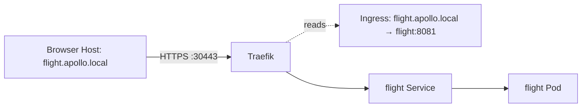
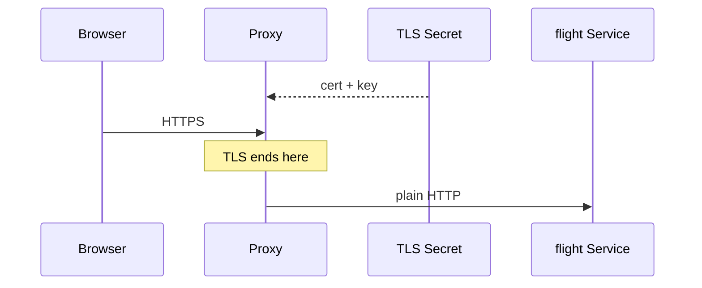

# Ingress and TLS

*Stage 2 · Guidance*

**You will be able to:** separate Ingress rules from the proxy, trace TLS termination, and list what a self-signed cert cannot prove.

## Key points

- Requests carry a `Host` header, so one proxy on 80/443 can choose the backend by host/path.
- **Ingress** = stored routing rules. **Ingress controller** (Traefik, NGINX) = the running proxy that reads them.
- Without a controller, an Ingress does nothing.



## Reading an Ingress

| Field | Meaning |
|---|---|
| `ingressClassName: traefik` | Which controller owns it |
| `rules[].host` | Host header to match |
| `paths[].pathType: Prefix` | `/` matches everything below |
| `backend.service` | Target Service + port |
| `tls[].secretName` | Secret with `tls.crt`/`tls.key` |

## TLS termination



- TLS protects **browser → proxy** only. Proxy → Service is plain HTTP in this lab.
- Missing/invalid Secret ⇒ Traefik serves its fallback cert (`CN=TRAEFIK DEFAULT CERT`), not a dropped connection.

## What a self-signed cert does not give

| Missing | Effect |
|---|---|
| Browser trust | Warnings; use `--cacert` |
| Renewal | Fixed expiry, no ACME |
| Edge → Pod encryption | Needs mTLS |
| Proof from `curl -k` | `-k` skips verification entirely |

## Try it

```bash
curl -kv --resolve flight.apollo.local:30443:127.0.0.1 https://flight.apollo.local:30443/readyz 2>&1 | grep -E 'issuer|subject|expire'
kubectl describe secret apollo-tls-secret -n apollo-airlines-apps
kubectl get ingress -n apollo-airlines-apps
```

## Diagnose

| Symptom | Layer |
|---|---|
| 404 from proxy | No rule matched the Host/path |
| 502/503 | Rule matched; backend has no ready endpoint |
| Wrong cert issuer | TLS Secret missing/invalid |

## Check yourself

<details>
<summary>Why does a 404 from the proxy not implicate the backend?</summary>

The proxy answered itself because no route matched; the backend was never contacted.
</details>
