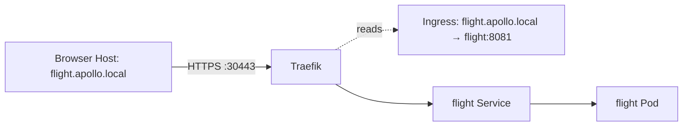
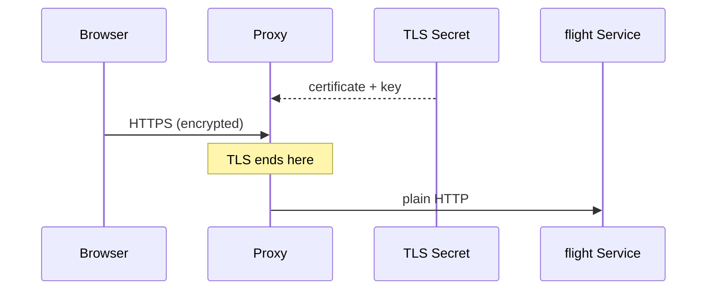

# Ingress and TLS

*Stage 2 · Guidance*

**You will be able to:** separate Ingress rules from the proxy that applies them, trace where TLS ends, and list what a self-signed certificate cannot prove.

## The problem

With NodePort, every service needs its own port number: flight on 30081, booking on 30082. Passengers should not need to know that. Yet every HTTP request already carries a `Host` header with the hostname it was meant for (`flight.apollo.local`). One proxy listening on the standard ports 80 and 443 can read that header and choose the right backend itself.

## The idea in plain words

Picture a hotel receptionist. Guests all arrive at one front desk and say which room they want; the receptionist directs them. Two separate things exist: the **guest list and room map** (the rules) and **the receptionist** (the one who acts on them).

- An **Ingress** is only the rules: "host `flight.apollo.local` goes to Service `flight` on 8081."
- An **Ingress controller** (Traefik, NGINX, …) is the running proxy that reads Ingress objects and configures itself from them.

An Ingress with no controller does nothing.



## How it works: reading an Ingress

| Field | Meaning |
|---|---|
| `ingressClassName: traefik` | Which controller owns this Ingress |
| `rules[].host` | The `Host` header to match |
| `paths[].pathType: Prefix` | `/` matches everything below it |
| `backend.service` | Target Service and port |
| `tls[].secretName` | Secret holding `tls.crt` and `tls.key` |

## How it works: TLS termination

TLS is the encryption behind HTTPS. **Terminating** TLS means the encrypted connection ends at the proxy, which holds the certificate and private key (loaded from a Kubernetes Secret). From there the proxy forwards the request to the Service in plain HTTP.



So TLS protects only the browser → proxy leg in this lab. If the Secret is missing or invalid, Traefik falls back to its own default certificate (`CN=TRAEFIK DEFAULT CERT`) instead of dropping the connection, which means the application is fine but the certificate is wrong.

## What a local self-signed certificate does not give you

| Missing | Effect |
|---|---|
| Browser trust | Warnings; you must supply the CA yourself (`curl --cacert`) |
| Renewal | Fixed expiry, no automatic issuing |
| Proxy → Pod encryption | Needs mTLS, which is out of scope here |
| Proof from `curl -k` | `-k` disables verification, so it proves only that a TLS port answered |

## Reading failures at the edge

| Symptom | Layer |
|---|---|
| 404 from the proxy | No rule matched the host or path; the backend was never contacted |
| 502 / 503 | A rule matched but the backend has no ready endpoint |
| Wrong certificate issuer | The TLS Secret is missing or invalid |

## Try it

```bash
curl -kv --resolve flight.apollo.local:30443:127.0.0.1 https://flight.apollo.local:30443/readyz 2>&1 | grep -E 'issuer|subject|expire'
kubectl describe secret apollo-tls-secret -n apollo-airlines-apps
kubectl get ingress -n apollo-airlines-apps
```

- The first command shows who issued the certificate the proxy presented.

## Common misconceptions

- **"An Ingress is a proxy."** It is configuration.
- **"HTTPS means the whole path is encrypted."** Only up to the TLS-terminating proxy.
- **"`curl -k` working means TLS is correct."** It skips the checks that matter.

## Check yourself

<details>
<summary>Why does a 404 from the proxy not implicate the backend?</summary>

The proxy answered itself because no route matched; the backend was never contacted.
</details>

## Where this leads

Ingress combines the entry point and the application's routes in one object. Gateway API separates them so different teams can own each part.
