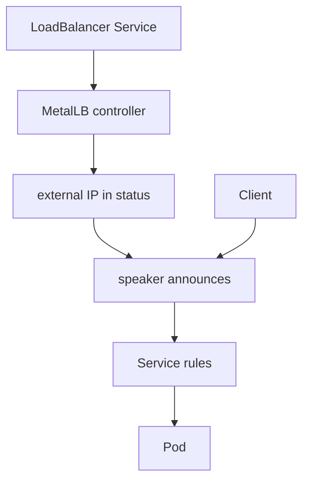

# NodePort and LoadBalancer

*Stage 2 · Guidance*

**You will be able to:** trace `localhost:30082` down to a Pod, and explain what actually fulfils `type: LoadBalancer`.

## The problem

A ClusterIP is private to the cluster network. Your laptop is outside it, so `curl` to a ClusterIP gets nowhere. To demonstrate Apollo in a browser we need a way in. The solutions form a ladder, each fixing the previous step's limitation.

## The idea in plain words

Imagine an office building (the cluster) with internal extension numbers (ClusterIPs). A visitor cannot dial an extension from the street. First you could give each department a **side door on a high floor** (NodePort). Better, a single **street-level entrance with a proper address** that someone staffs (LoadBalancer).

## How it works: NodePort

A `NodePort` Service does everything a ClusterIP does and additionally opens one port (30000–32767) **on every node**. Traffic arriving at any node on that port is routed to a ready Pod.

In kind there are *two* forwarding hops, owned by two different systems:

| Hop | System | Configured by |
|---|---|---|
| Your laptop `localhost:30082` → the control-plane container's port `30082` | Docker | `extraPortMappings` in `kind-config.yaml` |
| Node port `30082` → a ready booking Pod on `8082` | Kubernetes (`kube-proxy`) | The NodePort Service |


A NodePort Service involves three port numbers: `port` (the Service's own), `targetPort` (the container's) and `nodePort` (opened on each node). Without the kind mapping, the NodePort works inside the nodes but your laptop cannot reach it.

NodePort is fine for a lab but poor for production: awkward port range (users expect 80/443), opened on every node, and it works only at layer 4 with no host or path routing.

## How it works: LoadBalancer and MetalLB

`type: LoadBalancer` is a **request** stored on the Service: "give me an external address." Something in your environment must fulfil it. In a cloud, a cloud controller creates a managed load balancer. In kind there is no such controller, so the Service sits at `EXTERNAL-IP <pending>` forever.

**MetalLB** is the missing piece for local and bare-metal clusters:

| Part | Job |
|---|---|
| Controller | Assigns an IP from a configured pool (`172.18.0.50-172.18.0.100`) |
| Speaker | Announces that IP on the local Docker network using ARP (layer 2) |



## Comparison

| Type | Reachable from | Use |
|---|---|---|
| `ClusterIP` | Inside the cluster | Backends, databases |
| `NodePort` | `nodeIP:highport` | Local development |
| `LoadBalancer` | A dedicated external IP | An edge proxy or gateway |
| Gateway / Ingress | Layer-7 routing behind a LoadBalancer | Host and path routing |

## Try it

```bash
docker ps --filter name=apollo11 --format '{{.Names}} {{.Ports}}'
kubectl get svc -A -o wide | grep -E 'NodePort|LoadBalancer'
kubectl get svc -n envoy-gateway-system
```

- The first shows Docker's side (hop 1); the next two show the Kubernetes side.

## Common misconceptions

- **"NodePort alone exposes the app to my laptop."** In kind it also needs the Docker mapping.
- **"LoadBalancer creates a load balancer."** It requests one; a controller must create it.
- **"`<pending>` means the app is broken."** It means no controller fulfilled the request.

## Check yourself

<details>
<summary>A NodePort Service exists but <code>localhost:30099</code> refuses the connection. Why?</summary>

There is no kind host-port mapping for 30099. The port is open on the nodes only.
</details>

<details>
<summary>Why is <code>EXTERNAL-IP</code> <code>&lt;pending&gt;</code> without MetalLB?</summary>

No controller exists to fulfil the LoadBalancer request.
</details>

## Where this leads

An address gets traffic in. The next chapter lets one address serve many hostnames by routing on the HTTP `Host` header, and adds HTTPS.
