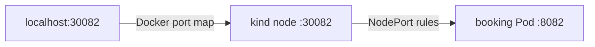
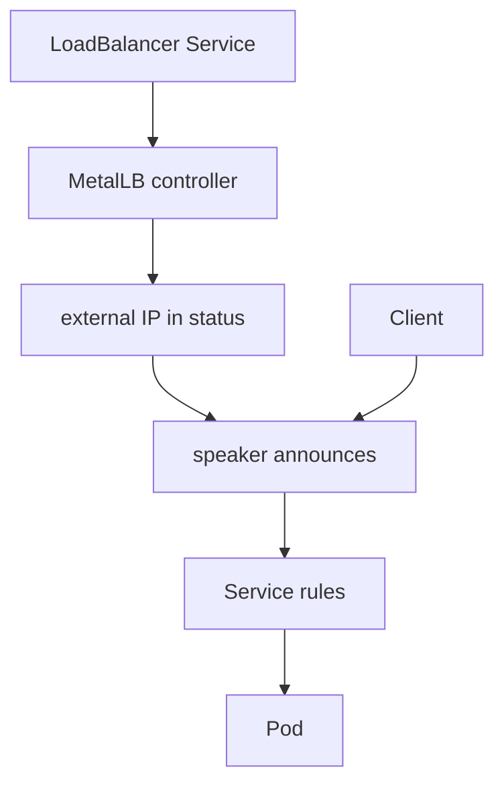

# NodePort and LoadBalancer

*Stage 2 · Guidance*

**You will be able to:** trace `localhost:30082` to a Pod, and explain what fulfils `type: LoadBalancer`.

## Two hops, two systems

| Hop | System | Configured by |
|---|---|---|
| Laptop `localhost:30082` → control-plane container `:30082` | Docker | `extraPortMappings` in `kind-config.yaml` |
| Node `:30082` → a ready Pod `:8082` | Kubernetes (`kube-proxy`) | NodePort Service |



- A NodePort opens on **every** node. Without the kind mapping it is not reachable from the laptop.
- Three numbers: `port` (Service), `targetPort` (container), `nodePort` (each node, 30000–32767).

## Why not production

- Ports 30000–32767, not 80/443.
- Opened on every node.
- L4 only: no host/path routing, no central TLS.

## LoadBalancer and MetalLB

- `type: LoadBalancer` is a **request**. In a cloud, a controller creates a cloud load balancer.
- In kind nothing fulfils it → `EXTERNAL-IP <pending>` forever.
- **MetalLB** fills the gap:

| Part | Job |
|---|---|
| Controller | Assign an IP from the pool (`172.18.0.50-100`) |
| Speaker | Announce the IP on the Docker network via ARP (layer 2) |



## Comparison

| Type | Reach | Use |
|---|---|---|
| `ClusterIP` | In cluster | Backends, DBs |
| `NodePort` | `nodeIP:highport` | Local dev |
| `LoadBalancer` | Dedicated external IP | Edge proxy/gateway |
| Gateway / Ingress | L7 behind a LoadBalancer | Host/path routing |

## Try it

```bash
docker ps --filter name=apollo11 --format '{{.Names}} {{.Ports}}'
kubectl get svc -A -o wide | grep -E 'NodePort|LoadBalancer'
kubectl get svc -n envoy-gateway-system
```

## Check yourself

<details>
<summary>A NodePort Service exists but <code>localhost:30099</code> refuses the connection. Why?</summary>

No kind host-port mapping for 30099. The port is open on the nodes only.
</details>

<details>
<summary>Why is <code>EXTERNAL-IP</code> <code>&lt;pending&gt;</code> without MetalLB?</summary>

No controller exists to fulfil the LoadBalancer request.
</details>
