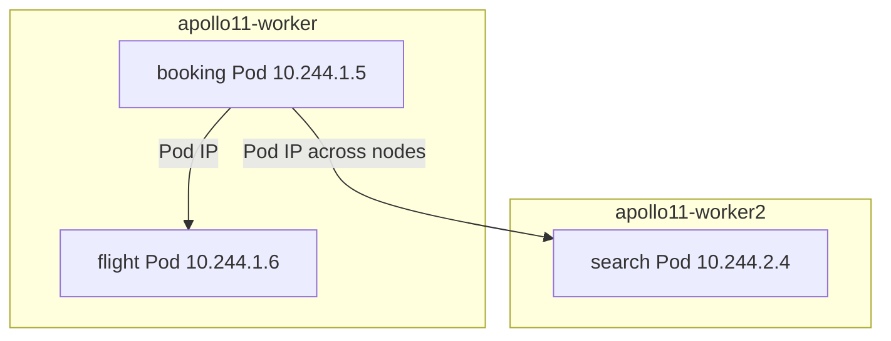

# Pod networks and CNI

*Stage 2 · Guidance*

**You will be able to:** explain how Pods reach each other across nodes, what a CNI plugin does, and what it deliberately does not provide.

Booking in one Pod must call flight in another, possibly on a different machine. For that to work, every Pod needs its own address and the machines must know how to carry packets between those addresses. Containers on a plain Docker host never needed this: Docker's bridge handled one machine. A cluster spans several.

## One flat network, built by a plugin

Imagine every Pod is a flat in a city with its own street address. The city (the cluster network) guarantees that any address can send a letter to any other address, no matter which district it is in. The **rule** is simple: *every Pod can reach every other Pod directly by IP, without translation.*

Kubernetes states that rule but does not build the roads. A **CNI plugin** (Container Network Interface) is the road builder: a plugin the container runtime calls whenever a Pod is created, to give it an address and connect it. Different clusters use different plugins; Apollo's kind cluster uses **kindnet**.

Inside a Pod there is one more rule: containers in the **same Pod** share a single network environment: one IP, one set of interfaces, one `localhost`. They can talk to each other over `localhost`. Containers in **different** Pods have different IPs, even on the same node.

## What the CNI plugin does for each Pod

When a Pod is created, the runtime asks the CNI plugin to do three things:

1. **Choose an address:** allocate a Pod IP from the range reserved for that node (this is called IPAM; Apollo's Pod range is `10.244.0.0/16`).
2. **Connect the Pod:** create a virtual network interface for the Pod and attach it to the node's networking.
3. **Make it routable:** configure routes so packets for that IP reach this node, and from other nodes as well.



How it is done underneath (virtual cables, tunnels, eBPF) differs by plugin, and you do not need those details to trace a request.

## What the CNI does not give you

| Missing | Why it matters | What fills it |
|---|---|---|
| Stable addresses | Pod IPs change on every replacement | Services (next chapters) |
| Access from outside | The Pod range is private to the cluster | NodePort, LoadBalancer, Gateway |
| Policy enforcement | A `NetworkPolicy` is only a request unless the CNI enforces it. **kindnet does not**; Calico does (Stage 8) | An enforcing CNI |

## Try it

```bash
kubectl get pods -n apollo-airlines-apps -o wide
IP=$(kubectl get pod -n apollo-airlines-apps -l app=booking -o jsonpath='{.items[0].status.podIP}')
kubectl exec -n apollo-airlines-ui curl-client -- curl -s http://$IP:8082/healthz
kubectl get pods -n kube-system -l 'k8s-app in (kindnet,calico-node,cilium)'
```

- The direct call skips the Service and tests raw Pod-to-Pod routing. The last command shows which CNI is installed.

## Common misconceptions

- **"Pods on the same node share an IP."** Each Pod has its own; only containers *within* a Pod share one.
- **"I should hard-code a Pod's IP."** It changes on replacement.
- **"Applying a NetworkPolicy secured the network."** On kindnet it does nothing.

## Check yourself

<details>
<summary>Two containers in one Pod: how do they talk?</summary>

Over `localhost`; they share one network namespace and IP.
</details>

<details>
<summary>A NetworkPolicy is applied on kindnet. Is traffic restricted?</summary>

No. The CNI must implement enforcement; kindnet does not.
</details>

## Where this leads

Pod IPs work but do not last. The next chapter shows how a Service turns "a set of changing Pods" into one stable address, and separates the configuration from the packets.
