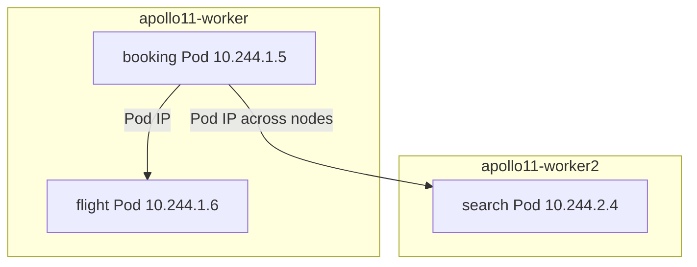

# Pod networks and CNI

*Stage 2 · Guidance*

**You will be able to:** explain how Pods reach each other across nodes and what the CNI does and does not provide.

## Key points

- Containers in **one Pod** share a network namespace: same IP, same interfaces, same `localhost`.
- **Different Pods** have different IPs, even on the same node. Pod-to-Pod traffic needs no host port.
- Kubernetes states the requirement ("every Pod can reach every Pod by IP"); a **CNI plugin** implements it. Apollo's kind cluster uses **kindnet**; Pod CIDR is `10.244.0.0/16`.



## What the CNI does

| Step | Work |
|---|---|
| IPAM | Allocate a Pod IP from the node's range |
| Connect | Create the Pod's virtual interface, attach to the node network |
| Route | Make Pod IPs reachable on this and other nodes |

- `veth`, VXLAN, eBPF are implementation choices; you do not need them to trace a request.

## What the CNI does not give you

| Missing | Because |
|---|---|
| Stable addresses | Pod IPs change on replacement → Services |
| External access | Pod CIDR is private to the cluster |
| Policy enforcement | `NetworkPolicy` objects do nothing unless the CNI enforces them. **kindnet does not**; Stage 8 adds Calico |

## Try it

```bash
kubectl get pods -n apollo-airlines-apps -o wide                       # Pod IPs and nodes
IP=$(kubectl get pod -n apollo-airlines-apps -l app=booking -o jsonpath='{.items[0].status.podIP}')
kubectl exec -n apollo-airlines-ui curl-client -- curl -s http://$IP:8082/healthz   # bypass the Service
kubectl get pods -n kube-system -l 'k8s-app in (kindnet,calico-node,cilium)'
```

- The direct call isolates raw Pod routing from Service routing.

## Gotchas

- Do not hard-code Pod IPs; replacements get new ones.
- A declared NetworkPolicy on kindnet is inert. Label it *reference only*.

## Check yourself

<details>
<summary>Two containers in one Pod: how do they talk?</summary>

Over `localhost`; they share one network namespace and IP.
</details>

<details>
<summary>A NetworkPolicy is applied on kindnet. Is traffic restricted?</summary>

No. The CNI must implement enforcement; kindnet does not.
</details>
