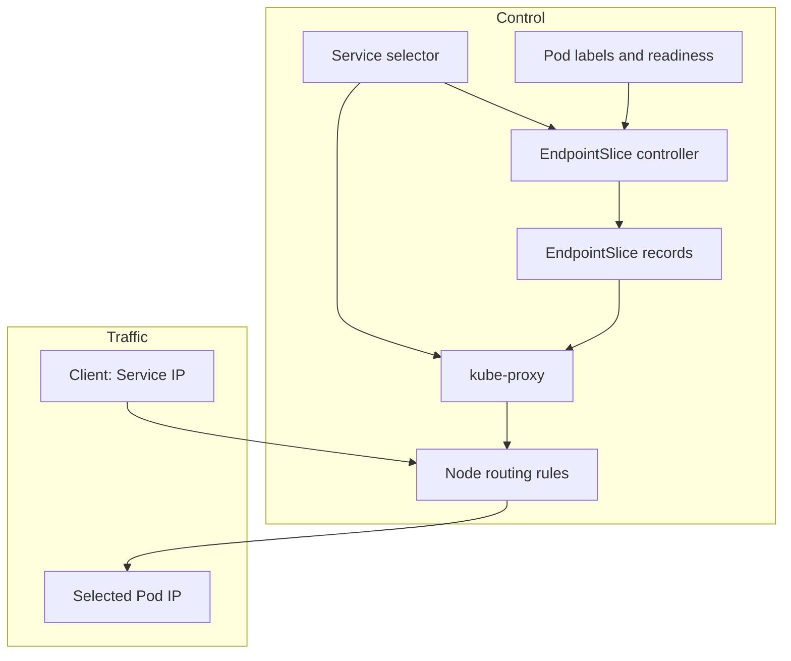

# Service control path and packet path

A Service is stable configuration, not a proxy process. The EndpointSlice controller records eligible endpoints from Service selectors and Pod readiness. Implementations such as kube-proxy consume Service and endpoint information to program node routing rules. Separately, a client sends traffic to the Service address; node rules choose and rewrite toward a backend. Packets do not travel through an EndpointSlice API object.

*Diagram NW-01 — configuration flow and application traffic are deliberately separate.*

## Build the route in two drawings

A Service begins as a desired relationship: its selector names the labels of
candidate Pods. The EndpointSlice controller watches Services and Pod
conditions, then records the current eligible addresses in EndpointSlice
objects. Those objects are routing information, not a process or a hop through
which packets travel.

A node routing implementation, such as kube-proxy, consumes Service and endpoint
information and updates node rules. Separately, a client sends a packet toward
the Service address. The node rules choose a backend and rewrite or forward the
destination. Keeping these paths separate prevents a diagram from making an API
record look like a network appliance.

## Evidence and limits

Inspect the selector, matching labels, readiness conditions, EndpointSlices, and
the node implementation’s rules or logs. Then make a request from the client
location that matters. Endpoint publication and node-rule updates are
asynchronous, so a change can be visible in the API before every traffic path
has adopted it.

