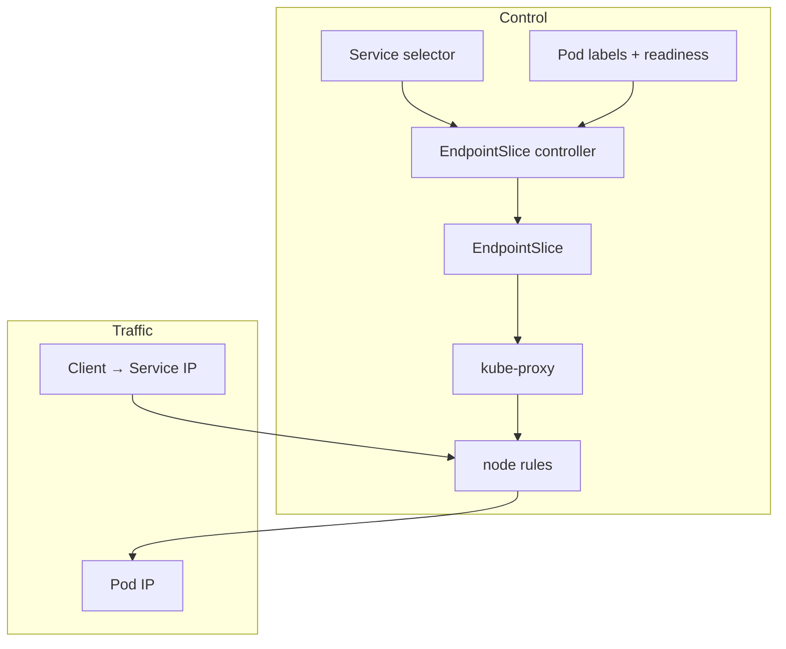

# Service control path and packet path

*Stage 2 · Guidance*

**You will be able to:** draw configuration flow and packet flow separately, and say what each object does.

## Key points

- A **Service** is stable configuration, not a proxy process.
- The **EndpointSlice controller** turns (Service selector + Pod readiness) into `EndpointSlice` records of ready Pod IPs.
- **kube-proxy** (or equivalent) on each node reads Services + EndpointSlices and programs kernel rules (iptables in kind).
- A client sends to the Service IP; the node's rules pick a backend and rewrite the destination.
- **Packets never traverse an EndpointSlice object.** It is routing information.


```mermaid
flowchart TB
  subgraph Control
    S[Service selector] --> ESC[EndpointSlice controller]
    P[Pod labels + readiness] --> ESC
    ESC --> ES[EndpointSlice]
    ES --> KP[kube-proxy] --> R[node rules]
  end
  subgraph Traffic
    C[Client → Service IP] --> R --> B[Pod IP]
  end
```

## Who owns which step

| Step | Actor | Evidence |
|---|---|---|
| Selector matches Pods | EndpointSlice controller | `kubectl get endpointslices` |
| Pod counts as an endpoint | kubelet readiness | `conditions.ready` |
| Rules installed | kube-proxy | `iptables-save` on the node |
| Packet rewritten | Kernel | Request succeeds from the client |

## Gotchas

- Publishing is **asynchronous**: the API can show a change before every node has adopted it.
- A Service with no ready endpoints still has a ClusterIP and resolves in DNS.

## Try it

```bash
kubectl get svc flight -n apollo-airlines-apps
kubectl get endpointslice -n apollo-airlines-apps -l kubernetes.io/service-name=flight -o jsonpath='{range .items[*].endpoints[*]}{.addresses[0]} ready={.conditions.ready}{"\n"}{end}'
docker exec apollo11-worker iptables-save | grep -m3 'flight'
```

## Check yourself

<details>
<summary>Is an EndpointSlice a hop on the packet path?</summary>

No. It is data that node rules are built from.
</details>
