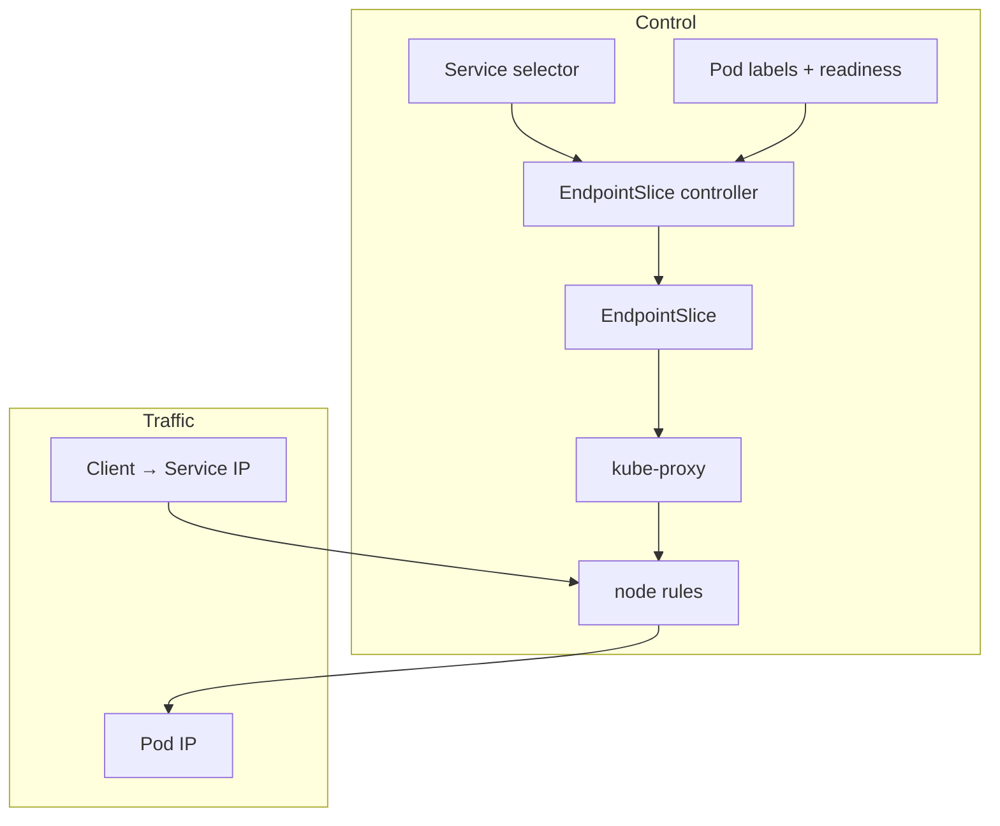

# Service control path and packet path

*Stage 2 · Guidance*

**You will be able to:** draw the configuration flow and the packet flow of a Service separately, and say what each object does.

Diagrams of Services often draw an arrow "client → Service → Pod" as if the Service were a little proxy program. That picture is wrong, and it causes real debugging mistakes: people look for a Service "process" to restart, or assume an EndpointSlice is something packets pass through. To debug routing you need the correct picture, which has two separate stories.

## Two paths: the directory and the call

Think of a **phone directory** and a **phone call**. Updating the directory (who is on duty today) is one activity; a call being connected is another. The directory entry is not on the line while you talk.

For a Service:

- The **control path** is the directory update: working out which Pods are currently eligible and recording them.
- The **traffic path** is the call: a real packet being sent to a Pod.

## Following both paths

**Control path (preparing the information):**

1. A **Service** says "I want Pods labelled `app=flight`" (its selector) and has a virtual ClusterIP.
2. The **EndpointSlice controller** watches Services and Pods. It lists the Pods that match the selector **and** are ready, and writes their IPs into `EndpointSlice` objects.
3. **kube-proxy**, a small agent on every node, reads Services and EndpointSlices and programs rules in the node's kernel (iptables in kind).

**Traffic path (a request):**

4. A client sends a packet to the Service's ClusterIP.
5. The node's kernel rules choose one ready Pod IP from the list and rewrite the packet's destination.
6. The packet arrives at that Pod.


```mermaid
flowchart TB
  subgraph Control
    S[Service selector] --> ESC[EndpointSlice controller]
    P[Pod labels + readiness] --> ESC
    ESC --> ES[EndpointSlice]
    ES --> KP[kube-proxy] --> R[node rules]
  end
  subgraph Traffic
    C[Client → Service IP] --> R --> B[Pod IP]
  end
```

The ClusterIP is virtual: no interface holds it and no program listens on it. It exists only as a pattern the kernel rules recognise and rewrite.

## Who owns each step

| Step | Actor | Evidence you can inspect |
|---|---|---|
| Selector matches Pods | EndpointSlice controller | `kubectl get endpointslices` |
| A Pod counts as an endpoint | kubelet readiness result | `conditions.ready` on the endpoint |
| Rules installed | kube-proxy | `iptables-save` on the node |
| Packet rewritten | Kernel | The request succeeds from the client |

## Apollo example

`flight` is a Service on port 8081. Its EndpointSlice lists the IPs of the ready flight Pods. If you scale flight to zero, the Service still has a ClusterIP and still resolves in DNS, but its EndpointSlice is empty, so there is nowhere to send a packet.

## Try it

```bash
kubectl get svc flight -n apollo-airlines-apps
kubectl get endpointslice -n apollo-airlines-apps -l kubernetes.io/service-name=flight -o jsonpath='{range .items[*].endpoints[*]}{.addresses[0]} ready={.conditions.ready}{"\n"}{end}'
docker exec apollo11-worker iptables-save | grep -m3 'flight'
```

- The first two are the control path's records; the last shows the rules the traffic path actually uses.

## Common misconceptions

- **"The Service is a proxy I can restart."** It is data; kernel rules do the forwarding.
- **"An EndpointSlice is a hop on the path."** Packets never traverse it.
- **"A change is visible everywhere instantly."** Publishing and rule updates are asynchronous, so the API can show a change before every node has adopted it.

## Check yourself

<details>
<summary>Is an EndpointSlice a hop on the packet path?</summary>

No. It is data that node rules are built from.
</details>

## Where this leads

Services are found by name. The next chapter explains how a name like `flight` becomes an IP, and why that stops working across namespaces.
