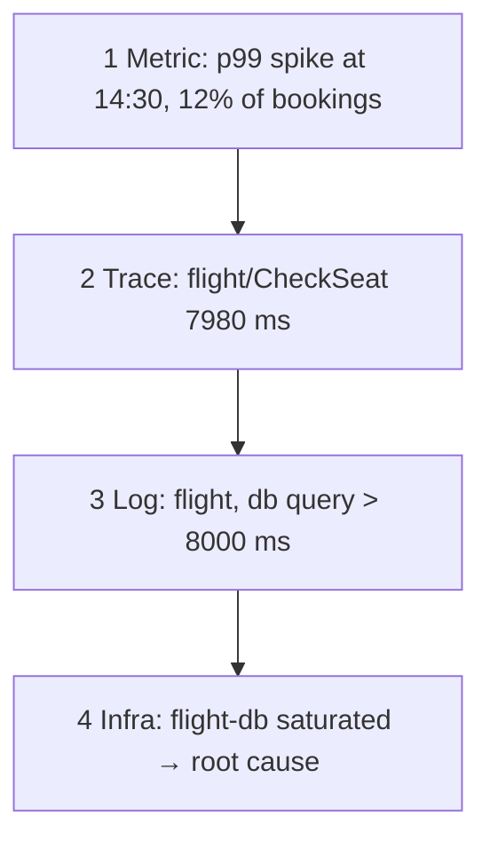

# Correlating a booking

*Stage 6 · Mission Operations*

**You will be able to:** follow a four-step triage from fleet scope to one request's cause.

## Triage



| Step | Question | Tool | Output |
|---|---|---|---|
| 1 | How widespread? since when? | Prometheus | Rate/p99/error ratio around the incident |
| 2 | Where did the time go? | Tempo (trace ID) | The slow/failing span |
| 3 | What did that service say? | Loki (`trace_id` / request ID) | Error text |
| 4 | Why? | Metrics on the resource | CPU, connections, queue |

- Each signal narrows the next: **scope → location → detail → cause**.
- Joins: `trace_id` (traces ↔ logs) and `X-Request-ID` (logs across services).

## Commands

```bash
kubectl logs -n apollo-airlines-apps deploy/booking | grep '<booking-ref>' | jq .trace_id
curl -s localhost:13200/api/traces/<trace-id> | jq '.batches[].scopeSpans[].spans[] | {name, ms: ((.endTimeUnixNano|tonumber) - (.startTimeUnixNano|tonumber))/1e6, status}'
```

## Limits

- An aggregate percentile cannot hand you one request's trace.
- A passing booking can still hide a failed async call (notification): trace it, don't assume.
- Correlation gives a hypothesis; confirm with a measurement or a controlled change.

## Check yourself

<details>
<summary>Which two IDs join metrics-era symptoms to the right log lines?</summary>

The time window (metric), then `trace_id` from the trace, then the same ID (or `X-Request-ID`) in Loki.
</details>
