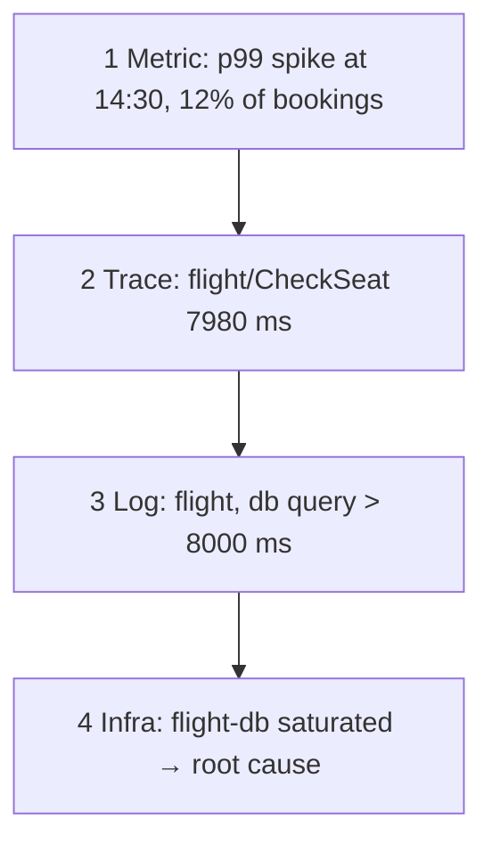

# Correlating a booking

*Stage 6 · Mission Operations*

**You will be able to:** follow a four-step triage from fleet-wide symptom to the cause behind one request.

## The problem

You have metrics, traces and logs. The skill is *order*: opening Grafana and clicking around is not an investigation. Each signal answers a different question, and each narrows what to ask the next.

## The idea in plain words

Finding a leak in a building: first notice that water use is up (where is the problem, roughly?); then check each floor's meter to find the floor (which part?); then enter the room and look (what exactly?); finally find out why the pipe failed (cause). Moving from the broad to the specific saves time.

| Step | Question | Tool | Output |
|---|---|---|---|
| 1 | How widespread? Since when? | Prometheus | Rate, p99 or error ratio around the incident |
| 2 | Where did the time go? | Tempo (trace ID) | The slow or failing span |
| 3 | What did that service say? | Loki (`trace_id` or request ID) | The error text |
| 4 | Why? | Metrics on the resource | CPU, connection pool, queue depth |



## How it works: the joins

The signals are connected by shared identifiers:

- **Time window** links a metric spike to traces from that window.
- **`trace_id`** links a trace to the log lines from the same request.
- **`X-Request-ID`** links log lines across services.

## Useful commands

```bash
kubectl logs -n apollo-airlines-apps deploy/booking | grep '<booking-ref>' | jq .trace_id
curl -s localhost:13200/api/traces/<trace-id> | jq '.batches[].scopeSpans[].spans[] | {name, ms: ((.endTimeUnixNano|tonumber) - (.startTimeUnixNano|tonumber))/1e6, status}'
```

## Limits

- An aggregate percentile cannot hand you the trace of one slow request.
- A booking that returns success may still hide a failed asynchronous call (notification). Trace it; do not assume.
- Correlation gives you a hypothesis. Confirm it with a measurement or a controlled change.

## Common misconceptions

- **"One dashboard is enough."** Each signal has blind spots.
- **"The first plausible cause is the cause."** Confirm it.

## Check yourself

<details>
<summary>Which identifiers join a metric spike to the right log lines?</summary>

The time window (metric), then `trace_id` from the trace, then the same ID (or `X-Request-ID`) in Loki.
</details>

## Where this leads

Now you can see problems. Stage 7 asks the next question: when load grows, which change genuinely helps?
