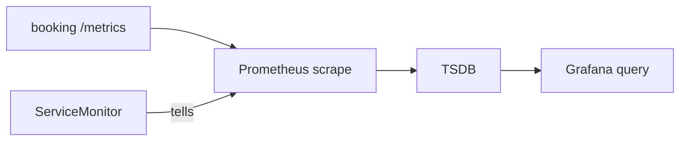

# Discovery and collection

*Stage 6 · Mission Operations*

**You will be able to:** find which of four links is broken when a metric is missing from a dashboard.

A Grafana panel is empty. The cause could be the app, the scrape configuration, Prometheus itself, or the query. Without a model of the chain you will poke at random. The key insight: *creating a configuration object is not the same as data arriving*.

## Scraping needs an unbroken chain

Think of a **newspaper delivery chain**: the printing press (your app) must produce papers, the delivery route (discovery) must include your street, the courier (Prometheus) must actually go, and finally you must be looking at the right paper (the query). A missing paper could fail at any link.

Prometheus works by **scraping**: every so often it makes an HTTP request to each target's `/metrics` endpoint and stores what it reads. It needs a list of targets, and on Kubernetes that list is built automatically.

## The four links



| Link | Owner | What a break looks like |
|---|---|---|
| 1. The app exposes `/metrics` | The app | `curl` of the endpoint fails |
| 2. **Discovery:** a ServiceMonitor selects a Service | You | The target is **missing** from `/api/v1/targets` |
| 3. **Scrape** | Prometheus | The target is listed but `health: down` (`up == 0`) |
| 4. Query and visualise | You / Grafana | Samples exist but the panel is empty (a wrong query) |

A **ServiceMonitor** is a custom resource, installed with the Prometheus Operator, that says "scrape the Services matching these labels, on this port, at this path". The Operator translates it into Prometheus's scrape configuration. So the object existing is only a *request*; samples must still be stored.

```yaml
metadata:
  labels: {app.kubernetes.io/part-of: apollo-airlines}   # Prometheus selects monitors by this label
spec:
  selector: {matchLabels: {app: booking}}                # labels on the Service
  namespaceSelector: {matchNames: [apollo-airlines-apps]}
  endpoints: [{port: http, path: /metrics, interval: 30s}]
```

| Common error | Fix |
|---|---|
| The monitor's labels do not match Prometheus' `serviceMonitorSelector` | Read the real selector instead of copying another chart's convention |
| `port` is a number | Use the Service port's **name** |
| Wrong namespace selector | List the app's namespace |

## Diagnose from the inside out

Test each link in order, starting at the app:

```bash
kubectl -n apollo-airlines-apps port-forward svc/booking 18082:8082 &
curl -s localhost:18082/metrics | grep http_requests_total                       # 1: does the app expose it?
kubectl describe servicemonitor booking -n apollo-observability                  # 2: does the selector match?
curl -s localhost:19090/api/v1/targets | jq -r '.data.activeTargets[]|"\(.scrapePool) \(.health)"'   # 3: is it scraped?
curl -sG localhost:19090/api/v1/query --data-urlencode 'query=up == 0'           # 3: which scrapes are failing?
```

`up` is a metric Prometheus records for every target: `1` if the last scrape worked, `0` if not.

## Common misconceptions

- **"The ServiceMonitor exists, so Prometheus is collecting."** Check the target list and that the sample count is rising.
- **"A missing target and a down target are the same."** Missing is a discovery problem; down is a scrape problem.

## Check yourself

<details>
<summary>The target is listed but <code>health: down</code>. Discovery or scrape?</summary>

Scrape: discovery worked (it is listed). Check the endpoint, port and network.
</details>

## Where this leads

Collected metrics become useful when you turn them into questions and alerts. That is the next chapter.
