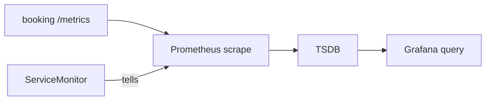

# Discovery and collection

*Stage 6 · Mission Operations*

**You will be able to:** find which of four links is broken when a metric is missing.

## The chain



| Link | Owner | Break looks like |
|---|---|---|
| 1 App exposes `/metrics` | App | `curl` of the endpoint fails |
| 2 Discovery: ServiceMonitor matches a Service | You | Target **missing** from `/api/v1/targets` |
| 3 Scrape | Prometheus | Target present, `health: down`, `up == 0` |
| 4 Query/visualise | You / Grafana | Samples exist but panel is empty (wrong query) |

- A ServiceMonitor **object existing** is not collection. Prometheus' Operator turns it into scrape config; only then are samples stored.

## ServiceMonitor anatomy

```yaml
metadata:
  labels: {app.kubernetes.io/part-of: apollo-airlines}   # Prometheus selects monitors by this
spec:
  selector: {matchLabels: {app: booking}}                # labels on the Service
  namespaceSelector: {matchNames: [apollo-airlines-apps]}
  endpoints: [{port: http, path: /metrics, interval: 30s}]
```

| Common error | Fix |
|---|---|
| Monitor labels don't match the Prometheus `serviceMonitorSelector` | Check the real selector, not another chart's convention |
| `port` is a number | Use the Service port **name** |
| Wrong namespace selector | List the app's namespace |

## Diagnose from the inside out

```bash
kubectl -n apollo-airlines-apps port-forward svc/booking 18082:8082 &
curl -s localhost:18082/metrics | grep http_requests_total              # 1 app
kubectl describe servicemonitor booking -n apollo-observability          # 2 selector
curl -s localhost:19090/api/v1/targets | jq -r '.data.activeTargets[]|"\(.scrapePool) \(.health)"'  # 3 scrape
curl -sG localhost:19090/api/v1/query --data-urlencode 'query=up == 0'   # 3 failed scrapes
```

## Check yourself

<details>
<summary>The target is listed but <code>health: down</code>. Discovery or scrape?</summary>

Scrape: discovery worked (it is listed). Check the endpoint, port and network.
</details>
