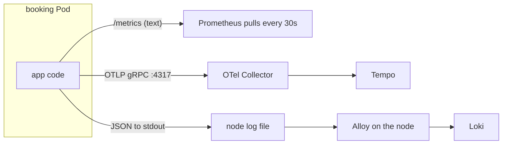

# How signals leave a service

*Stage 6 · Mission Operations*

**You will be able to:** say which code produces each of Apollo's three signals, how each one leaves the Pod, and which component you'd check when one of them goes quiet.

Stage 5 delivered Apollo reliably, yet booking's `/metrics` returned a small JSON object nothing could read, logs existed only inside each container, and nothing recorded how a request moved between services. No dashboard or tool installed *around* the app can fix that. **Observability starts in the code.** The app has to produce the data, and then the data has to get out of the Pod, and each signal gets out a different way.

## Three signals, three delivery styles

Think of a hospital patient with three kinds of record:

- A **bedside monitor** shows readings, and a nurse walks round every few minutes to write them down. The patient does nothing; the nurse *pulls*. That's **metrics**.
- A **referral letter** goes with the patient to every department, and each department adds a note and sends a copy to records. The patient *pushes* it along. That's **traces**.
- The patient **talks**, and a ward clerk writes down what was said. That's **logs**: the app only speaks (writes to stdout), and something else collects it.

The analogy ends there. In software these three paths are separate pipelines with separate failure modes, and each one is fixed in a different place.

## The paths out of a Pod



| Signal | Produced by (in Apollo's Go services) | Leaves the Pod by | Collected by | If it's broken, check |
|---|---|---|---|---|
| **Metrics** | `prometheus/client_golang`: a counter `http_requests_total`, a histogram `http_request_duration_ms`, updated by middleware on every request | **Pull**: Prometheus GETs `/metrics` | Prometheus, told where to look by a ServiceMonitor | `curl /metrics`, then the Prometheus targets page |
| **Traces** | OpenTelemetry SDK: `otelgin` middleware starts a span per request; `callService` starts a child span per outgoing call and injects `traceparent` | **Push**: OTLP to `OTEL_EXPORTER_OTLP_ENDPOINT` | OTel Collector, which batches and forwards to Tempo | Collector logs, then whether *every* hop forwards `traceparent` |
| **Logs** | `logJSON(...)`: one JSON line per event with `level`, `service`, `trace_id`, `span_id`, `message` | **Stdout**: the container runtime writes it to a file on the node | Alloy (a DaemonSet) reads those files and pushes to Loki | A request made *now* appears in Loki, not just old lines |

Identity is in Python and uses the matching OpenTelemetry packages for FastAPI, `requests` and `psycopg2`, so the same three paths apply.

### Why three different paths

- **Metrics are pulled** because they're cheap running totals. Prometheus decides how often to read them, and a missed scrape just means one missing point. It also tells you if a target is *down* (`up == 0`), which a push model can't.
- **Traces are pushed** because spans are events that happen once. If nobody receives them, they're gone, so the app sends them as soon as they finish, to a nearby Collector.
- **Logs go to stdout** because the app shouldn't need to know where logs are stored. The platform picks them up from the node, and they survive the Pod being deleted.

### Why a Collector and an agent in the middle

The app talks to one local endpoint (the Collector) or to nothing at all (stdout). It doesn't know that Tempo or Loki exist. Changing a backend, adding batching or capping memory is then a change to one config, not to six services.

### The join between signals

Each signal answers a different question ([Signals and metrics](./signals-and-metrics)). To move from one to another you need something they share:

- **Time:** a metric spike tells you *when* to look.
- **`trace_id`:** request handlers pass the current trace ID to `logJSON`, so the log lines a request produces carry it, and a trace in Tempo leads straight to them in Loki. A line logged outside a request (start-up, for example) has an empty `trace_id`.
- **Labels:** `service` and `namespace` mean the same thing in Prometheus and Loki because both are taken from the same Pod and Service labels.

What *not* to share: per-request IDs as metric labels. Each new value creates a new time series ([the cardinality rule](./signals-and-metrics#the-cardinality-rule)).

### Telemetry is out of band

If Tempo is down, booking keeps taking bookings and the spans are dropped. If Prometheus stops scraping, nothing in the app notices. That's deliberate: a monitoring failure must never become a passenger failure. The cost is that a broken pipeline is silent, so each pipeline needs its own check.

## Apollo example

- [`stages/stage6/code/booking/main.go`](https://github.com/darshan-raul/Apollo11/blob/69113dcc80f77e32301d8ee7b9e73a67c923de96/stages/stage6/code/booking/main.go): metrics vars, `logJSON`, `callService`, `addTraceparent`, OTel set-up.
- The Helm app templates set `OTEL_EXPORTER_OTLP_ENDPOINT` and `OTEL_SERVICE_NAME` on each Deployment.
- Stage 5's chart and Stage 6's chart deploy the apps the same way. The difference is in the code.

## Try it

```bash
kubectl exec -n apollo-airlines-apps deploy/booking -- wget -qO- http://127.0.0.1:8082/metrics | grep '^http_requests_total' | head -3
kubectl logs -n apollo-airlines-apps deploy/booking --tail=3
```

The first shows the pull endpoint; the second shows the JSON lines that Alloy will ship, each with a `trace_id` field.

## Common misconceptions

- **"Installing Prometheus gives me metrics."** It gives you a collector. Without instrumented code there's nothing to collect.
- **"Logs, metrics and traces all travel the same way."** Each has its own path and its own failure point.
- **"If traces are missing, the request failed."** Tracing is out of band. Bookings can succeed while every span is dropped.
- **"Auto-instrumentation middleware is enough."** It traces incoming requests. Outgoing calls must carry `traceparent`, or the next service starts a new trace.

## Check yourself

<details>
<summary>Bookings work and Grafana shows request rates, but Tempo has no new traces. Which path broke, and what's still fine?</summary>

The push path (app → Collector → Tempo). The pull path for metrics is independent and still works. Check that the Collector is running and can reach Tempo.
</details>

<details>
<summary>Why does Alloy run as a DaemonSet, not as one Deployment replica?</summary>

Log files live on the node that ran the container. One agent per node can read every Pod's logs on that node, including Pods scheduled later.
</details>

## Where this leads

Now the signals reach the cluster. The next chapters follow each one: [Discovery and collection](./discovery-and-collection) for how Prometheus finds targets, then [Logs](./logs) and [Traces](./traces).
