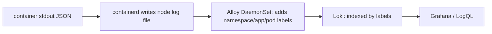

# Logs

*Stage 6 · Mission Operations*

**You will be able to:** write a useful structured log, trace the shipping path, and query Loki.

## Structured beats unstructured

| Unstructured | Structured JSON |
|---|---|
| `ERROR booking failed for user 1234: duplicate key` | `{"level":"error","service":"booking","trace_id":"…","booking_reference":"AA-…","error":"…duplicate key…"}` |
| Regex to query | Filter by field; join to traces via `trace_id` |

## Pipeline



- Apps log to **stdout**. Alloy (one per node) reads the files, labels them (`app` → `service`) and pushes to Loki.
- Loki indexes **labels**, not content: filter by label first, then search text.

## What to log

| Always | Never |
|---|---|
| `trace_id`, `request_id`, error reason, safe business IDs (flight code, booking ref) | JWTs, passwords, card numbers, passenger PII |

## Queries

```logql
{service="booking", namespace="apollo-airlines-apps"} |= "error" | json | level="error"
{service=~".+"} |= "<request-id>"
```

```bash
kubectl logs -n apollo-airlines-apps deploy/booking --tail=50     # ground truth
```

## Limits

- A search hit proves the line was **shipped**. Old logs staying searchable do not prove **current** collection: test with a fresh ID.
- `kubectl logs` of a deleted Pod is gone unless shipped to Loki.
- A "graceful shutdown" line does not prove no request failed.

## Check yourself

<details>
<summary>Loki still returns last week's lines. Is Alloy working today?</summary>

Unknown. Send a request with a new unique ID and check that it appears.
</details>
