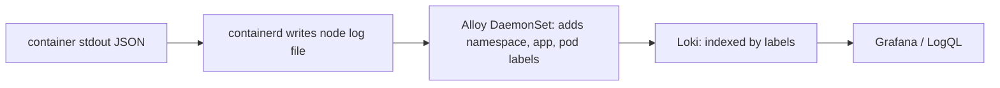

# Logs

*Stage 6 · Mission Operations*

**You will be able to:** write a log line that can be searched and correlated, trace how it reaches Loki, and query it.

## The problem

A metric tells you booking errors rose at 14:30. It cannot tell you the error message. For that you need the process's own account of what happened. But with many Pods that come and go, `kubectl logs` on a single Pod is not enough: the Pod may be gone, and you cannot search across services.

## The idea in plain words

Logs are the **ship's diary**. For the diary to be useful for investigation it needs a consistent structure (so you can search by field, not guess with text patterns) and a way to be collected somewhere central before the ship (Pod) is lost.

| Unstructured | Structured JSON |
|---|---|
| `ERROR booking failed for user 1234: duplicate key` | `{"level":"error","service":"booking","trace_id":"…","booking_reference":"AA-…","error":"…duplicate key…"}` |
| Searching needs fragile text patterns | Filter by field; join to traces with `trace_id` |

Including a `trace_id` is the key to correlation: it lets you jump from a slow span in a trace straight to the log lines from that very request.

## How it works: the pipeline



1. Apps just write JSON to **stdout**. They do not manage log files.
2. The container runtime captures stdout to a file on the node.
3. **Grafana Alloy** runs on every node (a DaemonSet). It reads those files and attaches Kubernetes labels (`namespace`, `app` → `service`, `pod`).
4. It ships them to **Loki**, which indexes the **labels** (not the text) and stores the lines.
5. You query with **LogQL**: filter by label first, then search text.

## What to log

| Always | Never |
|---|---|
| `trace_id`, `request_id`, the error reason, safe business IDs (flight code, booking reference) | JWTs, passwords, card numbers, passenger personal data |

## Queries

```logql
{service="booking", namespace="apollo-airlines-apps"} |= "error" | json | level="error"
{service=~".+"} |= "<request-id>"
```

```bash
kubectl logs -n apollo-airlines-apps deploy/booking --tail=50     # ground truth, one Pod
```

## What a log can and cannot show

- A search hit proves that line was **shipped**. Old logs staying searchable do **not** prove collection is working *today*: test with a fresh ID.
- `kubectl logs` for a deleted Pod is gone unless the line was shipped to Loki.
- A "graceful shutdown" message does not prove no request failed.

## Common misconceptions

- **"If it is in Loki, the pipeline is healthy."** It might be old data.
- **"Loki indexes everything I log."** It indexes labels; text search scans.
- **"Logging more detail is always safer."** Sensitive data in logs is a security incident.

## Check yourself

<details>
<summary>Loki still returns last week's lines. Is Alloy working today?</summary>

Unknown. Send a request with a new unique ID and check that it appears.
</details>

## Where this leads

Logs show what one process saw. A booking crosses four services; the next chapter follows the whole journey with traces.
