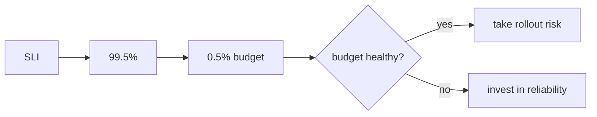

# Queries, alerts, and objectives

*Stage 6 · Mission Operations*

**You will be able to:** write the three core queries, say what an alert does, and compute an error budget.

## PromQL patterns

```promql
rate(http_requests_total{service="booking",status="200"}[5m])          # per-second rate

sum(rate(http_requests_total{service="booking",status=~"5.."}[5m]))
  / sum(rate(http_requests_total{service="booking"}[5m])) * 100        # error %

histogram_quantile(0.99, sum by(le) (rate(http_request_duration_ms_bucket{service="booking"}[5m])))   # p99
```

## Alerts

| Fact | Detail |
|---|---|
| An alert **notifies**; it does not scale or restart anything | Routes to Alertmanager → Slack/pager |
| `for: 2m` | Condition must hold 2 min before firing; stops flapping |
| States | inactive → **pending** → **firing** |

```yaml
- alert: BookingErrorRateHigh
  expr: sum(rate(http_requests_total{service="booking",status=~"5.."}[5m])) / sum(rate(http_requests_total{service="booking"}[5m])) > 0.05
  for: 2m
  labels: {severity: warning}
```

## SLI, SLO, error budget

| Term | Apollo booking |
|---|---|
| **SLI** | Good ÷ eligible `POST /api/bookings`. Eligible = 2xx or 5xx; **4xx excluded** (caller's fault) |
| **SLO** | 99.5% over 28 days |
| **Error budget** | 0.5% of eligible requests may fail. Remaining = `1 − error_ratio / 0.005`, may go negative |



*Source: `PrometheusRule` records `apollo:booking_error_ratio:{5m,1h,28d}` and `apollo:booking_error_budget_remaining:28d`; alert `ApolloBookingErrorBudgetBurn` compares short and long windows to 14.4× the allowed error rate for 2 min.*

## Limits

- **No traffic ⇒ no ratio** (series absent). It is not "100% available".
- A 150 s drill shows burn and recovery; it **cannot prove a 28-day objective** on a new cluster.
- Remaining budget can stay negative after the API recovers because the failures remain in the window.
- Latency and availability are separate objectives: a latency bucket cannot say whether a request succeeded.

## Try it

```bash
cd stages/stage6 && bash scripts/signals-lab.sh apply 3 helm
curl -sG localhost:19090/api/v1/query --data-urlencode 'query=apollo:booking_error_ratio:5m'
bash scripts/slo-lab.sh        # bounded outage; restores Flight on exit
```

## Check yourself

<details>
<summary>Why exclude 4xx from the booking SLI?</summary>

They are caller errors (bad password, invalid input), not service failures.
</details>

<details>
<summary>Can a healthy Pod coexist with a burning budget?</summary>

Yes. Pod readiness says the process is up; failures can come from dependencies on the request path.
</details>
