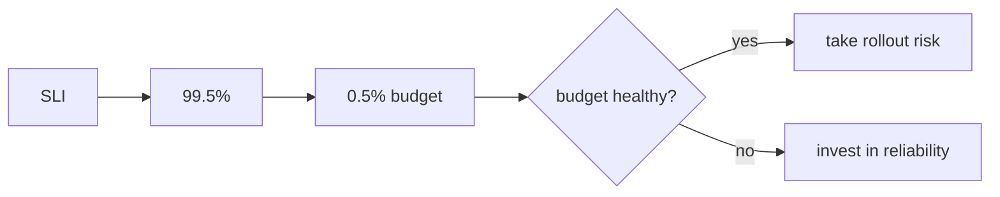

# Queries, alerts, and objectives

*Stage 6 · Mission Operations*

**You will be able to:** write the three core queries, say what an alert does and does not do, and compute an error budget.

Raw samples sitting in a database do not help at 3 a.m. You need to turn them into answers ("how many bookings are failing?"), into a notification when something is wrong, and into an agreed definition of "good enough" so teams can decide whether to ship risky changes or fix reliability.

## Queries, alerts and objectives

**Queries** ask questions of stored data. **Alerts** are queries that run continuously and tap a human on the shoulder. **Objectives** are promises about how good service should be, measured by those same queries.

### Three core PromQL patterns

```promql
rate(http_requests_total{service="booking",status="200"}[5m])          # requests per second

sum(rate(http_requests_total{service="booking",status=~"5.."}[5m]))
  / sum(rate(http_requests_total{service="booking"}[5m])) * 100        # error percentage

histogram_quantile(0.99, sum by(le) (rate(http_request_duration_ms_bucket{service="booking"}[5m])))   # p99 latency
```

### Alerts notify; they do not repair

An alert rule evaluates a query on a schedule. When the condition has held for the `for` duration, Prometheus fires the alert to Alertmanager, which routes it to Slack or a pager. Nothing is scaled or restarted. The `for` delay stops momentary spikes from waking someone.

```yaml
- alert: BookingErrorRateHigh
  expr: sum(rate(http_requests_total{service="booking",status=~"5.."}[5m])) / sum(rate(http_requests_total{service="booking"}[5m])) > 0.05
  for: 2m
  labels: {severity: warning}
```

An alert moves through `inactive → pending → firing`.

## SLI, SLO and error budget

Three terms turn "reliable" into numbers:

| Term | Meaning | Apollo booking |
|---|---|---|
| **SLI** (indicator) | The measured quantity | Good ÷ eligible `POST /api/bookings`. Eligible = responses that are 2xx or 5xx. **4xx are excluded** because they are caller mistakes (wrong password), not service failures |
| **SLO** (objective) | The target for the SLI | 99.5% over 28 days |
| **Error budget** | The allowed failure | 0.5% of eligible requests. Remaining = `1 − error_ratio / 0.005`, which can go negative |



The budget makes a trade-off explicit: while it is healthy, take risks and ship faster; once it is spent, prioritise reliability.

*Source: the `PrometheusRule` records `apollo:booking_error_ratio:{5m,1h,28d}` and `apollo:booking_error_budget_remaining:28d`. The alert `ApolloBookingErrorBudgetBurn` fires when both a short and a long window burn the budget faster than 14.4 times the allowed rate for two minutes.*

## Recording rules and burn rate

Two more ideas turn the SLO from a definition into something Prometheus watches.

**Recording rules** save a query's answer as a new, named series. The booking error ratio is a long expression, and it is needed in three windows, on dashboards and in alerts. A recording rule evaluates it every 30 seconds and stores the result under a name:

```yaml
# PrometheusRule apollo-services, group apollo.booking-slo (trimmed)
- record: apollo:booking_error_ratio:5m          # level:metric:window naming
  expr: |
    (sum(rate(http_requests_total{service="booking",method="POST",path="/api/bookings",status=~"5.."}[5m])) or vector(0))
    / sum(rate(http_requests_total{service="booking",method="POST",path="/api/bookings",status=~"2..|5.."}[5m]))
- record: apollo:booking_error_budget_remaining:28d
  expr: 1 - apollo:booking_error_ratio:28d / 0.005
```

- **Why:** the expensive expression is computed once, everyone uses the same definition, and the alert reads a simple series.
- **`or vector(0)`:** with no failures, the 5xx part would be an empty result. This turns it into 0 so the ratio still exists.

**Burn rate** is how fast you are using the budget, compared with the speed that would use it up exactly at the end of the window. A burn rate of 1 spends the 0.5% budget in exactly 28 days. A burn rate of 14.4 spends it in about two days.

```yaml
- alert: ApolloBookingErrorBudgetBurn
  expr: apollo:booking_error_ratio:5m > (14.4 * 0.005)
    and apollo:booking_error_ratio:1h > (14.4 * 0.005)
  for: 2m
```

- **Why two windows:** the 1-hour window proves the problem is big enough to matter, and the 5-minute window proves it is still happening. Either alone is worse: 1h by itself keeps firing long after a fix, and 5m by itself pages on every blip.
- **Why alert on burn rate and not on "error ratio > X":** a fixed threshold either pages too often or too late. Burn rate asks the question that matters: *at this pace, will we break the promise?*

## Limits to respect

- **No traffic means no ratio.** The series is absent. It is not "100% available".
- A 150-second drill shows burn and recovery, but **cannot prove a 28-day objective** on a new cluster.
- The remaining budget can stay negative after the API recovers, because past failures stay in the window.
- Latency and availability are separate objectives: a latency bucket cannot say whether a request succeeded.

## Try it

```bash
cd stages/stage6 && bash scripts/signals-lab.sh apply 3 helm
curl -sG localhost:19090/api/v1/query --data-urlencode 'query=apollo:booking_error_ratio:5m'
bash scripts/slo-lab.sh        # bounded outage; restores Flight on exit
```

## Common misconceptions

- **"An alert fixes the problem."** It only notifies.
- **"Healthy Pods mean the SLO is fine."** Failures can come from dependencies on the request path.
- **"Errors should include all non-200s."** Client mistakes do not count against the service.

## Check yourself

<details>
<summary>Why exclude 4xx from the booking SLI?</summary>

They are caller errors (bad password, invalid input), not service failures.
</details>

<details>
<summary>Can a healthy Pod coexist with a burning budget?</summary>

Yes. Pod readiness says the process is up; failures can come from dependencies on the request path.
</details>

## Where this leads

Metrics say how much. Logs say what happened. Next: how Apollo's logs are produced and found.
