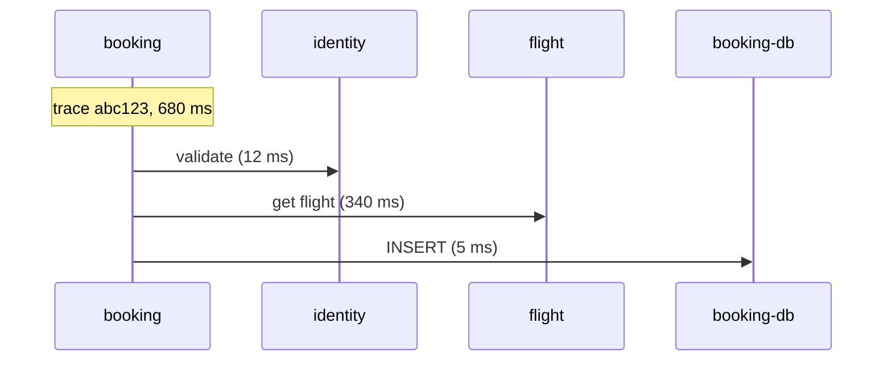

# Distributed traces

*Stage 6 · Mission Operations*

**You will be able to:** read a trace, explain what breaks one, and say what a trace does not prove.

## The problem

A single booking passes through the frontend, booking, identity, flight, the database and notification. If it takes eight seconds, which hop was slow? Looking at each service's own logs and metrics separately, you cannot easily line up which entries belong to the same request.

## The idea in plain words

A **parcel tracking number**: every depot scans it, so you can see the parcel's whole route and how long each leg took. A **trace** is that, for a request. It has one **Trace ID**, shared by every service the request touches. Each unit of work along the way is a **span**: a timed operation in one service, with its own **Span ID** and a pointer to its **parent** span.

| Term | Meaning |
|---|---|
| **Trace** | The whole journey of one request |
| **Span** | One timed step in one service (carries duration and attributes such as `http.status_code`) |



From this you can see that of 680 ms, 340 ms was spent waiting for flight: the starting point for investigation.

## How it works: context propagation

For spans in different services to join one trace, each service must pass the identifying information along when it calls the next. The standard way is the W3C `traceparent` HTTP header:

```text
traceparent: 00-4bf92f3577b34da6a3ce929d0e0e4736-00f067aa0ba902b7-01
             │  └ trace id (32 hex)               └ parent span id (16 hex)  └ flags (sampled)
             └ version
```

If a service forgets to copy `traceparent` onto an outgoing call, the next service starts a **new** trace, and its spans appear as an unrelated root. Every hop must propagate. Booking also forwards `X-Request-ID` for backwards compatibility, but log lines are matched by the `trace_id` they carry.

### Getting spans to storage


Services send spans (over the OpenTelemetry protocol, OTLP) to a **Collector** on their node, which batches them and forwards them to **Tempo**. The Collector does not invent missing context. Tracing is also **out of band**: if the Collector cannot reach Tempo, requests keep working and traces silently go missing.

## What a trace does and does not prove

- It shows **where time went**, strong evidence of a bottleneck.
- It does not by itself prove the **root cause**: why flight's database was slow is in logs and metrics.
- With sampling, not every request has a trace.

## Try it

```bash
TRACE=$(openssl rand -hex 16)
curl -s -X POST http://<gateway>/api/bookings -H "traceparent: 00-$TRACE-$(openssl rand -hex 8)-01" -H "Authorization: Bearer $TOKEN" -H 'Content-Type: application/json' -d '{"flightId":"aaaaaaaa-aaaa-aaaa-aaaa-aaaaaaaaaaaa"}'
kubectl port-forward -n apollo-observability svc/tempo 13200:3100 &
curl -s localhost:13200/api/traces/$TRACE | jq '.batches|length'
bash stages/stage6/scripts/trace-test.sh      # end-to-end proof with four services
```

## Common misconceptions

- **"Tracing is automatic."** Each service must instrument and propagate.
- **"A trace tells me why it was slow."** It tells you where.
- **"If traces vanish, the app is broken."** The pipeline may be.

## Check yourself

<details>
<summary>Spans from <code>flight</code> show up as a separate trace. Likely cause?</summary>

`booking` did not forward `traceparent` on that outbound call.
</details>

## Where this leads

You now have three signals. The last chapter uses them together to investigate one slow booking.
