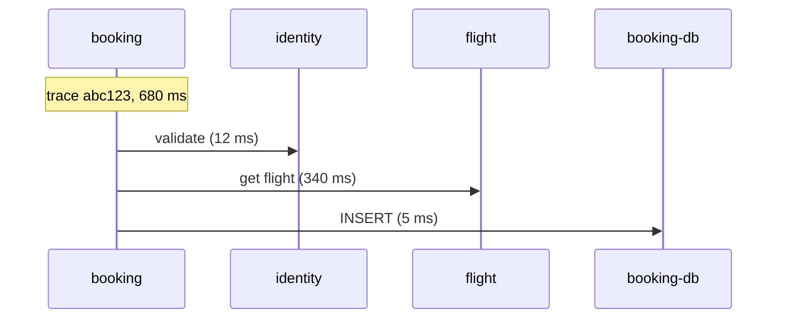

# Distributed traces

*Stage 6 · Mission Operations*

**You will be able to:** read a trace, explain what breaks it, and say what it does not prove.

## Terms

| Term | Meaning |
|---|---|
| **Trace** | The whole request journey; one `Trace ID` |
| **Span** | One timed operation in one service; has `Span ID`, `Parent Span ID`, duration, attributes |



## Context propagation

```text
traceparent: 00-4bf92f3577b34da6a3ce929d0e0e4736-00f067aa0ba902b7-01
             │  └ trace id (32 hex)               └ parent span id (16 hex)  └ flags (sampled)
             └ version
```

- Every service must **copy `traceparent` onto its outgoing calls**. A service that drops it starts a new trace; downstream spans appear as unrelated roots.
- Booking also forwards `X-Request-ID` for log correlation.

## Pipeline


- The Collector batches and exports. It does **not** invent missing context.
- Tracing is **out of band**: a dead exporter loses traces without failing requests.

## Limits

- A trace shows **where time went**. It is strong evidence of the bottleneck, not proof of root cause (why flight's DB was slow is in logs/metrics).
- Sampling means not every request has a trace.

## Try it

```bash
TRACE=$(openssl rand -hex 16)
curl -s -X POST http://<gateway>/api/bookings -H "traceparent: 00-$TRACE-$(openssl rand -hex 8)-01" -H "Authorization: Bearer $TOKEN" -H 'Content-Type: application/json' -d '{"flightId":"aaaaaaaa-aaaa-aaaa-aaaa-aaaaaaaaaaaa"}'
kubectl port-forward -n apollo-observability svc/tempo 13200:3100 &
curl -s localhost:13200/api/traces/$TRACE | jq '.batches|length'
bash stages/stage6/scripts/trace-test.sh      # end-to-end proof with four services
```

## Check yourself

<details>
<summary>Spans from <code>flight</code> show up as a separate trace. Likely cause?</summary>

`booking` did not forward `traceparent` on that outbound call.
</details>
