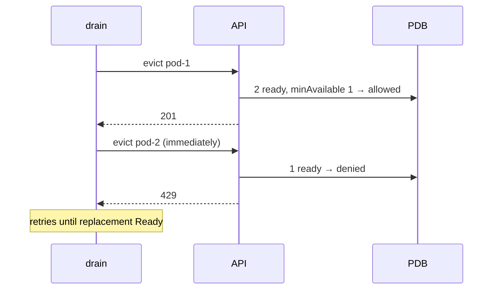

# Disruption budgets

*Stage 4 · Flight Control*

**You will be able to:** compute `disruptionsAllowed`, and name disruptions a PDB does and does not block.

## Voluntary vs involuntary

| Voluntary (PDB consulted via Eviction API) | Involuntary / bypass (PDB ignored) |
|---|---|
| `kubectl drain` | Node crash, power loss |
| Cluster autoscaler scale-down | Kernel panic, OOMKilled |
| Direct Eviction API call | `kubectl delete pod`, scale-down of a Deployment, `--force --grace-period=0` |



## Configuration

| Field | Meaning |
|---|---|
| `minAvailable: 1` | At least 1 healthy replica must remain |
| `maxUnavailable: 1` | At most 1 may be disrupted |
| `"50%"` | Scales with replicas |

- `disruptionsAllowed = currentHealthy − minAvailable`. Three healthy, `minAvailable: 2` ⇒ 1 allowed.

```yaml
apiVersion: policy/v1
kind: PodDisruptionBudget
metadata: {name: booking-pdb, namespace: apollo-airlines-apps}
spec:
  minAvailable: 1
  selector: {matchLabels: {app: booking}}
```

## The stuck drain

1. Drain starts; pod-1 is evicted.
2. Its replacement is `Pending` (no capacity).
3. PDB keeps denying eviction of pod-2 (429).
4. Drain hangs until capacity appears.

- PDB with `minAvailable` equal to `replicas` allows **zero** disruptions: drains never finish.
- A PDB cannot make an app available: it only slows planned maintenance.

## Try it

```bash
kubectl get pdb -n apollo-airlines-apps
kubectl describe pdb booking-pdb -n apollo-airlines-apps
kubectl drain apollo11-worker --dry-run=client --ignore-daemonsets --delete-emptydir-data
```

## Check yourself

<details>
<summary>2 replicas, <code>minAvailable: 2</code>. What does a drain do?</summary>

It can never evict a booking Pod (0 allowed) and hangs. Use `minAvailable: 1` or `maxUnavailable: 1`.
</details>

<details>
<summary>Does a PDB stop <code>kubectl delete pod</code>?</summary>

No. Only evictions through the Eviction API are budgeted.
</details>
