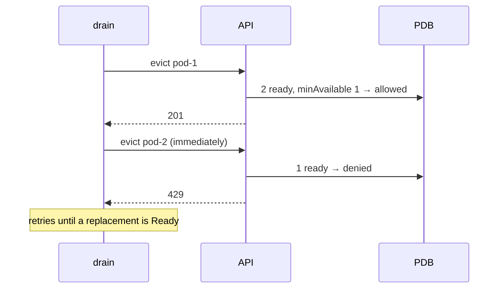

# Disruption budgets

*Stage 4 · Flight Control*

**You will be able to:** compute `disruptionsAllowed`, and name disruptions a PDB does and does not block.

## The problem

An administrator drains a node for a kernel upgrade, which evicts every Pod on it. If both booking replicas happen to be on that node, booking disappears completely, and nothing was "broken": it was planned maintenance. We need a way for an application to say "during planned maintenance, always leave at least this many of me running."

## The idea in plain words

A hospital ward during a shift change: staff are allowed to leave, but the rule is that **at least one nurse must remain on the ward** at any moment. The next nurse may leave only once a replacement has arrived.

A **PodDisruptionBudget (PDB)** is that rule. It limits how many Pods of a group may be *voluntarily* taken down at once.

### Voluntary versus involuntary

The PDB governs **voluntary** disruptions: ones a person or an automation chooses, which are routed through the **Eviction API**. Anything else bypasses it.

| Voluntary (PDB consulted) | Involuntary or bypass (PDB ignored) |
|---|---|
| `kubectl drain` | Node crash or power loss |
| Cluster autoscaler scale-down | Kernel panic, OOMKilled |
| Direct Eviction API call | `kubectl delete pod`, scaling a Deployment down, `--force --grace-period=0` |

## How it works

The API server checks the PDB on every eviction request. If granting it would drop healthy Pods below the budget, the request is refused with HTTP 429, and the drain retries until the replacement is Ready.



You express the budget one of two ways:

| Field | Meaning |
|---|---|
| `minAvailable: 1` | At least 1 healthy replica must remain |
| `maxUnavailable: 1` | At most 1 may be disrupted at once |
| `"50%"` | A percentage that scales with replicas |

`disruptionsAllowed = currentHealthy − minAvailable`. With three healthy and `minAvailable: 2`, exactly one eviction is allowed; once it happens, no more until a Pod is healthy again.

```yaml
apiVersion: policy/v1
kind: PodDisruptionBudget
metadata: {name: booking-pdb, namespace: apollo-airlines-apps}
spec:
  minAvailable: 1
  selector: {matchLabels: {app: booking}}
```

## The stuck-drain trap

1. A drain starts and evicts pod-1.
2. Its replacement is `Pending` because the cluster has no spare capacity.
3. The PDB keeps refusing pod-2's eviction (429).
4. The drain hangs until capacity appears.

The same thing happens if `minAvailable` equals `replicas`: the budget allows zero disruptions, so drains never finish. A PDB slows planned maintenance to protect availability; it cannot create availability.

## Try it

```bash
kubectl get pdb -n apollo-airlines-apps
kubectl describe pdb booking-pdb -n apollo-airlines-apps
kubectl drain apollo11-worker --dry-run=client --ignore-daemonsets --delete-emptydir-data
```

## Common misconceptions

- **"A PDB protects against any outage."** Only against voluntary evictions.
- **"A PDB stops `kubectl delete pod`."** Deletes bypass it.
- **"More protection is always better."** A too-strict PDB blocks maintenance.

## Check yourself

<details>
<summary>2 replicas, <code>minAvailable: 2</code>. What does a drain do?</summary>

It can never evict a booking Pod (0 allowed) and hangs. Use `minAvailable: 1` or `maxUnavailable: 1`.
</details>

<details>
<summary>Does a PDB stop <code>kubectl delete pod</code>?</summary>

No. Only evictions through the Eviction API are budgeted.
</details>

## Where this leads

Stage 4 made Apollo robust to individual events. Stage 5 turns to changing it on purpose: packaging, shipping and rolling back releases.
