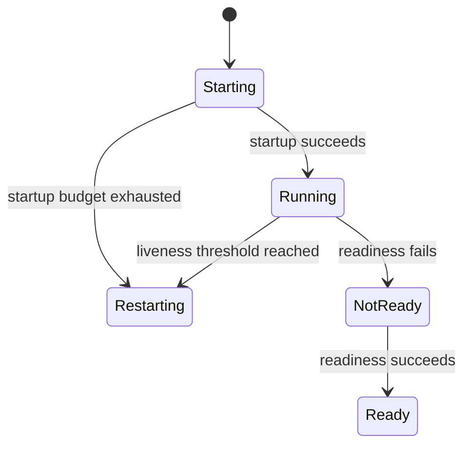

# Probes: startup, liveness, and readiness

The kubelet runs probes. A startup probe delays liveness and readiness evaluation until startup succeeds; its failureThreshold multiplied by periodSeconds must cover the stated worst-case startup time. Liveness failure can restart a container. Readiness failure removes a Pod from eligible endpoints without restarting it. These are sampled signals, not instantaneous truths.

*Diagram RL-01 — each probe has a different kubelet action.*

## Begin with the three questions

Apollo’s process can start slowly while its database is still initializing. A
**startup probe** asks whether startup has completed. A **liveness probe** asks
whether a running container should be restarted. A **readiness probe** asks
whether a Pod should receive new traffic. The kubelet runs these checks and
applies their configured thresholds; a controller does not magically interpret
the probe itself.

A startup probe pauses liveness and readiness evaluation until it succeeds. Its
failure budget must cover the stated worst-case startup, including the probe
period and threshold. A liveness failure can restart the container. A readiness
failure normally leaves it running but makes it ineligible for new Service
traffic.

## Read the result as a state transition

A single failed sample is not the same as a threshold being reached. Consecutive
failure and success thresholds, initial delays, and periods decide when the
kubelet changes its action. A restart can erase process memory and repeat startup
work. Withholding traffic gives the process a chance to recover without creating
a new container.

## Evidence and limits

Inspect probe configuration, Pod conditions, container restart counts, events,
and the application endpoint itself. A green readiness condition is evidence for
that check at that moment. It is not a proof that every dependency, request, or
future interval will succeed.
