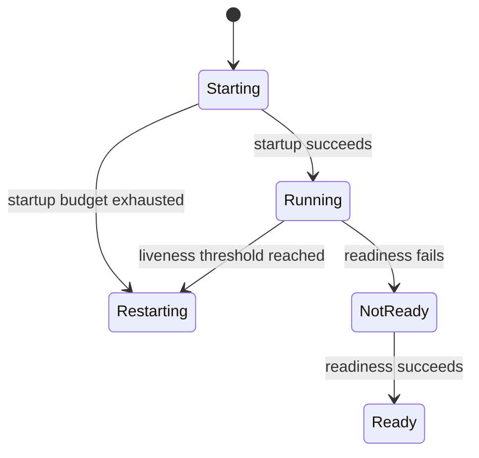

# Probes: startup, liveness, and readiness

*Stage 4 · Flight Control*

**You will be able to:** pick the right probe for a question, size a startup budget, and predict what the kubelet does when each probe fails.

A container that has started is not automatically able to serve. Booking might still be connecting to its database. Later it might hang without crashing. And at any moment its database might vanish while the process itself is fine. Kubernetes sees only "process running" unless you tell it how to ask better questions, and a single yes/no cannot answer all three situations because they need **different reactions**: wait, restart, or stop sending traffic.

## Three questions, three probes

Think of a new employee: **Has the employee finished arriving and setting up?** (startup) **Are they conscious and responsive, or frozen?** (liveness) **Are they at their desk with everything they need, ready for the next customer?** (readiness). You react differently to each answer: wait, send them home to reset, or just stop routing customers to them for a while.

The **kubelet**, the agent on each node, runs these checks. It issues a small request (an HTTP call, a command, or a TCP connect) repeatedly and applies thresholds to the results. No controller interprets the probe.

| Probe | Question | On failure | Apollo path |
|---|---|---|---|
| **startup** | Has it finished starting? | Waits. If the budget runs out, **restarts**. Holds off liveness and readiness until it passes | `/healthz/startup` |
| **liveness** | Should this container be restarted? | **Restarts** the container | `/healthz/live` |
| **readiness** | Should it receive new traffic now? | **Removes** the Pod from Service endpoints; no restart | `/healthz/ready` |

## Probe timing

Each probe is a sampling loop, and a single failure is not a verdict. These fields shape the loop:

| Field | Meaning |
|---|---|
| `initialDelaySeconds` | Wait before the first sample |
| `periodSeconds` | Time between samples |
| `timeoutSeconds` | How long a single sample may take |
| `failureThreshold` | **Consecutive** failures before the kubelet acts |
| `successThreshold` | Consecutive successes needed to become ready again |


```mermaid
stateDiagram-v2
  [*] --> Starting
  Starting --> Running: startup succeeds
  Starting --> Restarting: startup budget exhausted
  Running --> NotReady: readiness fails
  NotReady --> Ready: readiness succeeds
  Running --> Restarting: liveness threshold reached
```

**Startup budget** = `periodSeconds × failureThreshold`. Booking's is 5 s × 6 = 30 s, and it must cover the worst-case start.

### Why the startup probe exists

Suppose an app needs 45 seconds to start, and liveness starts checking at 15 seconds. At second 15 the check fails, the kubelet decides the app is stuck and kills it. It restarts, fails again at 15 seconds, and enters a `CrashLoopBackOff` even though nothing is wrong. A startup probe fixes this by pausing liveness and readiness until the app has finished starting.

### Readiness means "stop routing", not "repair"

If `booking-db` goes down, booking's readiness check fails. Booking is removed from its Service's endpoints and receives no traffic, but its process keeps running. When the database returns and the check passes, traffic resumes with no restart. Restarting booking would not have helped, since the problem is the database. This is why liveness should check only the process itself: a dependency check there creates restart storms during any outage.

## Apollo example

*Source: `stages/stage4/k8s/apps/booking/booking-dep.yaml`*

`/healthz/startup` always returns OK once the server is listening; `/healthz/live` returns OK if the process responds; `/healthz/ready` pings the booking database and returns `503` if it fails. The older `/readyz` also checks identity, flight and notification, which is why Stage 4 prefers the narrower `/healthz/ready` for readiness.

## Try it

```bash
kubectl get deploy booking -n apollo-airlines-apps -o jsonpath='{.spec.template.spec.containers[0].startupProbe}{"\n"}'
kubectl describe pod -n apollo-airlines-apps -l app=booking | grep -E 'Liveness|Readiness|Startup|Restart Count'
```

## Common misconceptions

- **"Readiness fails, so Kubernetes will restart it."** That is liveness. Readiness only withholds traffic.
- **"One failed sample triggers action."** Only `failureThreshold` consecutive failures do.
- **"A green readiness check means everything works."** It is true for that check at that moment only.

## Check yourself

<details>
<summary>Readiness fails and <code>RESTARTS</code> stays 0. Is that a bug?</summary>

No. Readiness failure only removes the Pod from endpoints.
</details>

<details>
<summary>5 s period, failureThreshold 6: how long may startup take?</summary>

About 30 s before the kubelet restarts the container.
</details>

## Where this leads

Probes govern starting and serving. The next chapter covers the end of a Pod's life: shutting down without dropping requests.
