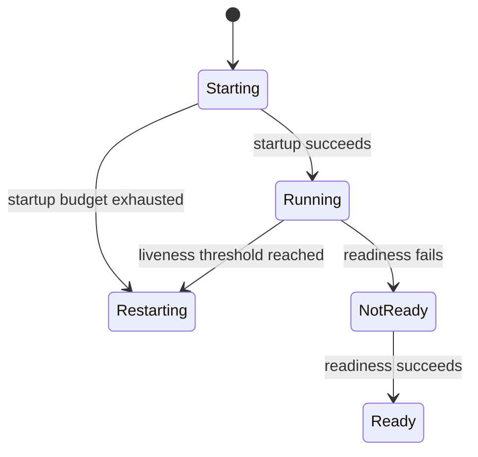

# Probes: startup, liveness, and readiness

*Stage 4 · Flight Control*

**You will be able to:** pick the right probe for a question, set a startup budget, and predict the kubelet's action.

## Key points

- The **kubelet** runs probes and applies thresholds. A controller does not interpret them.
- Each probe has a different authority:

| Probe | Question | On failure | Apollo path |
|---|---|---|---|
| **startup** | Has it finished starting? | Waits; budget exhausted ⇒ **restart**. Holds off liveness/readiness until it passes | `/healthz/startup` |
| **liveness** | Should this container be restarted? | **Restart** the container | `/healthz/live` |
| **readiness** | Should it receive new traffic? | **Remove from endpoints**; no restart | `/healthz/ready` |

- Probes are **sampled** signals, not instant truth.


```mermaid
stateDiagram-v2
  [*] --> Starting
  Starting --> Running: startup succeeds
  Starting --> Restarting: startup budget exhausted
  Running --> NotReady: readiness fails
  NotReady --> Ready: readiness succeeds
  Running --> Restarting: liveness threshold reached
```

## Timing fields

| Field | Meaning |
|---|---|
| `initialDelaySeconds` | Wait before the first sample |
| `periodSeconds` | Time between samples |
| `failureThreshold` | **Consecutive** failures before acting |
| `successThreshold` | Consecutive successes to become ready again |
| `timeoutSeconds` | Per-sample timeout |

- **Startup budget = `periodSeconds × failureThreshold`.** Booking: 5 s × 6 = 30 s. It must cover the worst-case start.
- One failed sample ≠ a threshold reached.

## Why a startup probe

| Without it | With it |
|---|---|
| App needs 45 s; liveness starts at 15 s, fails, kills it; loop → `CrashLoopBackOff` | Liveness does not run until startup passes; no false kills |

## Readiness is "stop routing", not "repair"

- `booking-db` down ⇒ booking's `/healthz/ready` fails ⇒ endpoint removed ⇒ **no restart** (restarting cannot fix the DB). DB back ⇒ endpoint returns.
- Liveness should check only the process itself. Putting a dependency check there creates restart storms.

## Try it

```bash
kubectl get deploy booking -n apollo-airlines-apps -o jsonpath='{.spec.template.spec.containers[0].startupProbe}{"\n"}'
kubectl describe pod -n apollo-airlines-apps -l app=booking | grep -E 'Liveness|Readiness|Startup|Restart Count'
```

## Gotchas

- Green readiness = true for that check at that moment, not for every dependency or future request.
- A restart erases memory and repeats startup work.

## Check yourself

<details>
<summary>Readiness fails and <code>RESTARTS</code> stays 0. Is that a bug?</summary>

No. Readiness failure only removes the Pod from endpoints.
</details>

<details>
<summary>5 s period, failureThreshold 6: how long may startup take?</summary>

About 30 s before the kubelet restarts the container.
</details>
